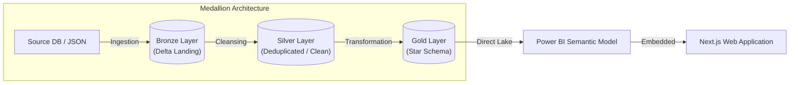

# Rookie Data DN 2026 - Insurance Analytics

This repository serves as the single source of truth for the **Insurance Analytics MockProject** (Rookie Data DN 2026 / CarPro Insurance Analytics). It contains all project documentation, SQL DDL scripts, test assets, and Microsoft Fabric-related configurations and notebooks.

> [!IMPORTANT]
> **Project Handover & Client Delivery**: For a quick index mapping all consolidated project deliverables (Source Code, Technical Documentation, Performance Reports, Deployment Guides, and Test Assets) as shown in the presentation slides, please refer to the **[Knowledge Transfer & Project Handover Guide](docs/final-deliverables/project-handover-guide.md)**.

---

## 1. Project Overview

The objective of this project is to implement a medallion data architecture (Bronze → Silver → Gold) to ingest, clean, model, and serve insurance analytics data. The data platform leverages **Microsoft Fabric** as the primary integration engine, **Power BI** for reporting, and **GitHub** for source control management and collaboration.



---

## 2. Core Project Deliverables

This repository is structured around the five core pillars of our client handover:

1.  **[Source Code](fabric/)**: PySpark notebooks and data pipelines for Bronze ingestion, Silver cleansing, and Gold SCD Type 2 dimension loading. Includes [sql/](sql/) schemas and the [web-app/](web-app/) Power BI embedded Next.js application.
2.  **[Technical Documentation](docs/)**: Complete system architecture designs, BPMN process workflows, star schema data models, and column-level Source-to-Target Mappings (STTM).
3.  **[Performance Reports](tests/performance/rows/)**: Stress-test benchmarks showing pipeline execution logs at scale (1M, 5M, 10M, 100M, and 4 Billion rows), alongside detailed [refactoring and optimization reports](docs/refactor-optimize-pipeline/before-and-after-with-4000-records.md).
4.  **[Deployment Guide](cicd/docs/)**: Continuous Integration and Continuous Deployment (CI/CD) pipelines, setup prerequisites, orchestration strategies, and environment promotion runbooks.
5.  **[Test Assets](tests/)**: Automated row-level data quality constraints, temporal integrity checkers, KPI revalidation logs, and sample database validation datasets.

For a detailed walkthrough of each asset, please check the **[Project Handover Guide](docs/final-deliverables/project-handover-guide.md)**.

---

## 3. Directory Structure

Below is the physical folder organization of the repository:

```text
rookies-data-dn-2026/
├── .github/                          # GitHub actions automation workflows
├── architecture/                     # System architecture design & diagrams
│   ├── data-quality/                 # Data quality specs
│   ├── diagrams/                     # Mermaid diagram source files
│   └── exports/                      # Exported diagram images (PNG)
├── cicd/                             # CI/CD workflows and deployment guides
├── config/                           # Environment configuration templates
├── docs/                             # Project documentation and designs
│   ├── business-process/             # Business workflow analysis
│   ├── data-modeling/                # Star schema designs & table definitions
│   ├── final-deliverables/           # Handover guides and client deliverables
│   ├── presentation/                 # Presentation slides
│   ├── refactor-optimize-pipeline/   # Pipeline performance optimizations
│   ├── source-to-target-mapping/     # Column mappings (STTM)
│   └── standards/                    # Global team development guidelines
├── fabric/                           # Microsoft Fabric Git integration artifacts
├── json-source/                      # Mock transaction source data files
├── sql/                              # Raw SQL scripts and DDLs
│   ├── etl-control/                  # Control flow schemas
│   ├── lakehouse/                    # Silver/Gold Delta table DDLs
│   └── source/                       # Source system simulator SQLs
└── tests/                            # Quality assurance and testing suite
    ├── data-quality/                 # PySpark constraints & KPI validations
    ├── performance/                  # Scalability stress-test benchmarks
    └── pipeline-tests/               # Integration pipeline validations
```

---

## 4. Git & Development Standards

To keep collaboration clean and trackable, all team members must follow our Git branching, naming, and commit conventions:

### Quick Links to Development Guides:
*   [Repository Structure & Naming Guide](docs/standards/git-rules/02-naming-convention-and-structure.md) – Directory usage rules and general file naming.
*   [Branching & Commit Conventions](docs/standards/git-rules/01-branching-and-commit-conventions.md) – Kebab-case branch templates and conventional commit structures.
*   [Pull Request Process](docs/standards/git-rules/03-pull-request-process.md) – PR size limits, template, reviewer checklists, and merge policies.
*   [Promotion Workflow](docs/standards/git-rules/00-promotion-workflow.md) – Environment progression (Feature $\rightarrow$ dev $\rightarrow$ release $\rightarrow$ main).
*   [Conflict Resolution Guide](docs/standards/git-rules/04-conflict-resolution.md) – Resolving conflicts in source code and Jupyter Notebooks.

### Code Naming Conventions:
*   For Python variables, classes, SQL tables, and database schemas, follow the [Python & SQL Naming Convention Guide](docs/standards/fabric-rules/naming-convention.md).
*   For Fabric-specific item structures, consult the [Fabric Workspace Structure Guide](docs/standards/fabric-rules/workspace-fabric-structure.md).

---

## 5. Development Workflow Checklist

1.  **Start Task**: Create a feature branch off `dev` following [Branching Conventions](docs/standards/git-rules/01-branching-and-commit-conventions.md).
2.  **Implement Changes**: Write code using [Code Naming Standards](docs/standards/fabric-rules/naming-convention.md).
3.  **Commit Code**: Commit changes frequently with [Conventional Commits](docs/standards/git-rules/01-branching-and-commit-conventions.md).
4.  **Push & Create PR**: Push feature branch and create a PR using the [PR Template](docs/standards/git-rules/03-pull-request-process.md).
5.  **Review & Merge**: Review with checklist, resolve any [Conflicts](docs/standards/git-rules/04-conflict-resolution.md), merge to `dev`, and delete the branch.
