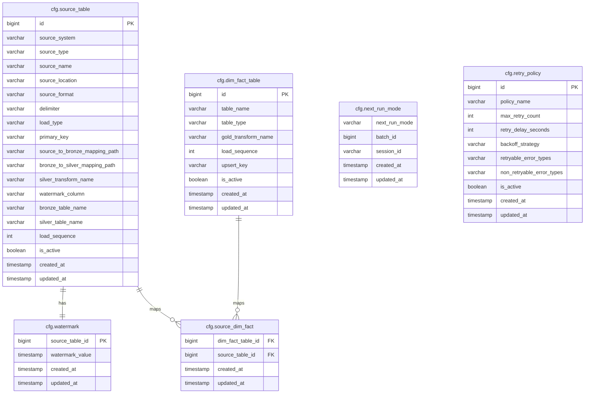
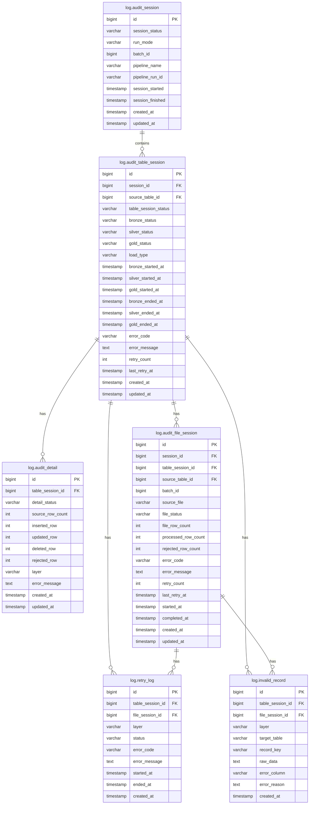

# Data Workflow Control Strategy

## Mapping to Project Baseline Control Tables

| Suggested Baseline Table | Detailed Design Table | Notes |
| --- | --- | --- |
| `Job_Config` | `cfg.source_table` | Stores source configuration and table-level ingestion metadata |
| `Watermark` | `cfg.watermark` | Stores Source-to-Bronze ingestion checkpoints |
| `Batch_Log` | `log.audit_session` | Stores batch/session-level execution status |
| `Pipeline_Log` | `log.audit_session`, `log.audit_table_session`, `log.audit_detail`, `log.audit_file_session` | Stores run/session, table/layer, detail/reconciliation, and file-level execution tracking |
| `Pipeline_Error` | `log.invalid_record`, `log.audit_table_session.error_code`, `log.audit_table_session.error_message`, `log.audit_file_session.error_code`, `log.audit_file_session.error_message`, `log.retry_log` | Stores validation/data errors, operational failure details, and retry failure history |
| Retry support | `log.retry_log`, `cfg.retry_policy` | Stores retry policy and retry attempt details for transient system failures |
| N/A | `cfg.next_run_mode` | Stores the next execution mode and recovery context |
| N/A | `cfg.dim_fact_table`, `cfg.source_dim_fact` | Stores Gold-layer table configuration and source-to-Gold mapping |

## 1. Configuration Tables

Configuration tables store metadata and configuration used to drive pipeline processing.



### 1.1. `cfg.source_table`

**Purpose:** Stores source system configurations used for Bronze ingestion.

| Column | Data Type | Description |
|---|---|---|
| `id` | bigint | Unique identifier of the source configuration |
| `source_system` | varchar(100) | Source system name, such as CRM, Policy System, or Payment System |
| `source_type` | varchar(20) | Source type such as database, file, or API |
| `source_name` | varchar(100) | Source entity name, such as customers, quotations, or policies |
| `source_location` | varchar(255) | Source location such as database table or file path |
| `source_format` | varchar(20) | Source data format, such as table, csv, json, or parquet |
| `delimiter` | varchar(5) | Delimiter used for delimited file formats |
| `load_type` | varchar(20) | Loading strategy, such as full or incremental |
| `primary_key` | varchar(255) | Primary key column(s) used for merge and deduplication |
| `source_to_bronze_mapping_path` |	varchar(255)  |	Path to the Source-to-Bronze column mapping configuration file |
| `bronze_to_silver_mapping_path` |	varchar(255)  |	Path to the Bronze-to-Silver column mapping configuration file |
| `silver_transform_name` | varchar(50) | Custom transformation function applied during Bronze-to-Silver processing |
| `watermark_column` | varchar(100) | Source column used for incremental extraction |
| `bronze_table_name` | varchar(100) | Target Bronze table name |
| `silver_table_name` | varchar(100) | Target Silver table name |
| `load_sequence` | int | Execution order of source ingestion |
| `is_active` | boolean | Indicates whether the source configuration is active |
| `created_at` | timestamp | Record creation timestamp |
| `updated_at` | timestamp | Last update timestamp |

### 1.2. `cfg.dim_fact_table`

**Purpose:** Stores metadata for Gold layer dimension and fact tables.

| Column | Data Type | Description |
|---|---|---|
| `id` | bigint | Unique identifier of the table configuration |
| `table_name` | varchar(100) | Target dimension or fact table name |
| `table_type` | varchar(20) | Table type, such as dimension or fact |
| `gold_transform_name` | varchar(50) | Custom transformation function applied during Silver-to-Gold processing |
| `load_sequence` | int | Execution order of Gold table processing |
| `upsert_key` | varchar(255) | Key used for merge or upsert operations |
| `is_active` | boolean | Indicates whether the configuration is active |
| `created_at` | timestamp | Record creation timestamp |
| `updated_at` | timestamp | Last update timestamp |

### 1.3. `cfg.watermark`

**Purpose:** Stores the latest source watermark value used for incremental extraction from Source to Bronze.

| Column | Data Type | Description |
|---|---|---|
| `source_table_id` | bigint | Source table configuration identifier |
| `watermark_value` | timestamp | Latest processed source watermark value |
| `created_at` | timestamp | Record creation timestamp |
| `updated_at` | timestamp | Last update timestamp |

### 1.4. `cfg.source_dim_fact`

**Purpose:** Defines the many-to-many relationship between source tables and Gold dimension/fact tables.

| Column | Data Type | Description |
|---|---|---|
| `dim_fact_table_id` | bigint | Gold dimension/fact table configuration identifier |
| `source_table_id` | bigint | Source table configuration identifier |
| `created_at` | timestamp | Record creation timestamp |
| `updated_at` | timestamp | Last update timestamp |

### 1.5. `cfg.next_run_mode`

**Purpose:** Stores the execution mode and context for the next pipeline run, allowing the pipeline to determine whether to start a new batch or continue a recovery run without manual input.

| Column | Data Type | Description |
|---|---|---|
| `next_run_mode` | varchar(20) | Execution mode for the next pipeline run, such as NEW or RECOVERY |
| `batch_id` | bigint | Batch identifier associated with the next pipeline run |
| `session_id` | varchar | Previous failed audit session UUID used for recovery lineage |
| `created_at` | timestamp | Record creation timestamp |
| `updated_at` | timestamp | Last update timestamp |

### 1.6. `cfg.retry_policy`

**Purpose:** Stores the retry policy used by audited pipeline processing.

| Column | Data Type | Description |
|---|---|---|
| `id` | bigint | Unique retry policy identifier |
| `policy_name` | varchar(100) | Policy name, such as default_transient_system_retry |
| `max_retry_count` | int | Maximum number of retry attempts after the initial failed attempt |
| `retry_delay_seconds` | int | Delay between retry attempts in seconds |
| `backoff_strategy` | varchar(50) | Retry delay strategy, such as FIXED_DELAY |
| `retryable_error_types` | varchar(255) | Comma-separated error types that can be retried |
| `non_retryable_error_types` | varchar(255) | Comma-separated error types that must not be retried |
| `is_active` | boolean | Indicates whether the policy is active |
| `created_at` | timestamp | Record creation timestamp |
| `updated_at` | timestamp | Last update timestamp |

---

## 2. Audit and Logging Tables

Audit and logging tables store pipeline execution status, processing metrics, retry history, and error information for monitoring and recovery.



### 2.1. `log.audit_session`

**Purpose:** Stores execution-level audit information for each pipeline run.

| Column | Data Type | Description |
|---|---|---|
| `id` | bigint | Unique pipeline execution session identifier |
| `session_status` | varchar(20) | Overall pipeline execution status |
| `run_mode` | varchar(20) | Execution mode, such as NEW or RECOVERY |
| `batch_id` | bigint | Logical batch identifier being processed |
| `pipeline_name` | varchar(20) | Pipeline name |
| `pipeline_run_id` | varchar(100) | Pipeline execution identifier generated by the orchestration platform |
| `session_started` | timestamp | Pipeline execution start timestamp |
| `session_finished` | timestamp | Pipeline execution completion timestamp |
| `created_at` | timestamp | Record creation timestamp |
| `updated_at` | timestamp | Last update timestamp |

### 2.2. `log.audit_table_session`

**Purpose:** Stores table-level execution status across Bronze, Silver, and Gold layers.

| Column | Data Type | Description |
|---|---|---|
| `id` | bigint | Unique table execution session identifier |
| `session_id` | bigint | Related audit session identifier |
| `source_table_id` | bigint | Related source table configuration identifier |
| `table_session_status` | varchar(20) | Overall processing status of the table |
| `bronze_status` | varchar(20) | Bronze layer processing status |
| `silver_status` | varchar(20) | Silver layer processing status |
| `gold_status` | varchar(20) | Gold layer processing status |
| `load_type` | varchar(20) | Load strategy used during processing |
| `bronze_started_at` | timestamp | Bronze processing start timestamp |
| `silver_started_at` | timestamp | Silver processing start timestamp |
| `gold_started_at` | timestamp | Gold processing start timestamp |
| `bronze_ended_at` | timestamp | Bronze processing completion timestamp |
| `silver_ended_at` | timestamp | Silver processing completion timestamp |
| `gold_ended_at` | timestamp | Gold processing completion timestamp |
| `error_code`  |	varchar(100) | Standardized error code for table-level execution failures |
| `error_message` | varchar(1000)	| Detailed error message for troubleshooting and operational support |
| `retry_count` | int | Number of retry attempts |
| `last_retry_at` | timestamp | Timestamp of the latest retry attempt |
| `created_at` | timestamp | Record creation timestamp |
| `updated_at` | timestamp | Last update timestamp |

### 2.3. `log.audit_detail`

**Purpose:** Stores processing metrics and execution details for each table and layer.

| Column | Data Type | Description |
|---|---|---|
| `id` | bigint | Unique audit detail identifier |
| `table_session_id` | bigint | Related table execution session identifier |
| `detail_status` | varchar(20) | Processing detail status |
| `source_row_count` | int | Number of records extracted from the source |
| `inserted_row` | int | Number of inserted records |
| `updated_row` | int | Number of updated records |
| `deleted_row` | int | Number of deleted records |
| `rejected_row` | int | Number of rejected records |
| `layer` | varchar(20) | Processing layer, such as Bronze, Silver, or Gold |
| `error_message` | text | Error message if processing failed |
| `created_at` | timestamp | Record creation timestamp |
| `updated_at` | timestamp | Last update timestamp |

### 2.4. `log.audit_file_session`

**Purpose:** Stores file-level ingestion status for file-based sources to support incremental loading, recovery, reprocessing, and source file traceability.

| Column | Data Type | Description |
|---|---|---|
| `id` | bigint | Unique file execution session identifier |
| `session_id` | bigint | Related audit session identifier |
| `table_session_id` | bigint | Related table execution session identifier |
| `batch_id` | bigint | Logical batch identifier inherited from `log.audit_session.batch_id` |
| `source_table_id` | bigint | Related source table configuration identifier |
| `source_file` | varchar(500) | Physical source file name or path being processed |
| `file_status` | varchar(20) | File processing status, such as RUNNING, SUCCESS, or FAILED |
| `file_row_count` | int | Total number of records found in the source file |
| `processed_row_count` | int | Number of records successfully processed |
| `rejected_row_count` | int | Number of rejected or invalid records |
| `error_code` | varchar(100) | Standardized error code for file-level processing failures |
| `error_message` | text | Detailed error message for troubleshooting and operational support |
| `retry_count` | int | Number of retry attempts |
| `last_retry_at` | timestamp | Timestamp of the latest retry attempt |
| `started_at` | timestamp | File processing start timestamp |
| `completed_at` | timestamp | File processing completion timestamp |
| `created_at` | timestamp | Record creation timestamp |
| `updated_at` | timestamp | Last update timestamp |

> **Note:**
>
> - This table is only required for file-based ingestion sources (for example, JSON, CSV, or Parquet files).
> - It supports incremental loading by tracking which source files have been processed successfully.
> - It supports recovery and reprocessing scenarios by identifying failed or partially processed files.
> - It works together with `_source_file` in Bronze metadata to provide end-to-end source file lineage and traceability.
> - The file tracking uniqueness key is (`batch_id`, `source_table_id`, `source_file`).
> - `batch_id`, `session_id`, and `source_table_id` are denormalized from parent audit records for query convenience and must always match the corresponding values in the parent `log.audit_table_session` and `log.audit_session` records.

### 2.5. `log.retry_log`

**Purpose:** Stores retry execution history for failed processing attempts.

| Column | Data Type | Description |
|---|---|---|
| `id` | bigint | Unique retry log identifier |
| `table_session_id` | bigint | Related table execution session identifier |
| `file_session_id` | bigint | Related file execution session identifier for file-based processing; null for non-file sources |
| `layer` | varchar(20) | Layer where retry occurred |
| `status` | varchar(20) | Retry execution status (RUNNING, SUCCESS, FAILED) |
| `error_code` | varchar(100) | Error code returned by the failed operation |
| `error_message` | text | Error details captured during retry |
| `started_at` | timestamp | Retry start timestamp |
| `ended_at` | timestamp | Retry completion timestamp |
| `created_at` | timestamp | Record creation timestamp |

### 2.6. `log.invalid_record`

**Purpose:** Stores records that fail validation or transformation rules during processing.

| Column | Data Type | Description |
|---|---|---|
| `id` | bigint | Unique invalid record identifier |
| `table_session_id` | bigint | Related table execution session identifier |
| `file_session_id` | bigint | Related file execution session identifier for file-based processing; null for non-file sources |
| `layer` | varchar(20) | Layer where the validation failure occurred |
| `target_table` | varchar(100) | Target table associated with the failed record |
| `record_key` | varchar(255) | Business key or primary key of the failed record |
| `raw_data` | text | Original record content |
| `error_column` | varchar(100) | Column that failed validation |
| `error_reason` | text | Validation or processing error description |
| `created_at` | timestamp | Record creation timestamp |

---

## 3. Incremental Load Strategy

> **Note:**
>
> - `watermark_value` is used only as the Source-to-Bronze ingestion checkpoint. It tracks the latest source record successfully ingested into the Bronze layer.
>
> - Downstream recovery between Bronze, Silver, and Gold is managed through `_batch_id` and `cfg.next_run_mode`.
>
> - Therefore, `watermark_value` is not used as an end-to-end pipeline checkpoint.
> - `_batch_id` represents the logical batch identifier propagated across Bronze, Silver, and Gold records.

### Source to Bronze

- Read source records where `watermark_column > watermark_value`.
- Assign `_batch_id` to all records loaded into Bronze.
- After Bronze succeeds, update `watermark_value = MAX(source.watermark_column)`.

### Bronze to Silver

- Read Bronze records by `_batch_id`.
- Write valid records into Silver with the same `_batch_id`.

### Silver to Gold

- Read Silver records by `_batch_id`.
- Write Gold records with the same `_batch_id`.

---

## 4. Retry Rules

Retry is used for short-lived transient system errors, not for data errors.

System errors include timeout, temporary connection failure, Spark execution failure, or storage write failure.

Data errors such as invalid format, null key, or failed validation are captured in `log.invalid_record` and are not retried.

Retry is handled within the same `session_id` and `batch_id`.

Each retry attempt is logged in `log.retry_log`.

Retry limits and delay settings are configured in `cfg.retry_policy`. The default project policy uses a fixed delay for transient system errors and treats data, rule, configuration, and unknown errors as non-retryable unless a future approved policy changes that behavior.

If the system error persists beyond the configured retry limit, recovery is required.

If all retry attempts fail, the related table/layer is marked as `FAILED` in `log.audit_table_session`.

---

## 5. Recovery Rules

> **Note:**
>
> - `log.audit_session.batch_id` represents the logical batch identifier for the data batch.
> - `_batch_id` is derived from `log.audit_session.batch_id` and is propagated to Bronze, Silver, and Gold records.
> - `log.audit_session.id` represents the execution session identifier and is independent of `_batch_id`.

### File-based Source Recovery

For file-based ingestion, Source-to-Bronze recovery is performed at the file level through `log.audit_file_session`.

Each file is uniquely tracked by (`batch_id`, `source_table_id`, `source_file`).

When the same file is reprocessed during recovery for the same batch, the existing `log.audit_file_session` row is updated instead of inserting a new row.

Before a file is marked as `FAILED` due to a system or transient error, the pipeline retries the operation up to the configured retry limit. Data errors are not retried and are recorded in `log.invalid_record`.

Files with `file_status = SUCCESS` are skipped.

Files with `file_status = FAILED` or files not found in `log.audit_file_session` are reprocessed.

Direct database sources do not require file-level recovery. Source-to-Bronze incremental extraction for database sources relies on `cfg.watermark`.

### Pipeline Recovery

Recovery is used to resume processing after a failed execution once the underlying issue has been resolved.

A recovery run creates a new `session_id` and reuses the same `batch_id`.

The recovery context (`batch_id` and `session_id`) is obtained from `cfg.next_run_mode`.

All recovery executions associated with the same failed batch must reuse the same `batch_id` until the batch is completed successfully.

The pipeline may be rerun from the beginning, but completed layers are skipped based on audit status so recovery resumes from the first failed layer.

For file-based ingestion, a table is considered successful only when all required files associated with the table have completed with `SUCCESS` status.

A layer is considered successful only when all required tables within that layer have completed with `SUCCESS` status.

Records stored in `log.invalid_record` do not automatically trigger recovery processing and are retained for audit and troubleshooting purposes.

After a batch is successfully completed, `cfg.next_run_mode` is updated to `NEW`.

A new batch must not be started until the failed batch has been successfully recovered.

### Framework Helper Scope

The current framework helpers support US47 recovery simulation without integrating production Bronze, Silver, or Gold notebooks.

| Capability | Framework Support | Production Integration Status |
|---|---|---|
| Batch/run context | `initialize_run_context()` reads `cfg.next_run_mode`, creates a new `log.audit_session`, creates a new `batch_id` for NEW, and reuses `batch_id` for RECOVERY | Ready for later orchestration integration |
| Recovery required marker | `mark_recovery_required()` sets `cfg.next_run_mode` to RECOVERY for the failed `batch_id` | Does not store failed layer/table/file physically because `cfg.next_run_mode` has only mode, batch, and session fields |
| Recovery reset | `reset_next_run_mode()` resets the singleton recovery context to NEW | Ready for later success path integration |
| Table skip/resume | `should_process_table_layer()` and `get_recovery_table_plan()` inspect prior audit status for a batch/source/layer | Ready for later Bronze/Silver/Gold use |
| File skip/resume | `should_process_file()` and `get_failed_or_missing_files()` inspect `log.audit_file_session` by `batch_id`, `source_table_id`, and `source_file` | Ready for later file ingestion use |
| Invalid records | `log_invalid_record()` and `log_invalid_records_from_dataframe()` write to `log.invalid_record` | Real validation rules still need to call these helpers |
| Retry | `run_with_retry()` reads `cfg.retry_policy`, retries retryable system errors, logs attempts, and marks table failures after exhaustion | Production notebooks still need to wrap real operations |

`log.invalid_record` does not physically duplicate `batch_id`, `session_id`, or source entity. Those values remain traceable through this join path:

```text
log.invalid_record.table_session_id
-> log.audit_table_session.id
-> log.audit_table_session.batch_id / session_id / source_table_id / source_table_name
```

`cfg.next_run_mode.session_id` is defined as `STRING` to store the previous failed audit session UUID for recovery lineage. The framework relies on `batch_id` as the durable recovery key and creates a new audit `session_id` for each execution while maintaining lineage to the failed run.

### Example Recovery Flow

| batch_id | session_id | run_mode | Bronze | Silver | Gold | Notes |
|---:|---:|---|---|---|---|---|
| 5002 | 1001 | NEW | FAILED | NOT_RUN | NOT_RUN | File-based ingestion failed (one or more source files failed). |
| 5002 | 1002 | RECOVERY | SUCCESS | FAILED | NOT_RUN | Failed files were reprocessed successfully. Silver processing failed. |
| 5002 | 1003 | RECOVERY | SKIPPED | SUCCESS | FAILED | Recovery resumes from Silver. |
| 5002 | 1004 | RECOVERY | SKIPPED | SKIPPED | SUCCESS | Recovery resumes from Gold. |

---

## Note

> - This document presents the proposed design and processing strategy based on the current understanding of requirements and assumptions. The design has not yet been implemented and may be refined during the implementation phase.
> - ID columns are defined as bigint for logical design purposes. The actual ID generation strategy may be finalized during implementation based on Fabric Lakehouse capabilities.
> - Current solution assumes daily batch processing.
