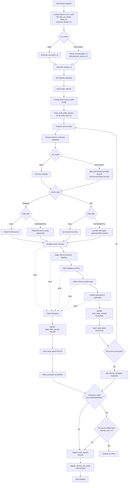

# Master Pipeline - Source-to-Bronze Processing Flow

> **Source of Truth**
>
> This Mermaid diagram is the source of truth for the Source-to-Bronze pipeline execution flow. It supersedes any previous draw.io or image-based diagrams.

## Workflow Diagram



## SQL Queries

### 1. Lookup Pipeline Run Mode

```sql
SELECT
    next_run_mode,
    batch_id,
    session_id
FROM cfg.next_run_mode;
```

**Purpose**
- Determine whether the pipeline runs in `NEW` or `RECOVERY` mode.
- Retrieve the latest `batch_id`.
- Retrieve the previous `session_id` for recovery processing.

### 2. Lookup Active Source Configurations

```sql
SELECT
    s.id,
    s.source_system,
    s.source_type,
    s.source_name,
    s.source_format,
    s.source_location,
    s.load_type,
    s.watermark_column,
    s.source_to_bronze_mapping_path,
    s.bronze_table_name,
    s.load_sequence,
    w.watermark_value
FROM cfg.source_table s
LEFT JOIN cfg.watermark w
    ON s.id = w.source_table_id
WHERE s.is_active = 1
ORDER BY s.load_sequence;
```

**Purpose**
- Retrieve all active source entities.
- Retrieve ingestion configurations and metadata.
- Retrieve watermark values for incremental loading.
- Ensure sources are processed according to `load_sequence`.