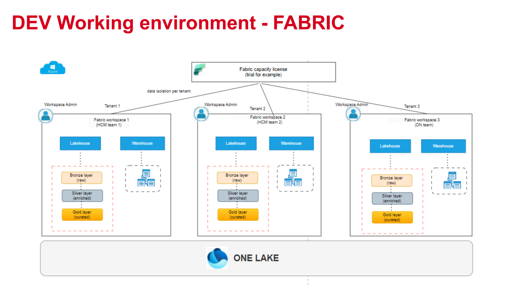

# Design Data Platform & Accessibility

_CarPro Insurance Analytics - Microsoft Fabric / OneLake_

| Field             | Value                                                                  |
| ----------------- | ---------------------------------------------------------------------- |
| Project           | Data Analytics for CarPro Insurance                                    |
| User Story        | Define Analytics Solution Architecture (US-5)                          |
| Task              | Design Data Platform & Accessibility (task-106)                        |
| Capacity          | Fabric trial capacity                                                  |
| Storage Direction | OneLake + Fabric Lakehouse for data layers; Semantic Model for serving |
| Document Version  | v1                                                                     |

**Purpose.** This document defines where data lives, who can access it, and how the design supports recovery from failures within the current DEV-only Fabric setup.

Reference context from the current DEV Fabric working environment:



Figure 1. DEV working environment in Fabric: one trial capacity, team workspaces, Lakehouse, Warehouse, and OneLake concept.

## 3. Proposed Current-State Fabric Design

### 3.1 Workspace and Capacity Topology

| Design Area           | Current Decision                                                         | Reason / Note                                                                       |
| --------------------- | ------------------------------------------------------------------------ | ----------------------------------------------------------------------------------- |
| Workspace topology    | One DEV workspace only: INS-DEV or the current team DEV workspace        | Confirmed that UAT/PROD are not implemented in this sprint.                         |
| Capacity              | Fabric trial capacity                                                    | Sufficient for mock project and sprint delivery, but not production-grade.          |
| Environment isolation | Logical isolation inside DEV using naming conventions and folders/tables | Physical DEV/UAT/PROD separation is deferred.                                       |
| Data platform item    | Fabric Lakehouse on OneLake                                              | Main storage and compute surface for raw, cleaned, and curated Delta data.          |
| Serving item          | Power BI Semantic Model over Gold tables                                 | Business users and dashboards consume curated Gold data through the semantic model. |

Recommended Fabric item naming in DEV:

| Item Type      | Recommended Name                     | Purpose                                                            |
| -------------- | ------------------------------------ | ------------------------------------------------------------------ |
| Workspace      | INS-DEV                              | Team DEV environment for the Insurance Analytics solution          |
| Lakehouse      | lh_insurance_dev                     | Stores Landing, Bronze, Silver, Gold, Audit, and Config data       |
| Data pipelines | pl*insurance*<source>\_ingestion_dev | Ingest source data into Landing/Bronze and call transformations    |
| Notebooks      | nb*<layer>*<entity>\_<purpose>\_dev  | Perform ingestion, transformation, quality checks, and maintenance |
| Semantic model | sm_insurance_gold_dev                | Business-facing serving layer built from Gold tables               |
| Report         | rpt_insurance_operations_dev         | Optional Power BI report connected to the semantic model           |

## 4. OneLake and Lakehouse Storage Convention

**Design principle.** Use one Lakehouse in the DEV workspace. Separate layers by folder/table naming convention. Files are used for raw file landing and archival. Delta tables are used for queryable Bronze, Silver, Gold, Audit, and Config data.

| Zone / Layer          | Recommended Path or Table Convention                                                                                     | Owner / Responsibility                                                                                                             |
| --------------------- | ------------------------------------------------------------------------------------------------------------------------ | ---------------------------------------------------------------------------------------------------------------------------------- |
| Landing files         | /Files/landing/{source_system}/{entity}/file_format={sql\|json}/load_type={full\|incremental}/ingestion_date=YYYY-MM-DD/ | Source-preserved file arrival zone. Stores original SQL or JSON files for ingestion, replay, and troubleshooting.                  |
| Bronze Delta tables   | /Tables/bronze\_{entity}                                                                                                 | Raw-to-Delta ingestion result. Minimal transformation only: metadata columns, schema capture, batch ID.                            |
| Silver Delta tables   | /Tables/silver\_{entity}                                                                                                 | Cleaned and standardized entity-level data. Applies type casting, deduplication, standard status mapping, and basic quality rules. |
| Gold Dimension tables | /Tables/gold*dim*{business_entity}                                                                                       | Conformed dimensions for analytics, e.g., customer, provider, product/package, date.                                               |
| Gold Fact tables      | /Tables/gold*fact*{business_process}                                                                                     | Fact tables at defined grain, e.g., quotation, policy, payment, cancellation.                                                      |
| Audit tables          | /Tables/audit\_{subject}                                                                                                 | Pipeline execution, row counts, quality results, and error records.                                                                |
| Config/control tables | /Tables/cfg\_{subject}                                                                                                   | Pipeline configuration, watermark state, source metadata, and load control.                                                        |
| Serving layer         | Semantic model: sm_insurance_gold_dev                                                                                    | Business-facing model created on Gold tables. Contains relationships, measures, and RLS roles when needed.                         |

Recommended common technical columns for Delta tables:

- `_batch_id`: unique pipeline/load execution identifier.

- `_source_system`: source system or source file group.

- `_source_file_name`: original file name where applicable.

- `_ingested_at`: timestamp when the row was ingested into the platform.

- `_record_hash`: optional hash used for change detection and deduplication.

- `_is_current / _effective_from / _effective_to`: optional SCD tracking fields for Silver/Gold dimensions if required.

Example path convention

Workspace: INS-DEV

Lakehouse: lh_insurance_dev

Files:

/Files/landing/insurance_sql_db/customer/file_format=sql/load_type=full/ingestion_date=2026-05-25/

/Files/landing/insurance_sql_db/quotation/file_format=sql/load_type=full/ingestion_date=2026-05-25/

/Files/landing/policy_system/policy/file_format=json/load_type=full/ingestion_date=2026-05-25/

/Files/landing/policy_system/policy/file_format=json/load_type=incremental/ingestion_date=2026-05-26/

/Files/landing/payment_system/payment/file_format=json/load_type=full/ingestion_date=2026-05-25/

/Files/landing/payment_system/payment/file_format=json/load_type=incremental/ingestion_date=2026-05-26/

/Files/landing/policy_system/cancellation/file_format=json/load_type=full/ingestion_date=2026-05-25/

/Files/landing/policy_system/cancellation/file_format=json/load_type=incremental/ingestion_date=2026-05-26/

## 5. Data Storage Responsibility by Layer

| Layer          | Owns                                                                                                                                          | Does Not Own                                                                                                                               | Example Outputs                                                                                                   |
| -------------- | --------------------------------------------------------------------------------------------------------------------------------------------- | ------------------------------------------------------------------------------------------------------------------------------------------ | ----------------------------------------------------------------------------------------------------------------- |
| Landing        | Incoming source files stored in original format before ingestion into Delta tables.                                                           | Preserve raw source files for ingestion, replay, troubleshooting, and audit tracking. No business transformation is applied in this layer. | SQL extracts and JSON files partitioned by source system, entity, load type, and ingestion date.                  |
| Bronze         | Raw Delta representation of source data with technical metadata. Keeps data traceability and supports replay.                                 | Heavy cleansing, deduplication as business truth, KPI calculation.                                                                         | bronze_customer, bronze_quotation, bronze_policy, bronze_payment, bronze_cancellation.                            |
| Silver         | Cleaned, standardized, and validated entity-level data. Applies type conversion, status normalization, deduplication, and data quality flags. | Aggregated KPI outputs and report-specific measures.                                                                                       | silver_customer, silver_quotation, silver_policy, silver_payment, silver_cancellation.                            |
| Gold           | Business-ready dimensional model and facts at agreed grain. Used by semantic model and reports.                                               | Raw source fields that are not useful for analytics, unresolved invalid records.                                                           | gold_dim_customer, gold_dim_provider, gold_dim_package, gold_fact_quotation, gold_fact_policy, gold_fact_payment. |
| Audit / Config | Execution logs, row counts, error records, quality results, and watermark/control metadata.                                                   | Business report facts unless explicitly designed as monitoring outputs.                                                                    | audit_pipeline_execution, audit_data_quality_result, audit_error_record, cfg_watermark.                           |
| Serving        | Semantic model relationships, business measures, display names, role-based security rules, and report consumption model.                      | Raw ingestion, operational transformation, or data repair logic.                                                                           | sm_insurance_gold_dev, Power BI report.                                                                           |

## 6. Lakehouse vs Warehouse Decision

| Layer / Component | Current Decision                | Rationale                                                                                                               | Trade-off                                                                              |
| ----------------- | ------------------------------- | ----------------------------------------------------------------------------------------------------------------------- | -------------------------------------------------------------------------------------- |
| Landing           | Files in Lakehouse / OneLake    | Best fit for raw files and replayable ingestion.                                                                        | Requires naming discipline because it is file-based.                                   |
| Bronze            | Lakehouse Delta tables          | Supports raw Delta storage and Spark-based ingestion/transformation.                                                    | Not designed as the final business serving interface.                                  |
| Silver            | Lakehouse Delta tables          | Good fit for data engineering transformations and quality checks.                                                       | SQL-only consumers should not query Silver directly as business truth.                 |
| Gold              | Lakehouse Delta tables          | Keeps the project simple and consistent in one DEV Lakehouse; works well with Direct Lake / semantic model consumption. | A Warehouse could provide more SQL-oriented governance later, but adds complexity now. |
| Serving           | Power BI Semantic Model on Gold | Provides business-friendly relationships, measures, and optional RLS. Avoids direct raw table exposure.                 | Semantic model must be maintained when Gold schema changes.                            |
| Warehouse         | Not used in current sprint      | PO context and sprint scope favor Lakehouse-only design.                                                                | May be reconsidered for production-grade SQL serving or stricter SQL permissions.      |

## 7. Delta Table Maintenance Strategy

**Goal.** Control small files, improve query performance, and clean obsolete Delta files without breaking recovery or time travel. In DEV, these schedules are lightweight recommendations and can be executed manually or through a Fabric pipeline/notebook maintenance job.

| Layer          | OPTIMIZE Schedule                                   | VACUUM Schedule                             | Retention Recommendation                            | Reason                                                                  |
| -------------- | --------------------------------------------------- | ------------------------------------------- | --------------------------------------------------- | ----------------------------------------------------------------------- |
| Bronze         | Weekly, or after a large full load                  | Monthly                                     | Keep at least 30 days                               | Bronze is the replay and traceability layer, so keep longer history.    |
| Silver         | Weekly; optionally after major transformation loads | Every 2 weeks                               | Keep at least 14 days                               | Silver is cleaned data and may need rollback during data quality fixes. |
| Gold           | After each major refresh or weekly                  | Weekly or every 2 weeks                     | Keep at least 7-14 days                             | Gold is query-facing, so performance matters more.                      |
| Audit / Config | Not required unless tables become large             | Do not aggressively vacuum; archive instead | Keep at least 90 days for audit logs where possible | Audit records support monitoring, troubleshooting, and review evidence. |

**Important retention note.** Do not use VACUUM retention shorter than seven days unless the Tech Lead explicitly approves and concurrent workloads are controlled. Short retention reduces Delta recovery/time-travel capability and can impact readers/writers.

Example maintenance commands to be executed from Fabric notebook/Spark context

```sql
OPTIMIZE bronze_policy;
VACUUM bronze_policy RETAIN 720 HOURS;  -- 30 days

OPTIMIZE silver_policy;
VACUUM silver_policy RETAIN 336 HOURS;  -- 14 days

OPTIMIZE gold_fact_policy;
VACUUM gold_fact_policy RETAIN 168 HOURS;  -- 7 days
```

## 8. Data Accessibility Model

**Current DEV assumption.** All team members may have equal access in the DEV workspace because this is a mock project. This should be explicitly documented as a DEV-only assumption, not a production security model.

| Role / User Group                   | Current DEV Access                                | Allowed Usage                                                                        | Restriction / Note                                                                                     |
| ----------------------------------- | ------------------------------------------------- | ------------------------------------------------------------------------------------ | ------------------------------------------------------------------------------------------------------ |
| Workspace Admin / Tech Lead         | Admin or Member                                   | Manage workspace, review architecture, approve design, troubleshoot access.          | Should be limited to Tech Lead / PO-approved admins.                                                   |
| Data Engineers / Team Members       | Member or Contributor                             | Build pipelines, notebooks, Lakehouse tables, and transformation logic.              | Equal DEV access is acceptable for sprint delivery; avoid direct changes without PR/review discipline. |
| Data Transformation & Quality Owner | Contributor / Member                              | Work mainly on Silver, quality checks, audit/error tables.                           | Should align with layer responsibility and not put business measures in Silver.                        |
| Architecture Diagram Owner          | Viewer / Contributor as needed                    | Read design and align diagram with workspace, Lakehouse, layers, audit, and serving. | Needs enough access to validate items but not necessarily edit all notebooks.                          |
| PO / PM / Reviewer                  | Viewer or access through exported document/report | Review design, assumptions, and final outputs.                                       | Should not need raw table edit access.                                                                 |
| Future Business / Embedded Users    | Access through Semantic Model / Report only       | Consume business-ready Gold metrics and dashboards.                                  | No direct Bronze/Silver access. RLS may apply later.                                                   |

## 9. Table-Level and Row-Level Access Approach

| Access Level           | Current DEV Decision                                                               | When to Use                                                                                           | Example                                                                                           |
| ---------------------- | ---------------------------------------------------------------------------------- | ----------------------------------------------------------------------------------------------------- | ------------------------------------------------------------------------------------------------- |
| Workspace-level access | Primary control in current DEV setup                                               | Use for team collaboration in the single DEV workspace.                                               | Team members can access INS-DEV.                                                                  |
| Item-level access      | Recommended when reviewers need access to report/model but not engineering objects | Use for PO/PM/report reviewers.                                                                       | Share semantic model/report without giving edit access to Lakehouse.                              |
| Table-level access     | Documented as target control, but may not be strictly enforced in DEV trial        | Use to prevent raw or sensitive tables from being queried by consumers.                               | Business users should query Gold only, not bronze_payment.                                        |
| Row-Level Security     | Not mandatory for current DEV team if everyone has equal access                    | Use later for business/embedded users when data must be filtered by provider, region, agent, or role. | Provider user sees only policies from their provider; regional manager sees only assigned region. |

Recommended RLS candidates for future production/embedded analytics:

- Provider-based RLS: insurance provider users can only see their own quotations, policies, and payments.

- Region-based RLS: regional managers can only see policies/payments for assigned region.

- Agent-based RLS: agents can only see customers/quotations/policies they manage.

- Internal operations role: operations team may see all operational monitoring records but not necessarily all customer-sensitive fields.

## 10. Failure and Recovery Considerations

| Failure Scenario                        | Design Response                                                                                               | Expected Recovery Action                                                              |
| --------------------------------------- | ------------------------------------------------------------------------------------------------------------- | ------------------------------------------------------------------------------------- |
| Bad source file or malformed records    | Keep raw file in Landing/Bronze archive and write invalid records to audit_error_record or quarantine output. | Fix source issue or parsing rule, then reprocess the same batch/file.                 |
| Partial pipeline failure                | Use batch ID, audit_pipeline_execution status, and row counts to detect incomplete loads.                     | Rerun failed step for the same batch after cleanup or idempotent MERGE logic.         |
| Duplicate incremental records           | Use business key + record hash + batch ID to deduplicate in Silver or during MERGE.                           | Reprocess affected entity and verify row counts.                                      |
| Wrong transformation logic              | Bronze remains unchanged; Silver/Gold can be rebuilt from Bronze.                                             | Fix notebook/transformation rule and rebuild Silver/Gold for impacted dates/entities. |
| Wrong Gold KPI or dimensional mapping   | Gold is derived from Silver; semantic model consumes Gold only.                                               | Fix Gold logic, refresh semantic model, and validate KPI numbers.                     |
| Accidental table overwrite              | Use Delta history/time travel where available and avoid aggressive VACUUM.                                    | Restore/rebuild table from previous Delta version or rebuild from upstream layer.     |
| Watermark error                         | Store watermark in cfg_watermark and update it only after successful load.                                    | Reset watermark to the last successful point and rerun incremental load.              |
| Trial capacity limitation or throttling | Keep maintenance lightweight and avoid unnecessary large refreshes.                                           | Run heavy jobs outside peak team usage or split workloads by entity.                  |

**Recovery design principle.** Bronze should be replayable, Silver should be rebuildable from Bronze, Gold should be rebuildable from Silver, and Serving should be refreshable from Gold. This keeps failures contained and makes data repair traceable.

## 11. Architecture Design Records

### ADR-001: Use one DEV Fabric workspace for the current project

| Field      | Content                                                                                                                                                                                 |
| ---------- | --------------------------------------------------------------------------------------------------------------------------------------------------------------------------------------- |
| Status     | Accepted for current project                                                                                                                                                            |
| Context    | The original acceptance criteria mentioned DEV/UAT/PROD, but PO confirmed that the team currently uses only one DEV workspace in Fabric.                                                |
| Decision   | Use one DEV workspace named INS-DEV or the current team DEV workspace. Record UAT/PROD separation as a future production design.                                                        |
| Rationale  | Matches the actual project setup, avoids documenting an environment that does not exist, and keeps the sprint deliverable realistic.                                                    |
| Trade-offs | Less environment isolation and no production-like promotion flow in the current sprint. Risks are mitigated through naming conventions, review discipline, and clear DEV-only labeling. |

### ADR-002: Use Lakehouse and OneLake as the storage foundation

| Field      | Content                                                                                                                                     |
| ---------- | ------------------------------------------------------------------------------------------------------------------------------------------- |
| Status     | Accepted                                                                                                                                    |
| Context    | The team needs a simple Medallion design that supports raw, cleaned, and curated data in Fabric.                                            |
| Decision   | Use one Fabric Lakehouse on OneLake for Landing, Bronze, Silver, Gold, Audit, and Config data.                                              |
| Rationale  | Lakehouse fits Spark-based ingestion/transformation and keeps all data layers in one consistent storage pattern.                            |
| Trade-offs | A separate Warehouse may provide a more SQL-centric serving layer later, but it adds complexity and is not required for the current sprint. |

### ADR-003: Use Semantic Model as the serving layer

| Field      | Content                                                                                                                                                 |
| ---------- | ------------------------------------------------------------------------------------------------------------------------------------------------------- |
| Status     | Accepted                                                                                                                                                |
| Context    | Business users and reports should not consume raw Bronze or intermediate Silver tables directly.                                                        |
| Decision   | Build the serving layer as a Power BI Semantic Model over Gold tables.                                                                                  |
| Rationale  | The semantic model provides relationships, measures, display names, and future RLS roles while keeping report consumption focused on curated Gold data. |
| Trade-offs | Semantic model changes must be managed when Gold schema changes. It also requires coordination with report owners.                                      |

### ADR-004: Define scheduled Delta table maintenance by layer

| Field      | Content                                                                                                                                           |
| ---------- | ------------------------------------------------------------------------------------------------------------------------------------------------- |
| Status     | Accepted                                                                                                                                          |
| Context    | Delta tables may accumulate small files and obsolete versions during ingestion and transformations.                                               |
| Decision   | Run OPTIMIZE and VACUUM on a layer-specific schedule: Bronze less aggressive, Silver moderate, Gold more performance-focused.                     |
| Rationale  | This balances performance, storage cleanup, and recovery ability.                                                                                 |
| Trade-offs | Aggressive VACUUM reduces time-travel/recovery capability. Therefore, retention should not be shorter than seven days unless explicitly approved. |

### ADR-005: Use equal team access in DEV but document future restrictions

| Field      | Content                                                                                                                                                                                          |
| ---------- | ------------------------------------------------------------------------------------------------------------------------------------------------------------------------------------------------ |
| Status     | Accepted for DEV only                                                                                                                                                                            |
| Context    | The current project is a mock DEV environment and all team members may need access to build and review quickly.                                                                                  |
| Decision   | Allow equal team access in DEV, but clearly document that Bronze/Silver are engineering-facing and Gold/Semantic Model are consumption-facing. Future production should restrict access by role. |
| Rationale  | This supports collaboration and sprint velocity while still showing security awareness for PO/Tech Lead review.                                                                                  |
| Trade-offs | DEV access is broader than production should be. Risk is mitigated by documentation, PR review, and avoiding sensitive production data in the trial environment.                                 |

## 15. References

- - [Microsoft Fabric - Medallion Lakehouse Architecture](https://learn.microsoft.com/en-us/fabric/onelake/onelake-medallion-lakehouse-architecture)

- - [Microsoft Fabric - Permission Model](https://learn.microsoft.com/en-us/fabric/security/permission-model)

- - [Microsoft Fabric - OneLake Security Access Control Model](https://learn.microsoft.com/en-us/fabric/onelake/security/data-access-control-model)

- - [Microsoft Fabric - Run Delta Table Maintenance in Lakehouse](https://learn.microsoft.com/en-us/fabric/data-engineering/lakehouse-table-maintenance)

- - [Microsoft Fabric - Cross-Workload Table Maintenance and Optimization](https://learn.microsoft.com/en-us/fabric/fundamentals/table-maintenance-optimization)
