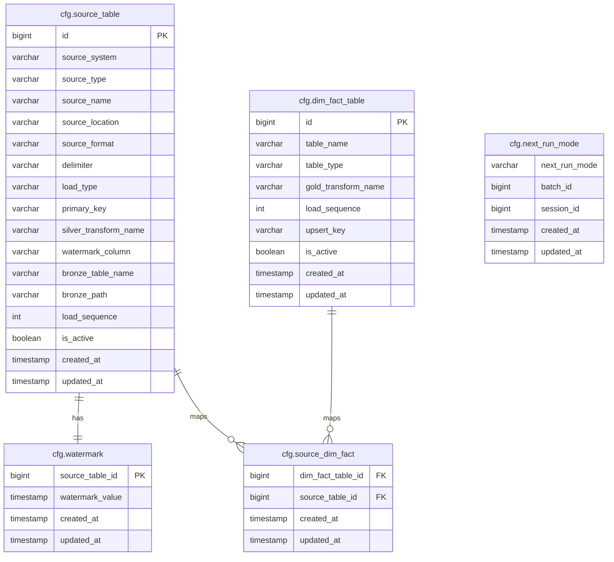
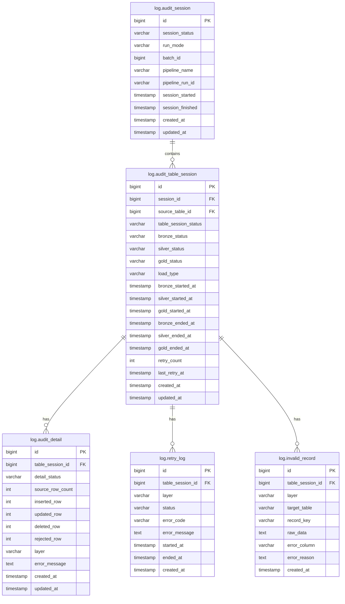

# Data Workflow Control Strategy

## 1. Configuration Tables

Configuration tables store metadata and configuration used to drive pipeline processing.

### 1.1. `cfg.source_table`

**Purpose:** Stores source system configurations used for Bronze ingestion.

| Column | Data Type | Description |
|---|---|---|
| `id` | bigint | Unique identifier of the source configuration |
| `source_system` | varchar(100) | Source system name, such as CRM, Policy System, or Payment System |
| `source_type` | varchar(20) | Source type such as database, file, or API |
| `source_name` | varchar(100) | Source entity name, such as customers, quotations, or policies |
| `source_location` | varchar(255) | Source location such as database table or file path |
| `source_format` | varchar(20) | Source data format, such as table, csv, json, or parquet |
| `delimiter` | varchar(5) | Delimiter used for delimited file formats |
| `load_type` | varchar(20) | Loading strategy, such as full or incremental |
| `primary_key` | varchar(255) | Primary key column(s) used for merge and deduplication |
| `silver_transform_name` | varchar(50) | Custom transformation function applied during Bronze-to-Silver processing |
| `watermark_column` | varchar(100) | Source column used for incremental extraction |
| `bronze_table_name` | varchar(100) | Target Bronze table name |
| `bronze_path` | varchar(255) | Target Bronze storage path |
| `load_sequence` | int | Execution order of source ingestion |
| `is_active` | boolean | Indicates whether the source configuration is active |
| `created_at` | timestamp | Record creation timestamp |
| `updated_at` | timestamp | Last update timestamp |

### 1.2. `cfg.dim_fact_table`

**Purpose:** Stores metadata for Gold layer dimension and fact tables.

| Column | Data Type | Description |
|---|---|---|
| `id` | bigint | Unique identifier of the table configuration |
| `table_name` | varchar(100) | Target dimension or fact table name |
| `table_type` | varchar(20) | Table type, such as dimension or fact |
| `gold_transform_name` | varchar(50) | Custom transformation function applied during Silver-to-Gold processing |
| `load_sequence` | int | Execution order of Gold table processing |
| `upsert_key` | varchar(255) | Key used for merge or upsert operations |
| `is_active` | boolean | Indicates whether the configuration is active |
| `created_at` | timestamp | Record creation timestamp |
| `updated_at` | timestamp | Last update timestamp |

### 1.3. `cfg.watermark`

**Purpose:** Stores the latest source watermark value used for incremental extraction from Source to Bronze.

| Column | Data Type | Description |
|---|---|---|
| `source_table_id` | bigint | Source table configuration identifier |
| `watermark_value` | timestamp | Latest processed source watermark value |
| `created_at` | timestamp | Record creation timestamp |
| `updated_at` | timestamp | Last update timestamp |

### 1.4. `cfg.source_dim_fact`

**Purpose:** Defines the many-to-many relationship between source tables and Gold dimension/fact tables.

| Column | Data Type | Description |
|---|---|---|
| `dim_fact_table_id` | bigint | Gold dimension/fact table configuration identifier |
| `source_table_id` | bigint | Source table configuration identifier |
| `created_at` | timestamp | Record creation timestamp |
| `updated_at` | timestamp | Last update timestamp |

### 1.5. `cfg.next_run_mode`

**Purpose:** Stores the execution mode and context for the next pipeline run, allowing the pipeline to determine whether to start a new batch or continue a recovery run without manual input.

| Column | Data Type | Description |
|---|---|---|
| `next_run_mode` | varchar(20) | Execution mode for the next pipeline run, such as NEW or RECOVERY |
| `batch_id` | bigint | Batch identifier associated with the next pipeline run |
| `session_id` | bigint | Session identifier associated with the next pipeline run |
| `created_at` | timestamp | Record creation timestamp |
| `updated_at` | timestamp | Last update timestamp |
---

## 2. Audit and Logging Tables

Audit and logging tables store pipeline execution status, processing metrics, retry history, and error information for monitoring and recovery.

### 2.1. `log.audit_session`

**Purpose:** Stores execution-level audit information for each pipeline run.

| Column | Data Type | Description |
|---|---|---|
| `id` | bigint | Unique pipeline execution session identifier |
| `session_status` | varchar(20) | Overall pipeline execution status |
| `run_mode` | varchar(20) | Execution mode, such as NEW or RECOVERY |
| `batch_id` | bigint | Logical batch identifier being processed |
| `pipeline_name` | varchar(20) | Pipeline name |
| `pipeline_run_id` | varchar(100) | Pipeline execution identifier generated by the orchestration platform |
| `session_started` | timestamp | Pipeline execution start timestamp |
| `session_finished` | timestamp | Pipeline execution completion timestamp |
| `created_at` | timestamp | Record creation timestamp |
| `updated_at` | timestamp | Last update timestamp |

### 2.2. `log.audit_table_session`

**Purpose:** Stores table-level execution status across Bronze, Silver, and Gold layers.

| Column | Data Type | Description |
|---|---|---|
| `id` | bigint | Unique table execution session identifier |
| `session_id` | bigint | Related audit session identifier |
| `source_table_id` | bigint | Related source table configuration identifier |
| `table_session_status` | varchar(20) | Overall processing status of the table |
| `bronze_status` | varchar(20) | Bronze layer processing status |
| `silver_status` | varchar(20) | Silver layer processing status |
| `gold_status` | varchar(20) | Gold layer processing status |
| `load_type` | varchar(20) | Load strategy used during processing |
| `bronze_started_at` | timestamp | Bronze processing start timestamp |
| `silver_started_at` | timestamp | Silver processing start timestamp |
| `gold_started_at` | timestamp | Gold processing start timestamp |
| `bronze_ended_at` | timestamp | Bronze processing completion timestamp |
| `silver_ended_at` | timestamp | Silver processing completion timestamp |
| `gold_ended_at` | timestamp | Gold processing completion timestamp |
| `retry_count` | int | Number of retry attempts |
| `last_retry_at` | timestamp | Timestamp of the latest retry attempt |
| `created_at` | timestamp | Record creation timestamp |
| `updated_at` | timestamp | Last update timestamp |

### 2.3. `log.audit_detail`

**Purpose:** Stores processing metrics and execution details for each table and layer.

| Column | Data Type | Description |
|---|---|---|
| `id` | bigint | Unique audit detail identifier |
| `table_session_id` | bigint | Related table execution session identifier |
| `detail_status` | varchar(20) | Processing detail status |
| `source_row_count` | int | Number of records extracted from the source |
| `inserted_row` | int | Number of inserted records |
| `updated_row` | int | Number of updated records |
| `deleted_row` | int | Number of deleted records |
| `rejected_row` | int | Number of rejected records |
| `layer` | varchar(20) | Processing layer, such as Bronze, Silver, or Gold |
| `error_message` | text | Error message if processing failed |
| `created_at` | timestamp | Record creation timestamp |
| `updated_at` | timestamp | Last update timestamp |

### 2.4. `log.retry_log`

**Purpose:** Stores retry execution history for failed processing attempts.

| Column | Data Type | Description |
|---|---|---|
| `id` | bigint | Unique retry log identifier |
| `table_session_id` | bigint | Related table execution session identifier |
| `layer` | varchar(20) | Layer where retry occurred |
| `status` | varchar(20) | Retry execution status |
| `error_code` | varchar(100) | Error code returned by the failed operation |
| `error_message` | text | Error details captured during retry |
| `started_at` | timestamp | Retry start timestamp |
| `ended_at` | timestamp | Retry completion timestamp |
| `created_at` | timestamp | Record creation timestamp |

### 2.5. `log.invalid_record`

**Purpose:** Stores records that fail validation or transformation rules during processing.

| Column | Data Type | Description |
|---|---|---|
| `id` | bigint | Unique invalid record identifier |
| `table_session_id` | bigint | Related table execution session identifier |
| `layer` | varchar(20) | Layer where the validation failure occurred |
| `target_table` | varchar(100) | Target table associated with the failed record |
| `record_key` | varchar(255) | Business key or primary key of the failed record |
| `raw_data` | text | Original record content |
| `error_column` | varchar(100) | Column that failed validation |
| `error_reason` | text | Validation or processing error description |
| `created_at` | timestamp | Record creation timestamp |

---

## 3. Incremental Load Strategy

### Source to Bronze

- Read source records where `watermark_column > watermark_value`.
- Assign `_batch_id` to all records loaded into Bronze.
- After Bronze succeeds, update `watermark_value = MAX(source.watermark_column)`.

### Bronze to Silver

- Read Bronze records by `_batch_id`.
- Write valid records into Silver with the same `_batch_id`.

### Silver to Gold

- Read Silver records by `_batch_id`.
- Write Gold records with the same `_batch_id`.

---

## 4. Retry Rules

Retry is used for short-lived transient system errors, not for data errors.

System errors include timeout, temporary connection failure, Spark execution failure, or storage write failure.

Data errors such as invalid format, null key, or failed validation are captured in `log.invalid_record` and are not retried.

Retry is handled within the same `session_id` and `batch_id`.

Each retry attempt is logged in `log.retry_log`.

If the system error persists beyond the configured retry limit, recovery is required.

If all retry attempts fail, the related table/layer is marked as `FAILED` in `log.audit_table_session`.

---

## 5. Recovery Rules

Recovery is used to resume processing after a failed execution once the underlying issue has been resolved.

A recovery run creates a new `session_id` and reuses the same `batch_id`.

The recovery context (`batch_id` and `session_id`) is obtained from `cfg.next_run_mode`.

All recovery executions associated with the same failed batch must reuse the same `batch_id` until the batch is completed successfully.

The pipeline may be rerun from the beginning, but completed layers are skipped based on audit status so recovery resumes from the first failed layer.

A layer is considered successful only when all required tables within that layer are successfully processed.

After a batch is successfully completed, `cfg.next_run_mode` is updated to `NEW`.

A new batch must not be started until the failed batch has been successfully recovered.

### Example Recovery Flow

| batch_id | audit_session_id | run_mode | Bronze | Silver | Gold | Notes |
|---:|---:|---|---|---|---|---|
| 5002 | 1001 | NEW | FAILED | NOT_RUN | NOT_RUN | Bronze failed. Recovery required. |
| 5002 | 1002 | RECOVERY | SUCCESS | FAILED | NOT_RUN | Bronze completed successfully. Silver failed. |
| 5002 | 1003 | RECOVERY | SKIPPED | SUCCESS | FAILED | Recovery resumes from Silver. Gold failed. |
| 5002 | 1004 | RECOVERY | SKIPPED | SKIPPED | SUCCESS | Recovery resumes from Gold. Batch completed successfully. |

---

## Note

> - This document presents the proposed design and processing strategy based on the current understanding of requirements and assumptions. The design has not yet been implemented and may be refined during the implementation phase.
