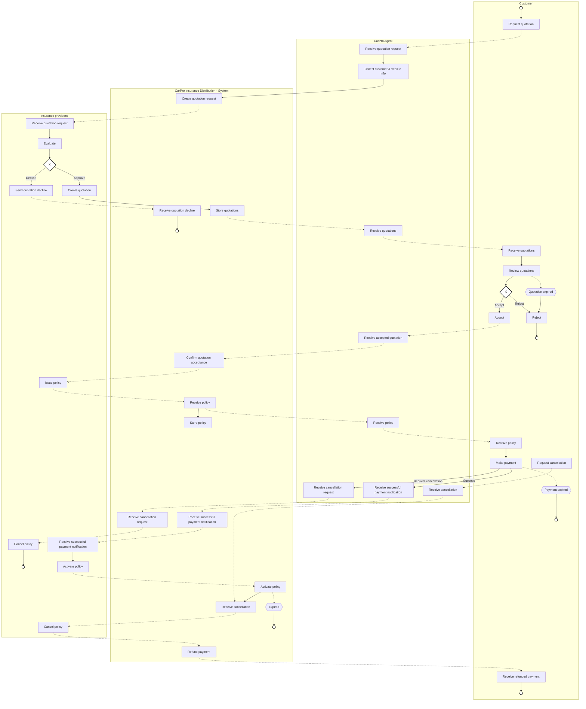

```mermaid
flowchart TB
    %% ------------------------------------
    %% LANES DEFINITION
    %% ------------------------------------
    subgraph Customer [Customer]
        C_Start(( )) --> C_ReqQuote[Request quotation]
        C_RecvQuote[Receive quotations] --> C_RevQuote[Review quotations]
        C_RevQuote --> C_Gate{X}
        C_Gate -->|Accept| C_Accept[Accept]
        C_Gate -->|Reject| C_Reject[Reject] --> C_End1(( ))
        
        C_Timer1{{Quotation expired}} --> C_Reject
        
        C_RecvPolicy[Receive policy] --> C_MakePay[Make payment]
        C_Timer2{{Payment expired}} --> C_End2(( ))
        
        C_ReqCancel[Request cancellation]
        C_RecvRefund[Receive refunded payment] --> C_End3(( ))
    end

    subgraph Agent [CarPro Agent]
        A_RecvQuote[Receive quotation request] --> A_Collect[Collect customer & vehicle info]
        A_RecvQuote2[Receive quotations]
        A_RecvAccQuote[Receive accepted quotation]
        A_RecvPolicy[Receive policy]
        A_RecvCancel[Receive cancellation request]
        A_RecvPayNoti[Receive successful payment notification]
        A_RecvCancel2[Receive cancellation]
    end

    subgraph System [CarPro Insurance Distribution - System]
        S_CreateQuoteReq[Create quotation request]
        S_RecvDecline[Receive quotation decline] --> S_EndDecline(( ))
        S_StoreQuote[Store quotations]
        S_ConfirmAcc[Confirm quotation acceptance]
        S_RecvPolicy[Receive policy] --> S_StorePolicy[Store policy]
        S_RecvCancel[Receive cancellation request]
        S_RecvPayNoti[Receive successful payment notification]
        S_Timer3{{Expired}} --> S_EndExpired(( ))
        S_ActPolicy[Activate policy]
        S_RecvCancel2[Receive cancellation]
        S_Refund[Refund payment]
    end

    subgraph Insurance_Providers [Insurance providers]
        P_RecvQuote[Receive quotation request] --> P_Eval[Evaluate]
        P_Eval --> P_Gate{X}
        P_Gate -->|Decline| P_SendDecline[Send quotation decline]
        P_Gate -->|Approve| P_CreateQuote[Create quotation]
        
        P_IssuePolicy[Issue policy]
        P_CancelPolicy[Cancel policy] --> P_EndCancel(( ))
        P_RecvPayNoti[Receive successful payment notification] --> P_ActPolicy[Activate policy]
        P_CancelPolicy2[Cancel policy]
    end

    %% ------------------------------------
    %% INTER-LANE FLOWS (INTERACTION / MESSAGE)
    %% ------------------------------------
    %% Phase 1: Request & Quote
    C_ReqQuote -.-> A_RecvQuote
    A_Collect --> S_CreateQuoteReq
    S_CreateQuoteReq -.-> P_RecvQuote
    
    P_SendDecline -.-> S_RecvDecline
    P_CreateQuote --> S_StoreQuote
    S_StoreQuote -.-> A_RecvQuote2
    A_RecvQuote2 -.-> C_RecvQuote
    C_RevQuote -.-> C_Timer1
    
    %% Phase 2: Acceptance & Policy Issuance
    C_Accept -.-> A_RecvAccQuote
    A_RecvAccQuote -.-> S_ConfirmAcc
    S_ConfirmAcc -.-> P_IssuePolicy
    
    P_IssuePolicy -.-> S_RecvPolicy
    S_RecvPolicy -.-> A_RecvPolicy
    A_RecvPolicy -.-> C_RecvPolicy
    
    %% Phase 3: Payment & Activation
    C_MakePay -.-> C_Timer2
    C_MakePay -- Success --> A_RecvPayNoti
    C_MakePay -- Request cancellation --> A_RecvCancel
    
    A_RecvCancel -.-> S_RecvCancel
    S_RecvCancel -.-> P_CancelPolicy
    
    A_RecvPayNoti -.-> S_RecvPayNoti
    S_RecvPayNoti -.-> P_RecvPayNoti
    
    P_ActPolicy -.-> S_ActPolicy
    S_ActPolicy -.-> S_Timer3
    
    %% Phase 4: Post-Activation Cancellation
    C_ReqCancel -.-> A_RecvCancel2
    A_RecvCancel2 -.-> S_RecvCancel2
    S_RecvCancel2 -.-> P_CancelPolicy2
    S_ActPolicy --> S_RecvCancel2
    
    P_CancelPolicy2 -.-> S_Refund
    S_Refund -.-> C_RecvRefund

    %% Styling to match BPMN look
    classDef startEnd fill:#fff,stroke:#000,stroke-width:2px;
    classDef gateway fill:#fff,stroke:#000,stroke-width:2px;
    class C_Start,C_End1,C_End2,C_End3,S_EndDecline,S_EndExpired,P_EndCancel startEnd;
    class C_Gate,P_Gate gateway;
```