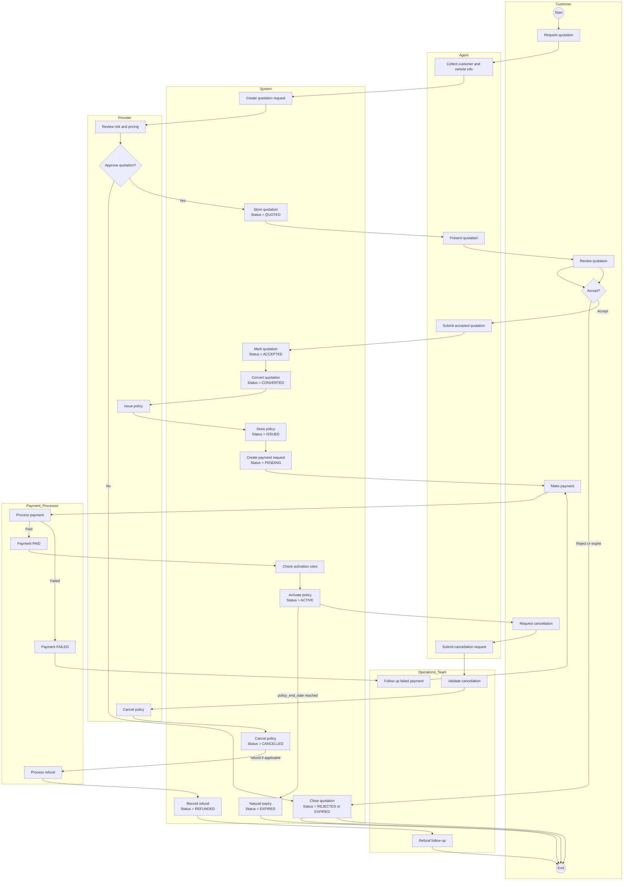

```mermaid
flowchart TB
     subgraph Customer
         C0((Start)) --> C1[Request quotation]
         C2[Review quotation] --> C3{Accept?}
         C4[Make payment]
         C5[Request cancellation]
         CEnd((End))
     end

     subgraph Agent
         A1[Collect customer and vehicle info]
         A2[Present quotation]
         A3[Submit accepted quotation]
         A4[Submit cancellation request]
     end

     subgraph System
         S1[Create quotation request]
         S2[Store quotation<br/>Status = QUOTED]
         S3[Mark quotation<br/>Status = ACCEPTED]
         S4[Convert quotation<br/>Status = CONVERTED]
         S5[Store policy<br/>Status = ISSUED]
         S6[Create payment request<br/>Status = PENDING]
         S7[Check activation rules]
         S8[Activate policy<br/>Status = ACTIVE]
         S9[Natural expiry<br/>Status = EXPIRED]
         S10[Cancel policy<br/>Status = CANCELLED]
         S11[Record refund<br/>Status = REFUNDED]
         SReject[Close quotation<br/>Status = REJECTED or EXPIRED]
     end

     subgraph Provider
         P1[Review risk and pricing]
         P2{Approve quotation?}
         P3[Issue policy]
         P4[Cancel policy]
     end

     subgraph Payment_Processor
         PP1[Process payment]
         PP2[Payment PAID]
         PP3[Payment FAILED]
         PP4[Process refund]
     end

     subgraph Operations_Team
         O1[Follow up failed payment]
         O2[Validate cancellation]
         O3[Refund follow-up]
     end

     %% --- Main Flow ---
     C1 --> A1 --> S1 --> P1 --> P2
     P2 -- No --> SReject --> CEnd
     P2 -- Yes --> S2 --> A2 --> C2 --> C3
     
     C3 -- Reject or expire --> SReject --> CEnd
     C3 -- Accept --> A3 --> S3 --> S4 --> P3 --> S5 --> S6
     
     %% --- Payment Lifecycle Connection ---
     S6 --> C4
     C4 --> PP1
     
     PP1 -- Paid --> PP2 --> S7 --> S8
     
     %% --- Failed Payment & Retry ---
     PP1 -- Failed --> PP3 --> O1 --> C4
     
     %% --- Post-Active Lifecycle ---
     S8 -- policy_end_date reached --> S9 --> CEnd
     S8 --> C5 --> A4 --> O2 --> P4 --> S10
     S10 -- refund if applicable --> PP4 --> S11 --> O3 --> CEnd
```