# Gold Layer Logical Schema

## Technical Metadata Mapping

| Implementation Field | Baseline Field |
|---------------------|----------------|
| _source_system | source_system |
| _batch_id | batch_id |

**Note:**  
>`_source_system` and `_batch_id` are implementation field names corresponding to the baseline metadata fields `source_system` and `batch_id`.

> **Pipeline-derived fields**
>
> `is_deleted`, `deleted_at`, and `delete_batch_id` are pipeline-derived fields and are not sourced from the source systems.
> For pipelines without CDC or delete detection, `is_deleted` defaults to `false` on load; `deleted_at` and `delete_batch_id` remain `null` until a delete event is detected.
>
> `pipeline_run_id` is a pipeline-derived lineage field. It maps to `log.audit_session.pipeline_run_id`, which stores the execution identifier generated by the orchestration platform for each pipeline run.

```mermaid
erDiagram
    dim_date {
        int date_key PK
        date full_date
        int day_number
        string day_name
        int week_number
        int month_number
        string month_name
        int quarter_number
        int year_number
        string year_month
        boolean is_weekend
    }

    dim_customer {
        bigint customer_key PK
        string customer_id
        string full_name
        string gender
        date dob
        string phone_number
        string email
        string city
        string district
        timestamp effective_from
        timestamp effective_to
        boolean is_current
        timestamp created_at
        timestamp updated_at
    }

    dim_agent {
        bigint agent_key PK
        string agent_id
        string agent_name
        string region
        string branch
        string manager_name
        timestamp effective_from
        timestamp effective_to
        boolean is_current
        timestamp created_at
        timestamp updated_at
    }

    dim_provider {
        bigint provider_key PK
        string provider_code
        string provider_name
        string provider_group
        int active_flag
        timestamp effective_from
        timestamp effective_to
        boolean is_current
        timestamp created_at
        timestamp updated_at
    }

    dim_package {
        bigint package_key PK
        string package_code
        timestamp created_at
        timestamp updated_at
    }

    dim_coverage {
        bigint coverage_key PK
        string coverage_type
        timestamp created_at
        timestamp updated_at
    }

    dim_quotation {
        bigint quotation_key PK
        string quotation_id
        date quotation_expiry_date
        timestamp created_at
        timestamp updated_at
    }

    dim_policy {
        bigint policy_key PK
        string policy_id
        timestamp created_at
        timestamp updated_at
    }

    dim_quotation_status {
        bigint quotation_status_key PK
        string quotation_status_code
        timestamp created_at
        timestamp updated_at
    }

    dim_policy_status {
        bigint policy_status_key PK
        string policy_status_code
        timestamp created_at
        timestamp updated_at
    }

    dim_payment_status {
        bigint payment_status_key PK
        string payment_status_code
        timestamp created_at
        timestamp updated_at
    }

    dim_payment_method {
        bigint payment_method_key PK
        string payment_method_code
        timestamp created_at
        timestamp updated_at
    }

    dim_cancellation_reason {
        bigint cancellation_reason_key PK
        string cancellation_reason
        timestamp created_at
        timestamp updated_at
    }

    dim_vehicle {
        bigint vehicle_key PK
        string vehicle_id
        string customer_id
        string plate_number
        string vehicle_brand
        string vehicle_model
        int manufacture_year
        decimal vehicle_value
        timestamp effective_from
        timestamp effective_to
        boolean is_current
        timestamp created_at
        timestamp updated_at
    }

    %% ========================================
    %% FACT TABLES
    %% ========================================

    fact_quotation {
        bigint quotation_key FK
        int quotation_date_key FK
        int quotation_expiry_date_key FK
        bigint customer_key FK
        bigint agent_key FK
        bigint provider_key FK
        bigint package_key FK
        bigint quotation_status_key FK
        bigint vehicle_key FK
        decimal premium_amount

        string quotation_id
        string customer_id
        string agent_id
        string provider_code

        string _source_system
        timestamp created_at
        timestamp updated_at

        string _batch_id
        string pipeline_run_id

        boolean is_deleted
        timestamp deleted_at
        string delete_batch_id
        boolean converted_flag
    }

    fact_quotation_item {
        bigint quotation_key FK
        int quotation_date_key FK
        bigint customer_key FK
        bigint agent_key FK
        bigint provider_key FK
        bigint package_key FK
        bigint coverage_key FK
        bigint quotation_status_key FK
        bigint vehicle_key FK
        decimal coverage_amount
        decimal deductible_amount

        string quotation_item_id
        string quotation_id

        string _source_system
        timestamp created_at
        timestamp updated_at

        string _batch_id
        string pipeline_run_id

        boolean is_deleted
        timestamp deleted_at
        string delete_batch_id
    }

    fact_policy {
        bigint policy_key FK
        bigint quotation_key FK
        int issued_date_key FK
        int policy_start_date_key FK
        int policy_end_date_key FK
        bigint customer_key FK
        bigint agent_key FK
        bigint provider_key FK
        bigint package_key FK
        bigint policy_status_key FK
        bigint vehicle_key FK
        decimal premium_amount

        string policy_id
        string policy_number
        string quotation_id
        string customer_id
        string provider_code

        string _source_system
        timestamp created_at
        timestamp updated_at

        string _batch_id
        string pipeline_run_id

        boolean is_deleted
        timestamp deleted_at
        string delete_batch_id
    }

    fact_payment {
        bigint policy_key FK
        int payment_date_key FK
        bigint customer_key FK
        bigint provider_key FK
        bigint payment_status_key FK
        bigint payment_method_key FK
        bigint vehicle_key FK
        decimal payment_amount

        string payment_id
        string policy_id
        string transaction_reference

        string _source_system
        timestamp created_at
        timestamp updated_at

        string _batch_id
        string pipeline_run_id

        boolean is_deleted
        timestamp deleted_at
        string delete_batch_id
    }

    fact_cancellation {
        bigint policy_key FK
        int cancellation_date_key FK
        bigint customer_key FK
        bigint provider_key FK
        bigint cancellation_reason_key FK
        bigint vehicle_key FK
        decimal refund_amount

        string cancellation_id
        string policy_id

        string _source_system
        timestamp created_at
        timestamp updated_at

        string _batch_id
        string pipeline_run_id

        boolean is_deleted
        timestamp deleted_at
        string delete_batch_id
    }

    %% ========================================
    %% RELATIONSHIPS (1:N)
    %% ========================================

    dim_date ||--o{ fact_quotation : "quotation_date"
    dim_date ||--o{ fact_quotation : "quotation_expiry_date"
    dim_date ||--o{ fact_quotation_item : "quotation_date"
    dim_date ||--o{ fact_policy : "issued_date"
    dim_date ||--o{ fact_policy : "policy_start_date"
    dim_date ||--o{ fact_policy : "policy_end_date"
    dim_date ||--o{ fact_payment : "payment_date"
    dim_date ||--o{ fact_cancellation : "cancellation_date"

    dim_customer ||--o{ fact_quotation : "quotation.customer_id"
    dim_customer ||--o{ fact_quotation_item : "quotation_item.quotation_id -> quotation.customer_id"
    dim_customer ||--o{ fact_policy : "policy_info.customer_id"
    dim_customer ||--o{ fact_payment : "payment.policy_id -> policy_info.customer_id"
    dim_customer ||--o{ fact_cancellation : "cancellation.policy_id -> policy_info.customer_id"

    dim_agent ||--o{ fact_quotation : "quotation.agent_id"
    dim_agent ||--o{ fact_quotation_item : "quotation_item.quotation_id -> quotation.agent_id"
    dim_agent ||--o{ fact_policy : "policy_info.quotation_id -> quotation.agent_id"

    dim_provider ||--o{ fact_quotation : "quotation.provider_code"
    dim_provider ||--o{ fact_quotation_item : "quotation_item.quotation_id -> quotation.provider_code"
    dim_provider ||--o{ fact_policy : "policy_info.provider_code"
    dim_provider ||--o{ fact_payment : "payment.policy_id -> policy_info.provider_code"
    dim_provider ||--o{ fact_cancellation : "cancellation.policy_id -> policy_info.provider_code" 

    dim_package ||--o{ fact_quotation : "quotation.package_code"
    dim_package ||--o{ fact_quotation_item : "quotation_item.quotation_id -> quotation.package_code"
    dim_package ||--o{ fact_policy : "policy_info.quotation_id -> quotation.package_code"

    dim_coverage ||--o{ fact_quotation_item : "quotation_item.coverage_type"
    
    dim_quotation ||--o{ fact_quotation : "quotation.quotation_id"
    dim_quotation ||--o{ fact_quotation_item : "quotation_item.quotation_id"
    dim_quotation ||--o{ fact_policy : "policy_info.quotation_id"

    dim_policy ||--o{ fact_policy : "policy_info.policy_id"
    dim_policy ||--o{ fact_payment : "payment.policy_id"
    dim_policy ||--o{ fact_cancellation : "cancellation.policy_id"

    dim_quotation_status ||--o{ fact_quotation : "quotation.quotation_status"
    dim_quotation_status ||--o{ fact_quotation_item : "quotation_item.quotation_id -> quotation.quotation_status"

    dim_policy_status ||--o{ fact_policy : "policy_info.policy_status"

    dim_payment_status ||--o{ fact_payment : "payment.payment_status"

    dim_payment_method ||--o{ fact_payment : "payment.payment_method"

    dim_cancellation_reason ||--o{ fact_cancellation : "cancellation.cancellation_reason"

    dim_vehicle ||--o{ fact_quotation : "quotation.customer_id -> vehicle.customer_id -> dim_vehicle.vehicle_key"
    dim_vehicle ||--o{ fact_quotation_item : "quotation_item.quotation_id -> quotation.customer_id -> vehicle.customer_id -> dim_vehicle.vehicle_key"
    dim_vehicle ||--o{ fact_policy : "policy_info.customer_id -> vehicle.customer_id -> dim_vehicle.vehicle_key"
    dim_vehicle ||--o{ fact_payment : "payment.policy_id -> policy_info.customer_id -> vehicle.customer_id -> dim_vehicle.vehicle_key"
    dim_vehicle ||--o{ fact_cancellation : "cancellation.policy_id -> policy_info.customer_id -> vehicle.customer_id -> dim_vehicle.vehicle_key"
```

