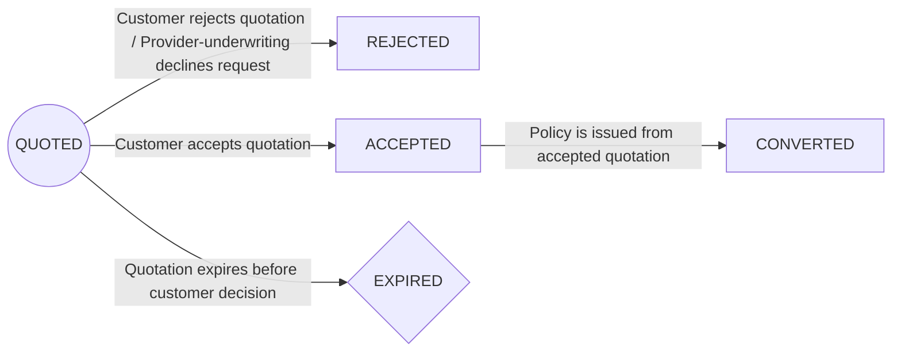
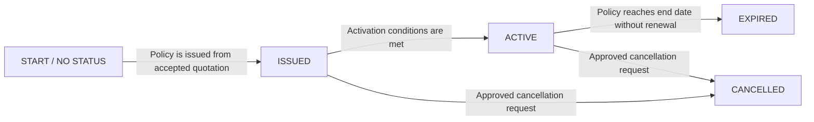
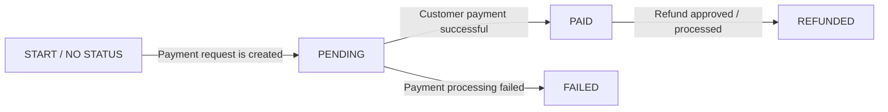
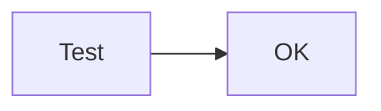

# CarPro Insurance - Business Process Documentation

## Documentation Approach

The documentation stands on three independent foundations: business context from the project PDF, actual source data structure from the SQL file, agreed business rules from the team discussion, and the updated BPMN business process diagram.

- Use business actors and business actions first.

- Avoid low-level database-only actions in the BPMN diagram. Business-level recording checkpoints, such as storing quotations or issued policy information, may appear when they represent meaningful process milestones.

- Keep database relationships in a separate source-data mapping section.

- Separate the core purchase process from later policy lifecycle events when the diagram becomes too crowded.

## Source Context and Boundaries

The PDF describes CarPro as an insurance aggregation business that partners with multiple insurance providers. Customers can request insurance quotations through agents. Multiple quotations may be generated for different packages and providers. The updated BPMN flow uses four main participants: Customer, CarPro Agent, CarPro System, and Insurance Providers. The project also tracks quotation, policy, payment, cancellation, and refund operations for reporting.

### Source tables used for traceability

| **Source area**  | **Tables**                                                                 | **Business meaning**                                                                                     |
| ---------------- | -------------------------------------------------------------------------- | -------------------------------------------------------------------------------------------------------- |
| CRM / Quotation  | customers, vehicle, agents, insurance_providers, quotation, quotation_item | Customer and vehicle data, agent ownership, provider/package quotation offer, and coverage details.      |
| Policy / Payment | policy_info, payment, cancellation                                         | Issued/active policy record, payment tracking, and cancellation/refund tracking after the policy exists. |

## Participants and Responsibilities

| **Participant**     | **Responsibility**                                                                                                                                                                                                                                                                                                   | **Why it appears in BPMN**                                                                                                        |
| ------------------- | -------------------------------------------------------------------------------------------------------------------------------------------------------------------------------------------------------------------------------------------------------------------------------------------------------------------- | --------------------------------------------------------------------------------------------------------------------------------- |
| Customer            | Requests vehicle insurance quotation, receives and reviews quotation options, accepts or rejects a quotation, receives the issued policy, makes payment, may request cancellation before payment, and may request cancellation after policy activation.                                                              | External business participant and main decision maker in the quotation, payment, and cancellation flow.                           |
| CarPro Agent        | Receives quotation request, collects customer and vehicle information, receives quotation options from the system, presents quotation options to the customer, receives customer acceptance, forwards policy information, and receives cancellation requests from the customer.                                      | Human business actor representing CarPro sales and operation touchpoints with the customer.                                       |
| CarPro System       | Creates quotation request, receives quotation decline, stores quotation options, confirms quotation acceptance, receives and stores issued policy information, receives payment success notification, records cancellation request, supports policy activation tracking, and processes refund payment if applicable. | Internal operational system that records and coordinates the business process between Customer, Agent, and Insurance Provider.    |
| Insurance Providers | Receive quotation request, evaluate customer and vehicle information, approve or decline quotation request, create quotation, issue policy after accepted quotation, receive payment success notification, activate policy, and cancel policy when cancellation is approved.                                         | External partner that owns quotation pricing, underwriting decision, policy issuance, policy activation, and policy cancellation. |

## Business Assumptions and Status Meaning

The following assumptions resolve the ambiguity between a business process diagram and the physical database structure.

| **Concept**              | **Meaning in this documentation**                                                                                                                                                                                                                                                                 | **Reason**                                                                                                               |
| ------------------------ | ------------------------------------------------------------------------------------------------------------------------------------------------------------------------------------------------------------------------------------------------------------------------------------------------- | ------------------------------------------------------------------------------------------------------------------------ |
| Quotation                | A business offer containing premium, provider/package, expiry time, and coverage terms. A quotation can be approved and returned, declined by provider/underwriting, accepted, rejected, expired, or later converted into a policy outcome.                                                       | This is the starting point of the commercial flow and matches the quotation branch in the BPMN diagram.                  |
| Issued policy            | A provider-created policy record/document after the customer accepts the quotation. At this stage, the policy exists but is not yet active because payment has not been completed. From ISSUED status, the customer can proceed to payment, cancel the policy, or let the payment timebox expire. | This matches the agreed flow: provider creates issued policy, then customer decides/pay within timebox.                  |
| Active policy            | The final effective policy after successful payment and activation confirmation. After activation, the customer may still request cancellation, and refund may be processed if applicable.                                                                                                        | This is the business outcome used for active policy reporting and later cancellation/refund analysis.                    |
| Timebox                  | The allowed period after a quotation or issued policy is sent to the customer. Within the quotation timebox, the customer must accept or reject. Within the payment timebox, the customer must pay or cancel. No response leads to expiry.                                                        | This supports the timer events shown in the BPMN diagram: quotation expired and payment expired.                         |
| Payment success          | Payment is completed within the payment timebox. A successful payment notification is received by CarPro and the insurance provider, then the policy becomes ACTIVE.                                                                                                                              | Payment success is the trigger for policy activation.                                                                    |
| Payment expired / failed | Customer does not complete payment within the payment timebox, or payment processing fails. The issued policy does not become ACTIVE.                                                                                                                                                             | This explains the non-active ending path before policy activation.                                                       |
| Cancellation / Refund    | Before payment, the customer may cancel the issued policy and the process ends without activation. After policy activation, the customer may request cancellation; if approved, the provider cancels the policy and CarPro processes refund payment when applicable.                              | This matches both cancellation paths in the BPMN diagram: cancellation before payment and cancellation after activation. |

## Target BPMN Business Flow

| **\#** | **Business action**                       | **Main actor**                                                | **Description**                                                                                                                              |
| ------ | ----------------------------------------- | ------------------------------------------------------------- | -------------------------------------------------------------------------------------------------------------------------------------------- |
| 1      | Customer requests quotation               | Customer                                                      | Customer starts the process by asking for vehicle insurance quotation.                                                                       |
| 2      | Agent collects information                | CarPro Agent                                                  | Agent collects customer, vehicle, and coverage needs.                                                                                        |
| 3      | Quotation request is created              | CarPro System                                                 | System creates the quotation request and sends it to insurance providers.                                                                    |
| 4      | Quotation request is evaluated            | Insurance Providers                                           | Provider evaluates customer and vehicle information.                                                                                         |
| 5      | Provider decides quotation outcome        | Insurance Providers                                           | If declined, provider sends quotation decline and the flow ends. If approved, provider creates quotation options.                            |
| 6      | Quotation options are stored and returned | CarPro System + CarPro Agent                                  | System stores quotation options; agent receives and presents quotation options to customer.                                                  |
| 7      | Customer reviews quotation                | Customer                                                      | Customer reviews quotation options. If the quotation expires before decision, the quotation flow ends as EXPIRED.                            |
| 8      | Customer decides on quotation             | Customer                                                      | Customer may reject or accept. Rejection ends the quotation flow; acceptance continues to policy issuance.                                   |
| 9      | Accepted quotation is confirmed           | CarPro Agent + CarPro System                                  | Agent receives accepted quotation; system confirms quotation acceptance.                                                                     |
| 10     | Policy is issued and stored               | Insurance Providers + CarPro System                           | Provider issues policy from accepted quotation. System receives and stores issued policy information.                                        |
| 11     | Issued policy is sent to customer         | CarPro Agent                                                  | Agent forwards issued policy to customer for payment decision.                                                                               |
| 12     | Customer decides within payment timebox   | Customer                                                      | Customer may make payment, request cancellation before payment, or take no action until payment expires.                                     |
| 13     | Payment is processed                      | Customer + CarPro System                                      | Customer makes payment. CarPro receives successful payment notification when payment succeeds.                                               |
| 14     | Policy is activated                       | Insurance Providers + CarPro System                           | Provider receives successful payment notification and activates policy; system records activation outcome.                                   |
| 15     | Cancellation is requested and processed   | Customer + CarPro Agent + CarPro System + Insurance Providers | Customer may request cancellation before payment or after activation. CarPro receives the request and provider cancels policy when approved. |
| 16     | Refund is processed if applicable         | CarPro System + Customer                                      | If cancellation leads to refund, CarPro processes refund payment and customer receives refunded payment.                                     |

## Relation to Source Data

The BPMN flow should explain the business process. The source data mapping should be documented separately so the reader can understand how the business events are represented after they are stored.

| **Business event**                                                                           | **Expected source area/table**                 | **Key relationship**                                                                                              | **Analytics use**                                                                                                                    |
| -------------------------------------------------------------------------------------------- | ---------------------------------------------- | ----------------------------------------------------------------------------------------------------------------- | ------------------------------------------------------------------------------------------------------------------------------------ |
| Customer requests quotation                                                                  | customers, vehicle, agents                     | customer_id, agent_id                                                                                             | Customer, geography, vehicle, and sales channel analysis.                                                                            |
| Quotation is created, stored, presented, declined, rejected, expired, accepted, or converted | quotation, quotation_item, insurance_providers | quotation.customer_id, quotation.agent_id, quotation.provider_code, quotation_item.quotation_id, quotation_status | Quotation volume, provider/package mix, quoted premium, coverage analysis, decline/rejection/expiry funnel, and conversion analysis. |
| Issued/active policy exists                                                                  | policy_info                                    | policy_info.quotation_id links back to quotation.quotation_id                                                     | Policy issuance, activation, active policies, expiry, cancellation, and provider performance.                                        |
| Payment requested and processed                                                              | payment                                        | payment.policy_id links to policy_info.policy_id                                                                  | Payment pending/success/failure monitoring, collected premium, and payment-to-activation analysis.                                   |
| Cancellation and refund later                                                                | cancellation, payment                          | cancellation.policy_id, payment_status = REFUNDED where applicable                                                | Cancellation reason, cancellation timing, refund amount, and refund rate analysis.                                                   |

### Status Lifecycle and Mapping

| **Object** | **Possible statuses**                          | **Interpretation**                                                                                                                                                                                                                                                                                                                                    |
| ---------- | ---------------------------------------------- | ----------------------------------------------------------------------------------------------------------------------------------------------------------------------------------------------------------------------------------------------------------------------------------------------------------------------------------------------------- |
| Quotation  | QUOTED, ACCEPTED, REJECTED, EXPIRED, CONVERTED | QUOTED means quotation option is created. ACCEPTED means customer accepts quotation. REJECTED means customer rejects quotation or provider/underwriting declines the request. EXPIRED means quotation expires before customer decision. CONVERTED means accepted quotation leads to policy issuance.                                                  |
| Policy     | ISSUED, ACTIVE, EXPIRED, CANCELLED             | ISSUED is provider-created but not necessarily active. ACTIVE requires successful payment and activation confirmation. EXPIRED can mean payment timebox expiry before activation or policy reaching end date without renewal, depending on business rule. CANCELLED can happen from ISSUED before payment or from ACTIVE after approved cancellation. |
| Payment    | PENDING, PAID, FAILED, REFUNDED                | PENDING starts when payment request is created. PAID means customer payment is successful. FAILED means payment processing failed or did not complete according to payment rule. REFUNDED means refund is approved/processed after cancellation when applicable.                                                                                      |

### Quotation Status Mapping

### Policy Status Mapping

### Payment Status Mapping

