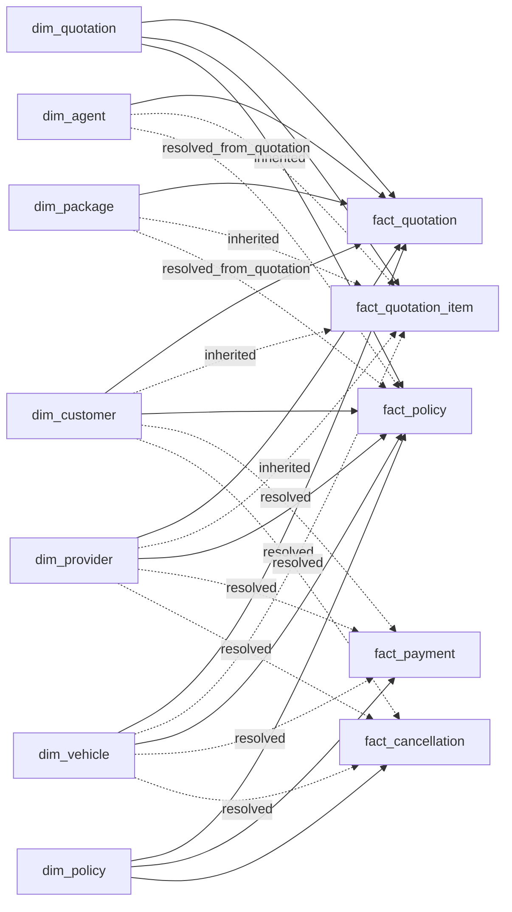

# Task 118: Define Bus Matrix and Conformed Dimension Scope

## 1. Purpose

This document defines the Bus Matrix for the Insurance Analytics Gold Layer. It aligns the agreed fact tables with conformed dimensions so the semantic model can support quotation, quotation item, policy, payment, and cancellation analytics consistently.

This version is aligned with:

- `insurance_source_db_task_115_ver3.sql`
- `Grain_Fact_Tables_Ver_1.4.docx`
- the current Star Schema ERD review

## 2. Key Modeling Assumptions

| Assumption | Design Impact |
|---|---|
| The Gold model keeps five fact tables. | The model supports `fact_quotation`, `fact_quotation_item`, `fact_policy`, `fact_payment`, and `fact_cancellation`. |
| All five fact tables are transaction facts in the current scope. | No periodic snapshot or accumulating snapshot fact is selected for Sprint 1 because the source and dashboard scope do not require stored periodic balances or milestone snapshots. |
| Fact tables should not be directly connected to each other in the semantic model. | Shared identifier dimensions such as `dim_policy` are used to analyze related processes without direct fact-to-fact joins. `dim_policy` connects policy, payment, and cancellation facts through a shared `policy_key`. |
| `dim_vehicle` is included in the Gold star schema. | The source has a `vehicle` table. Under the assumption that a customer owns exactly one vehicle, facts resolve `vehicle_key` from customer context (`customer_id` mapping). |
| `dim_region` is excluded as a standalone conformed dimension for the current ERD. | Customer geography and agent region remain attributes inside `dim_customer` and `dim_agent`. A separate region dimension can be added later if a confirmed reporting-region mapping is provided. |
| One logical `dim_date` is used as a role-playing date dimension. | Facts may contain several date keys, such as `quotation_date_key`, `policy_start_date_key`, `payment_date_key`, and `cancellation_date_key`. |
| Status values are modeled as small reference dimensions. | Status dimensions store raw status codes. Display values and status groupings are derived directly in queries or reporting layers to keep DWH dimensions lightweight. |

## 3. Source-to-Dimension Context

| Source Area | Source Object | Main Dimension Usage | Notes |
|---|---|---|---|
| CRM SQL | `customers` | `dim_customer` | `city` and `district` are kept as customer attributes. |
| CRM SQL | `agents` | `dim_agent` | `region`, `branch`, and `manager_name` are kept as agent attributes. |
| CRM SQL | `insurance_providers` | `dim_provider` | Provider attributes include provider name, group, and active flag. |
| CRM SQL | `vehicle` | `dim_vehicle` | Source vehicle details are resolved into a conformed vehicle dimension. |
| CRM SQL | `quotation.package_code` | `Dim_Package` |
| CRM SQL | `quotation` | `Dim_Quotation_Status`, `Dim_Date` |
| CRM SQL | `quotation_item` | `dim_coverage` | Coverage belongs to quotation item grain. |
| Policy DB / JSON | `policy_info` | `dim_policy`, `dim_policy_status`, `dim_date` | Policy keeps `policy_id`. Policy transaction dates, status, premium, and context keys are resolved into `fact_policy`. `dim_policy` serves as the transaction identifier dimension. |
| Payment DB / JSON | `payment` | `dim_payment_status`, `dim_payment_method`, `dim_date` | Payment is linked to policy by `policy_id`. |
| Cancellation DB / JSON | `cancellation` | `dim_cancellation_reason`, `dim_date` | Cancellation is linked to policy by `policy_id`. |

## 4. Fact Table Scope

| Business Process | Fact Table | Fact Type | Fact Grain | Fact Purpose |
|---|---|---|---|---|
| Quotation | `fact_quotation` | Transaction fact | One row per quotation / quote ID | Supports quote-level analytics such as total quotations, accepted quotations, conversion rate, premium amount, average premium, provider performance, agent performance, package analysis, and recent quotation details. |
| Quotation Coverage | `fact_quotation_item` | Transaction fact | One row per quotation coverage item | Supports coverage-level analytics such as coverage type, coverage amount, and deductible amount. |
| Policy Lifecycle | `fact_policy` | Transaction fact | One row per policy / policy number | Records one policy created from an accepted quotation, including policy status, policy period, issued date, and premium amount. |
| Payment | `fact_payment` | Transaction fact | One row per payment transaction / payment attempt | Tracks payment amount, payment status, payment method, payment date, and transaction reference. |
| Cancellation | `fact_cancellation` | Transaction fact | One row per cancellation event / cancellation request | Tracks cancellation date, cancellation reason, and refund amount separately from policy status. |

## 5. Dimension Declaration

| Dimension Table | Dimension Type | SCD Type | Dimension Grain | Business Key | Surrogate Key |
|---|---|---:|---|---|---|
| `dim_date` | Conformed / role-playing | No SCD | One row per calendar date | `full_date` | `date_key` |
| `dim_customer` | Conformed | Type 2 | One row per customer version | `customer_id` | `customer_key` |
| `dim_agent` | Conformed | Type 2 | One row per agent version | `agent_id` | `agent_key` |
| `dim_provider` | Conformed | Type 2 | One row per provider version | `provider_code` | `provider_key` |
| `dim_package` | Conformed reference | Type 1 | One row per distinct package code | `package_code` | `package_key` |
| `dim_coverage` | Conformed reference | Type 1 | One row per distinct coverage type | `coverage_type` | `coverage_key` |
| `dim_quotation` | Conformed reference | Type 1 | One row per quotation | `quotation_id` | `quotation_key` |
| `dim_policy` | Transaction identifier dimension | Type 1 | One row per policy | `policy_id` | `policy_key` |
| `dim_quotation_status` | Status mini-dimension | Type 1 | One row per quotation status | `quotation_status_code` | `quotation_status_key` |
| `dim_policy_status` | Status mini-dimension | Type 1 | One row per policy status | `policy_status_code` | `policy_status_key` |
| `dim_payment_status` | Status mini-dimension | Type 1 | One row per payment status | `payment_status_code` | `payment_status_key` |
| `dim_payment_method` | Reference | Type 1 | One row per payment method | `payment_method_code` | `payment_method_key` |
| `dim_cancellation_reason` | Reference | Type 1 | One row per cancellation reason | `cancellation_reason` | `cancellation_reason_key` |
| `dim_vehicle` | Conformed | Type 2 | One row per vehicle version | `vehicle_id` | `vehicle_key` |

## 6. Bus Matrix

Legend:

- `X`: direct/materialized key in the fact table.
- `X*`: inherited/resolved through quotation or policy during Gold ETL.
- `optional`: include only if payment/cancellation package analytics is required.

| Fact Table | Date | Customer | Agent | Provider | Package | Coverage | Quotation | Policy | Status | Vehicle |
|---|---:|---:|---:|---:|---:|---:|---:|---:|---:|---:|
| `fact_quotation` | X | X | X | X | X |  | X |  | quotation_status | X |
| `fact_quotation_item` | X* | X* | X* | X* | X* | X | X |  | quotation_status* | X* |
| `fact_policy` | Date role | X | X* | X | X* |  | X | X | policy_status | X |
| `fact_payment` | X | X* |  | X* | optional |  |  | X | payment_status/method | X* |
| `fact_cancellation` | X | X* |  | X* | optional |  |  | X | cancellation_reason | X* |

### 6.1 Relationship Diagram

## 7. Role-Playing Date Usage

| Fact Table | Date Key Column | Source Date | Business Meaning |
|---|---|---|---|
| `fact_quotation` | `quotation_date_key` | `quotation.quotation_date` | Date when quotation was created. |
| `fact_quotation` | `quotation_expiry_date_key` | `quotation.quotation_expiry_date` | Date when quotation expires. |
| `fact_quotation_item` | `quotation_date_key` | inherited from `quotation.quotation_date` | Date of the related quotation. |
| `fact_policy` | `issued_date_key` | `policy_info.issued_date` | Date when policy was issued. |
| `fact_policy` | `policy_start_date_key` | `policy_info.policy_start_date` | Policy coverage start date. |
| `fact_policy` | `policy_end_date_key` | `policy_info.policy_end_date` | Policy coverage end date. |
| `fact_payment` | `payment_date_key` | `payment.payment_date` | Date when payment attempt occurred. |
| `fact_cancellation` | `cancellation_date_key` | `cancellation.cancellation_date` | Date when cancellation event occurred. |

## 8. Conformed Dimension Scope

| Conformed Dimension | Shared By | Scope |
|---|---|---|
| `dim_date` | All five facts | Common calendar and role-playing date analysis. |
| `dim_customer` | `fact_quotation`, `fact_quotation_item`, `fact_policy`, optionally downstream payment/cancellation through policy context | Customer-level quotation, policy, payment, and cancellation analysis. |
| `dim_agent` | `fact_quotation`, `fact_quotation_item`, `fact_policy` | Agent performance and policy conversion analysis. Stored directly in quotation facts. In `fact_policy`, the `agent_key` is resolved by joining `policy_info` back to `quotation` via `quotation_id` during the ETL process (defaults to `-1` if the link is null or missing). |
| `dim_provider` | `fact_quotation`, `fact_quotation_item`, `fact_policy`, optionally downstream payment/cancellation through policy context | Provider performance across quotation, policy, payment, and cancellation. |
| `dim_package` | `fact_quotation`, `fact_quotation_item`, `fact_policy` | Package-code-level analysis. Stored directly in quotation and policy facts. Downstream facts (`fact_payment`, `fact_cancellation`) do not store `package_key` directly for Sprint 1 (Option A). Package-level payment/cancellation analysis is out of scope unless `package_key` is materialized during Gold ETL. |
| `dim_quotation` | `fact_quotation`, `fact_quotation_item`, `fact_policy` | Connects all quotation-related processes and facts through a shared physical quotation identifier dimension. |
| `dim_policy` | `fact_policy`, `fact_payment`, `fact_cancellation` | Allows policy, payment, and cancellation analysis through a shared policy identifier dimension without direct fact-to-fact joins. |
| `dim_vehicle` | All five facts | Stores vehicle details (brand, model, value, plate number). `dim_vehicle` is in scope as a Type 2 dimension. Since a customer has exactly one vehicle, the facts resolve the vehicle key via `customer_id` during ETL. |

## 9. Dimensions Limited to Specific Processes

| Dimension | Used By | Reason |
|---|---|---|
| `dim_coverage` | `fact_quotation_item` | Coverage type belongs to quotation item grain, not quotation header grain. |
| `dim_quotation_status` | `fact_quotation`, optionally `fact_quotation_item` through quotation context | Quotation status describes the quotation lifecycle. |
| `dim_policy_status` | `fact_policy` | Policy status describes policy lifecycle state. |
| `dim_payment_status` | `fact_payment` | Payment status describes payment transaction outcome. |
| `dim_payment_method` | `fact_payment` | Payment method exists only in payment source. |
| `dim_cancellation_reason` | `fact_cancellation` | Cancellation reason exists only in cancellation source. |

## 10. Degenerate Identifier Handling

| Degenerate Identifier | Used By | Details & Design Justification |
|---|---|---|
| `policy_id` | `fact_policy`, `fact_payment`, `fact_cancellation` | Retained as a degenerate identifier for operational traceability. The primary analytical relationship to policy context is through `policy_key` → `dim_policy`. |
| `quotation_id` | `fact_quotation`, `fact_quotation_item`, `fact_policy` | Retained for operational traceability. The primary analytical relationship is through the physical dimension `dim_quotation` and `quotation_key`. |

## 11. ERD Review Notes

| Topic | Decision |
|---|---|
| `dim_quotation` | Restored as a physical dimension table to support a clean star schema relationship across all quotation facts and policy lifecycle facts (`fact_quotation`, `fact_quotation_item`, and `fact_policy`). |
| `dim_vehicle` | Included in star schema. Modeled under the assumption that one customer owns exactly one vehicle, allowing `vehicle_key` to be resolved in fact tables using the customer context. |
| `dim_region` | Do not include as standalone dimension in current star schema. Keep geography/region attributes in customer and agent dimensions. |
| `dim_policy` | Included as a transaction identifier dimension (Type 1). Shared by `fact_policy`, `fact_payment`, and `fact_cancellation` to provide policy context without direct fact-to-fact joins. |
| `dim_cancellation_reason` | Keep connected only to `fact_cancellation`. |
| `dim_agent` in `fact_policy` | Since `policy_info` lacks `agent_id`, `agent_key` in `fact_policy` is resolved by joining back to `quotation` via `quotation_id`. If `quotation_id` is null or missing, it defaults to the unknown member `-1`. |
| `dim_coverage` grain | Confirmed as a lookup of distinct coverage types (e.g., Physical Damage, Third Party), NOT one row per quotation item, to ensure correct deduplication at the Silver-to-Gold transform step. |
| Fact-to-fact relationships | Avoid as main semantic model relationships. Use shared dimensions or degenerate identifiers instead. |

## 12. Output

This document is the output for **Task 118: Define Bus Matrix and conformed dimension scope**.

