# Power BI Semantic Model Relationship Design

This document defines the relationship design guidelines for the 14 dimensions and 5 fact tables of the Insurance Analytics semantic model in Power BI / Microsoft Fabric. It translates the Gold Dimensional Model designs into a robust semantic layer to support Executive and Operations dashboards.

---

## 1. Key Semantic Modeling Principles

To ensure query performance, data integrity, and correct filtering behavior in downstream dashboards, the semantic model must adhere to the following principles:

1. **Single Active Path Rule:** 
   Power BI allows only one active relationship path between any two tables. In cases where multiple relationship paths exist (such as multiple date columns in a fact table linking to `dim_date`), only one can be set as **Active**. All other relationships must be set as **Inactive** and resolved dynamically using DAX.
2. **Single Cross-Filter Direction:** 
   All relationships must be configured with a **Single** cross-filter direction, where the dimension table filters the fact table (1 filters Many). Do not use **Both** (bidirectional) cross-filtering, as it introduces circular filter paths, performance bottlenecks, and incorrect numbers in models with multiple fact tables sharing dimensions.
3. **Cardinality (One-to-Many):** 
   Relationships must always flow from the primary key of the dimension table (the "1" side) to the foreign key of the fact table (the "Many" side).
4. **No Direct Fact-to-Fact Relationships:** 
   Fact tables must never be joined directly to each other. They must communicate exclusively by sharing conformed dimensions (e.g., `dim_customer`, `dim_date`) or through physical transaction identifier dimensions (e.g., `dim_policy`, `dim_quotation`).
5. **Surrogate Key Joins:** 
   All relationships are defined using the numeric surrogate keys (e.g., `customer_key`, `policy_key`) generated during the Gold ETL process, rather than the natural business keys.

---

## 2. Role-Playing Date Dimension Strategy

Fact tables in the Insurance model contain multiple date keys (e.g., `fact_policy` has `issued_date_key`, `policy_start_date_key`, and `policy_end_date_key`). 

To model these role-playing dates, the semantic model uses a single conformed `dim_date` table. One relationship is configured as **Active** (representing the primary transaction or event date), while the others are configured as **Inactive**. 

### Active Date Choice per Fact Table:
* `fact_quotation`: `quotation_date_key`
* `fact_quotation_item`: `quotation_date_key`
* `fact_policy`: `issued_date_key`
* `fact_payment`: `payment_date_key`
* `fact_cancellation`: `cancellation_date_key`

To calculate measures based on the inactive date keys, use the `USERELATIONSHIP` function in DAX (refer to Section 5 for examples).

---

## 3. Comprehensive Relationship Matrix

Below is the complete relationship configuration for all 14 dimensions and 5 fact tables in the Power BI Semantic Model.

### 3.1 fact_quotation Relationships

| Dimension Table | Dimension Key | Fact Key | Cardinality | Cross-Filter Direction | Relationship Status | Business Meaning / Notes |
| :--- | :--- | :--- | :---: | :---: | :---: | :--- |
| dim_quotation | `quotation_key` | `quotation_key` | 1:Many | Single (Dim to Fact) | **Active** | Primary quotation transaction lookup. |
| dim_customer | `customer_key` | `customer_key` | 1:Many | Single (Dim to Fact) | **Active** | Links quotation to the customer profile. |
| dim_agent | `agent_key` | `agent_key` | 1:Many | Single (Dim to Fact) | **Active** | Agent responsible for handling the quote. |
| dim_provider | `provider_key` | `provider_key` | 1:Many | Single (Dim to Fact) | **Active** | Insurance provider of the quote. |
| dim_package | `package_key` | `package_key` | 1:Many | Single (Dim to Fact) | **Active** | Selected package (Basic, Standard, etc.). |
| dim_quotation_status | `quotation_status_key` | `quotation_status_key` | 1:Many | Single (Dim to Fact) | **Active** | Current status of the quotation. |
| dim_vehicle | `vehicle_key` | `vehicle_key` | 1:Many | Single (Dim to Fact) | **Active** | Vehicle model details linked to the quote. |
| dim_date | `date_key` | `quotation_date_key` | 1:Many | Single (Dim to Fact) | **Active** | Date when the quote was created. |
| dim_date | `date_key` | `quotation_expiry_date_key` | 1:Many | Single (Dim to Fact) | **Inactive** | Date when the quote expires. |

### 3.2 fact_quotation_item (Quotation Coverage) Relationships

| Dimension Table | Dimension Key | Fact Key | Cardinality | Cross-Filter Direction | Relationship Status | Business Meaning / Notes |
| :--- | :--- | :--- | :---: | :---: | :---: | :--- |
| dim_quotation | `quotation_key` | `quotation_key` | 1:Many | Single (Dim to Fact) | **Active** | Connects quote items to the parent quote context. |
| dim_customer | `customer_key` | `customer_key` | 1:Many | Single (Dim to Fact) | **Active** | Denormalized customer reference. |
| dim_agent | `agent_key` | `agent_key` | 1:Many | Single (Dim to Fact) | **Active** | Denormalized agent reference. |
| dim_provider | `provider_key` | `provider_key` | 1:Many | Single (Dim to Fact) | **Active** | Denormalized insurance provider reference. |
| dim_package | `package_key` | `package_key` | 1:Many | Single (Dim to Fact) | **Active** | Denormalized package reference. |
| dim_quotation_status | `quotation_status_key` | `quotation_status_key` | 1:Many | Single (Dim to Fact) | **Active** | Denormalized quotation status reference. |
| dim_coverage | `coverage_key` | `coverage_key` | 1:Many | Single (Dim to Fact) | **Active** | Coverage type lookup (Physical Damage, Third Party, etc.). |
| dim_vehicle | `vehicle_key` | `vehicle_key` | 1:Many | Single (Dim to Fact) | **Active** | Denormalized vehicle context key. |
| dim_date | `date_key` | `quotation_date_key` | 1:Many | Single (Dim to Fact) | **Active** | Date of the quotation (inherited from parent). |

### 3.3 fact_policy Relationships

| Dimension Table | Dimension Key | Fact Key | Cardinality | Cross-Filter Direction | Relationship Status | Business Meaning / Notes |
| :--- | :--- | :--- | :---: | :---: | :---: | :--- |
| dim_policy | `policy_key` | `policy_key` | 1:Many | Single (Dim to Fact) | **Active** | Primary policy transaction identifier lookup. |
| dim_quotation | `quotation_key` | `quotation_key` | 1:Many | Single (Dim to Fact) | **Active** | Originating quotation key (resolves quote-to-policy conversions). |
| dim_customer | `customer_key` | `customer_key` | 1:Many | Single (Dim to Fact) | **Active** | Customer holding the policy. |
| dim_agent | `agent_key` | `agent_key` | 1:Many | Single (Dim to Fact) | **Active** | Agent who issued the policy (resolved via quotation). |
| dim_provider | `provider_key` | `provider_key` | 1:Many | Single (Dim to Fact) | **Active** | Direct provider key from policy. |
| dim_package | `package_key` | `package_key` | 1:Many | Single (Dim to Fact) | **Active** | Policy package reference (resolved via quotation). |
| dim_policy_status | `policy_status_key` | `policy_status_key` | 1:Many | Single (Dim to Fact) | **Active** | Current status of the policy. |
| dim_vehicle | `vehicle_key` | `vehicle_key` | 1:Many | Single (Dim to Fact) | **Active** | Insured vehicle. |
| dim_date | `date_key` | `issued_date_key` | 1:Many | Single (Dim to Fact) | **Active** | Date when the policy was issued. |
| dim_date | `date_key` | `policy_start_date_key` | 1:Many | Single (Dim to Fact) | **Inactive** | Date when policy coverage begins. |
| dim_date | `date_key` | `policy_end_date_key` | 1:Many | Single (Dim to Fact) | **Inactive** | Date when policy coverage expires. |

### 3.4 fact_payment Relationships

| Dimension Table | Dimension Key | Fact Key | Cardinality | Cross-Filter Direction | Relationship Status | Business Meaning / Notes |
| :--- | :--- | :--- | :---: | :---: | :---: | :--- |
| dim_policy | `policy_key` | `policy_key` | 1:Many | Single (Dim to Fact) | **Active** | Links payment to the specific policy transaction. |
| dim_customer | `customer_key` | `customer_key` | 1:Many | Single (Dim to Fact) | **Active** | Customer making the payment (resolved via policy). |
| dim_provider | `provider_key` | `provider_key` | 1:Many | Single (Dim to Fact) | **Active** | Insurance provider receiving payment (resolved via policy). |
| dim_payment_status | `payment_status_key` | `payment_status_key` | 1:Many | Single (Dim to Fact) | **Active** | Outcome of payment transaction (Paid, Failed, etc.). |
| dim_payment_method | `payment_method_key` | `payment_method_key` | 1:Many | Single (Dim to Fact) | **Active** | Method used (E-Wallet, Credit Card, Cash, etc.). |
| dim_vehicle | `vehicle_key` | `vehicle_key` | 1:Many | Single (Dim to Fact) | **Active** | Vehicle context of the payment. |
| dim_date | `date_key` | `payment_date_key` | 1:Many | Single (Dim to Fact) | **Active** | Date of the payment transaction. |
| dim_date | `date_key` | `issued_date_key` | 1:Many | Single (Dim to Fact) | **Inactive** | Issue date of the policy (materialized for lag analytics). |

### 3.5 fact_cancellation Relationships

| Dimension Table | Dimension Key | Fact Key | Cardinality | Cross-Filter Direction | Relationship Status | Business Meaning / Notes |
| :--- | :--- | :--- | :---: | :---: | :---: | :--- |
| dim_policy | `policy_key` | `policy_key` | 1:Many | Single (Dim to Fact) | **Active** | Links cancellation to the canceled policy. |
| dim_customer | `customer_key` | `customer_key` | 1:Many | Single (Dim to Fact) | **Active** | Customer whose policy is canceled (resolved via policy). |
| dim_provider | `provider_key` | `provider_key` | 1:Many | Single (Dim to Fact) | **Active** | Insurance provider involved (resolved via policy). |
| dim_cancellation_reason | `cancellation_reason_key` | `cancellation_reason_key` | 1:Many | Single (Dim to Fact) | **Active** | Categorized reason for cancellation. |
| dim_vehicle | `vehicle_key` | `vehicle_key` | 1:Many | Single (Dim to Fact) | **Active** | Vehicle context of the cancellation. |
| dim_date | `date_key` | `cancellation_date_key` | 1:Many | Single (Dim to Fact) | **Active** | Date of cancellation. |

---

## 4. Logical Semantic Model Schema (Galaxy Schema)

The diagram below depicts the flow of filters from conformed and reference dimensions to the fact tables. In Power BI, relationships flow in the direction of the arrows (from 1 to Many).

```mermaid
flowchart TD
    %% Dimensions
    dim_date["dim_date (Date)"]
    dim_customer["dim_customer (Customer)"]
    dim_agent["dim_agent (Agent)"]
    dim_provider["dim_provider (Provider)"]
    dim_package["dim_package (Package)"]
    dim_quotation_status["dim_quotation_status (Quotation Status)"]
    dim_vehicle["dim_vehicle (Vehicle)"]
    dim_coverage["dim_coverage (Coverage Type)"]
    dim_quotation["dim_quotation (Quotation Identifier)"]
    dim_policy["dim_policy (Policy Identifier)"]
    dim_policy_status["dim_policy_status (Policy Status)"]
    dim_payment_status["dim_payment_status (Payment Status)"]
    dim_payment_method["dim_payment_method (Payment Method)"]
    dim_cancellation_reason["dim_cancellation_reason (Cancellation Reason)"]

    %% Facts
    fact_quotation["fact_quotation"]
    fact_quotation_item["fact_quotation_item"]
    fact_policy["fact_policy"]
    fact_payment["fact_payment"]
    fact_cancellation["fact_cancellation"]

    %% Relationships fact_quotation
    dim_date -->|Active: quotation_date_key\nInactive: quotation_expiry_date_key| fact_quotation
    dim_customer --> fact_quotation
    dim_agent --> fact_quotation
    dim_provider --> fact_quotation
    dim_package --> fact_quotation
    dim_quotation_status --> fact_quotation
    dim_vehicle --> fact_quotation
    dim_quotation --> fact_quotation

    %% Relationships fact_quotation_item
    dim_date -->|Active: quotation_date_key| fact_quotation_item
    dim_customer --> fact_quotation_item
    dim_agent --> fact_quotation_item
    dim_provider --> fact_quotation_item
    dim_package --> fact_quotation_item
    dim_quotation_status --> fact_quotation_item
    dim_vehicle --> fact_quotation_item
    dim_coverage --> fact_quotation_item
    dim_quotation --> fact_quotation_item

    %% Relationships fact_policy
    dim_date -->|Active: issued_date_key\nInactive: policy_start_date_key\nInactive: policy_end_date_key| fact_policy
    dim_customer --> fact_policy
    dim_agent --> fact_policy
    dim_provider --> fact_policy
    dim_package --> fact_policy
    dim_policy_status --> fact_policy
    dim_vehicle --> fact_policy
    dim_quotation --> fact_policy
    dim_policy --> fact_policy

    %% Relationships fact_payment
    dim_date -->|Active: payment_date_key\nInactive: issued_date_key| fact_payment
    dim_customer --> fact_payment
    dim_provider --> fact_payment
    dim_payment_status --> fact_payment
    dim_payment_method --> fact_payment
    dim_vehicle --> fact_payment
    dim_policy --> fact_payment

    %% Relationships fact_cancellation
    dim_date -->|Active: cancellation_date_key| fact_cancellation
    dim_customer --> fact_cancellation
    dim_provider --> fact_cancellation
    dim_cancellation_reason --> fact_cancellation
    dim_vehicle --> fact_cancellation
    dim_policy --> fact_cancellation
```



---

## 5. DAX Implementation Guides (Switching to Inactive Relationships)

To query facts using inactive relationships, use the DAX `USERELATIONSHIP` function. Below are specific DAX examples implementing key KPIs for the Executive and Operations dashboards.

### 5.1 Quotations Expired
Calculates the count of quotations based on the date they expire, overriding the active `quotation_date_key` relationship.

```dax
Quotations Expired = 
CALCULATE(
    COUNTROWS('fact_quotation'),
    USERELATIONSHIP('dim_date'[date_key], 'fact_quotation'[quotation_expiry_date_key]),
    'dim_quotation_status'[quotation_status_code] = "EXPIRED"
)
```

### 5.2 Active Policies Count
Calculates the number of active policies during a selected calendar window by comparing the date range with the inactive start and end date relationships using row-level lookup on `dim_date`.

```dax
Active Policies = 
VAR MaxSelectedDate = MAX('dim_date'[full_date])
VAR MinSelectedDate = MIN('dim_date'[full_date])
RETURN
    CALCULATE(
        COUNTROWS('fact_policy'),
        FILTER(
            'fact_policy',
            // Policy has started on or before the end of the selected period
            LOOKUPVALUE('dim_date'[full_date], 'dim_date'[date_key], 'fact_policy'[policy_start_date_key]) <= MaxSelectedDate &&
            // Policy has not expired before the start of the selected period
            LOOKUPVALUE('dim_date'[full_date], 'dim_date'[date_key], 'fact_policy'[policy_end_date_key]) >= MinSelectedDate
        ),
        'dim_policy_status'[policy_status_code] = "ACTIVE"
    )
```

### 5.3 Average Payment Lag (M-22 KPI)
Calculates the average number of days between the date a policy is issued and when a payment is processed. Since `fact_payment` includes `issued_date_key` (materialized from the policy context in Gold ETL), we use `LOOKUPVALUE` to retrieve the corresponding dates from `dim_date` at the row level, and apply the status filter via an outer `CALCULATE`.

```dax
Average Payment Lag Days = 
CALCULATE(
    AVERAGEX(
        'fact_payment',
        VAR PaymentDate = LOOKUPVALUE('dim_date'[full_date], 'dim_date'[date_key], 'fact_payment'[payment_date_key])
        VAR IssuedDate = LOOKUPVALUE('dim_date'[full_date], 'dim_date'[date_key], 'fact_payment'[issued_date_key])
        RETURN
            IF(
                NOT(ISBLANK(IssuedDate)) && NOT(ISBLANK(PaymentDate)),
                DATEDIFF(IssuedDate, PaymentDate, DAY),
                BLANK()
            )
    ),
    'dim_payment_status'[payment_status_code] = "PAID"
)
```
```

---

## 6. Output Review & Verification

This document represents the complete deliverable for **Task 135: Define Power BI Semantic Model Relationships**. It defines the necessary semantic model structure, cardinalities, filter behaviors, active status, and implementation details for the BI developers.