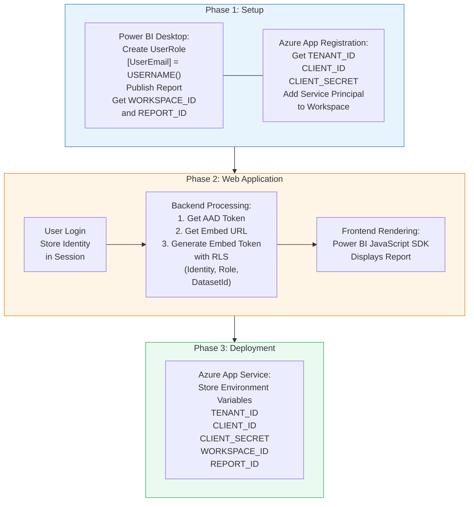

# Power BI Embedded with Row-Level Security (RLS) Implementation Guide

## Solution Overview



## Purpose

This document describes the implementation process of embedding a Power BI report into a web application with Row-Level Security (RLS). The solution uses a Service Principal for authentication and Power BI Embedded APIs to ensure that each user can only access the data assigned to them.

---

## Phase 1: Foundation Setup (Preparing the Environment)

Before writing any code, you need to complete the required configuration in both Power BI and Azure Portal.

### 1. Configure RLS in Power BI Desktop

1. Open the Power BI report file.
2. Go to **Modeling** → **Manage Roles**.
3. Create a role (for example, **UserRole**).
4. Add a DAX filter expression to restrict data based on the logged-in user.

Example:

```DAX
[UserEmail] = USERNAME()
```

5. Publish the report to a shared Workspace (do not use **My Workspace**).

After publishing, collect the following information from the report URL:

* **WORKSPACE_ID**
* **REPORT_ID**

### 2. Create an App Registration in Azure Portal (Service Principal)

1. Go to **Microsoft Entra ID (Azure Active Directory)**.
2. Select **App registrations**.
3. Create a new application.

After the application is created, collect:

* **TENANT_ID**
* **CLIENT_ID**

4. Navigate to **Certificates & Secrets**.
5. Create a new client secret.
6. Copy and save the generated value immediately.

This value will be used as:

* **CLIENT_SECRET**

### 3. Grant Power BI Permissions to the Service Principal

1. Open **Power BI Admin Portal**.
2. Go to **Tenant Settings**.
3. Enable the setting:

> Allow service principals to use Power BI APIs

4. Open the Workspace that contains the report.
5. Select **Manage Access**.
6. Add the App Registration (CLIENT_ID) as a:

* Member, or
* Admin

---

# Phase 2: Develop the Web Application (Backend and Frontend)

You can use Java, Python, .NET, or TypeScript.

The application should follow the logic below.

## 1. Authentication Module

Create a simple login page for your web application.

This login process is independent from the customer's Microsoft account.

After a user successfully logs in, for example:

* User: `nguyenvana@company.com`
* Department: Southern Sales

The application stores the user's identity information in the session.

---

## 2. Backend Module – Token Processing

When the user opens the **View Report** page, the backend performs the following three steps automatically.

### Step A: Authenticate with Azure

Use:

* TENANT_ID
* CLIENT_ID
* CLIENT_SECRET

to request an **AAD Access Token** from Azure.

### Step B: Locate the Report

Use:

* AAD Access Token
* WORKSPACE_ID
* REPORT_ID

to identify the report and retrieve the original **Embed URL**.

### Step C: Apply RLS and Generate an Embed Token

Send a request to Power BI to generate an **Embed Token**.

The request must include the RLS information of the logged-in user.

Example:

| Property  | Value                                                   |
| --------- | ------------------------------------------------------- |
| Identity  | [nguyenvana@company.com](mailto:nguyenvana@company.com) |
| Role      | UserRole                                                |
| DatasetId | Dataset ID                                              |

---

## 3. Frontend Module – Report Embedding

After the backend receives:

* Embed URL
* Embed Token

(which already contains RLS restrictions),

the backend returns the following information to the frontend:

* REPORT_ID
* Embed URL
* Embed Token

The frontend uses the **Power BI JavaScript SDK** (as described in the Developer Playground documentation) to render the report inside a `<div>` element in the web application.

---

# Phase 3: Deploy Configuration to Azure App Service

To run the application in a production environment and protect sensitive information, deploy the web application to **Azure App Service**.

### Configure Environment Variables

In Azure App Service:

1. Open **Settings**.
2. Select **Environment Variables**.
3. Add the following key-value pairs:

```text
TENANT_ID     = xxxxx-...
CLIENT_ID     = xxxxx-...
CLIENT_SECRET = xxxxx-...
WORKSPACE_ID  = xxxxx-...
REPORT_ID     = xxxxx-...
```

### Security Mechanism

When the application runs in Azure, it reads these values directly from Azure App Service environment variables.

The values are not stored in source code files.

This approach helps prevent sensitive information from being exposed through source control platforms such as GitHub or GitLab.

---

# Phase 4: Operational Validation (User Access Lifecycle)

After deployment, the authorization and embedding process runs automatically whenever a user accesses the report.

```text
[User Logs In to Web Application]
                │
                ▼
[Web App Verifies User Identity and Department]
                │
                ▼
[Backend Uses Configuration Variables and User Identity
 to Request a Power BI Token]
                │
                ▼
[Power BI Applies RLS and Returns a Secure Embed Token]
                │
                ▼
[Frontend Uses Power BI JavaScript SDK to Display
 the Filtered Dashboard]
```

---

# Expected Outcome

By following this process, the system ensures that:

* Each user only sees the data assigned to their account.
* Row-Level Security (RLS) is applied automatically.
* Data access is secure and centrally managed.
* Users do not need direct access to Power BI Service.
* The entire report access process is fully automated.
