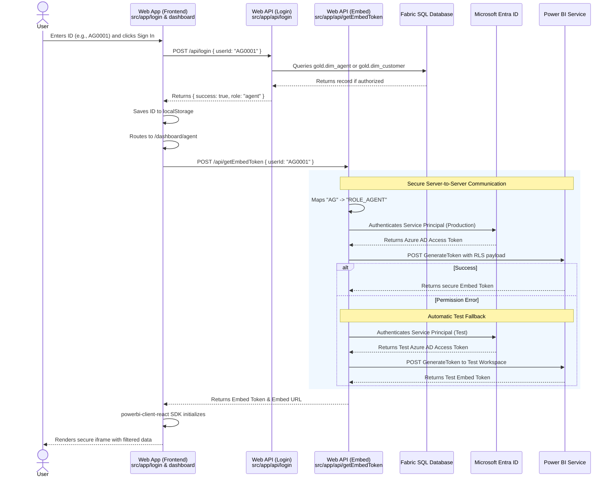

# CarPro Web App Architecture & Power BI Embedded Flow

## Overview

The `web-app` directory contains a Next.js web portal (CarPro) designed to securely embed Power BI reports using the **App-Owns-Data** architecture. It implements dynamic Row-Level Security (RLS) so that users (Customers or Agents) log in using an application-specific Short ID. The application first authenticates the user against a SQL database and then orchestrates the generation of a constrained Power BI Embed Token on their behalf.

This architecture acts as the concrete implementation of the theoretical process outlined in [embedded-rls-process-rerearch.md](./embedded-rls-process-rerearch.md).

---

## Architecture Flow

The sequence below illustrates how a user request flows from the browser, through our Next.js backend, to the SQL Database, Microsoft Azure/Power BI, and back to the screen.



---

## Component Breakdown

The web application is structured into three main logical parts to separate concerns between routing, backend orchestration, and frontend rendering.

### 1. Authentication API (`src/app/api/login/route.ts`)
The identity provider for our App-Owns-Data setup.
- Evaluates the prefix of the ID (`CUS` vs `AG`).
- Connects to the Fabric SQL Database (falling back to a TEST SQL Database if the production connection string is missing).
- Queries `gold.dim_customer` or `gold.dim_agent` to ensure the ID actually exists.
- Returns authorization status and role to the frontend.

### 2. Backend Token Orchestrator (`src/app/api/getEmbedToken/route.ts`)
A secure Next.js API route that holds the Azure App Registration secrets and communicates with Microsoft APIs.
- **Role Inference:** Automatically infers the Power BI role based on the prefix (e.g., assigning `ROLE_CUSTOMER` to `CUS` users).
- **Service Principal Auth:** Reaches out to `login.microsoftonline.com` to obtain a master Access Token.
- **RLS Payload Generation:** Makes a request to the Power BI `GenerateToken` API, injecting the `identities` array (mapping the exact `userId`, inferred role, and target datasets).
- **Automatic Test Fallback:** The orchestrator will attempt to generate a token using **Production** credentials first. If Power BI rejects the request (e.g., `PowerBINotAuthorizedException` due to lack of admin permissions), the system automatically catches the error and retries the entire process using the **Test** credentials and Test workspaces configured in the `.env.local` file.
- **Dev Mode:** If no credentials (production or test) are provided, it switches the frontend into a safe "Development Mode" rendering a static mock-up dashboard.

### 3. Frontend Dashboard Views (`src/app/dashboard/...`)
React components representing the final landing pages for the user.
- On mount, they retrieve the `carpro_userId` from `localStorage` (kicking unauthenticated users back to `/login`).
- They ping the internal `/api/getEmbedToken` route to fetch the secure token.
- **Token Refresh Strategy:** Power BI Embed tokens expire after 1 hour. Every 50 minutes, the frontend silently calls `/api/getEmbedToken` in the background to fetch a fresh token, updating the Power BI SDK instance without reloading the iframe.
- They utilize the official `@microsoft/powerbi-client-react` SDK (`<PowerBIEmbed>`) to spawn an `iframe` and securely bind the Power BI report to the UI.

---

## Environment Configuration

To operate correctly, the `web-app` relies on a `.env.local` file containing the following parameters:

```env
# --- PRODUCTION CREDENTIALS ---
# Azure Service Principal
AZURE_TENANT_ID="..."
AZURE_CLIENT_ID="..."
AZURE_CLIENT_SECRET="..."

# Power BI Specific IDs (Customer)
POWERBI_WORKSPACE_ID_CUSTOMER="..."
POWERBI_REPORT_ID_CUSTOMER="..."
POWERBI_DATASET_ID_CUSTOMER="..."

# Power BI Specific IDs (Agent)
POWERBI_WORKSPACE_ID_AGENT="..."
POWERBI_REPORT_ID_AGENT="..."
POWERBI_DATASET_ID_AGENT="..."

# SQL Authentication
SQL_CONNECTION_STRING="..."
SQL_DATABASE="..."

# --- TEST / FALLBACK CREDENTIALS ---
# Test Azure Service Principal
TEST_AZURE_TENANT_ID="..."
TEST_AZURE_CLIENT_ID="..."
TEST_AZURE_CLIENT_SECRET="..."

# Test Power BI Shared IDs
TEST_POWERBI_WORKSPACE_ID="..."
TEST_POWERBI_REPORT_ID="..."
TEST_POWERBI_DATASET_ID="..."

# Test SQL Database
TEST_SQL_CONNECTION_STRING="..."
TEST_SQL_DATABASE="..."
```

> **Security Note:** Because these variables are **not** prefixed with `NEXT_PUBLIC_`, Next.js guarantees they are never bundled into the client-side JavaScript. They are only accessible by the Node.js backend executing `route.ts`, ensuring the Service Principal secrets remain completely secure from end-users.
