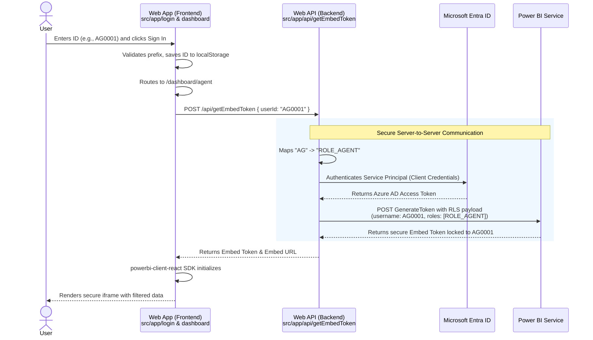

# CarPro Web App Architecture & Power BI Embedded Flow

## Overview

The `web-app` directory contains a Next.js web portal (CarPro) designed to securely embed Power BI reports using the **App-Owns-Data** architecture. It implements dynamic Row-Level Security (RLS) so that users (Customers or Agents) log in using an application-specific Short ID, and the application orchestrates the generation of a constrained Power BI Embed Token on their behalf.

This architecture acts as the concrete implementation of the theoretical process outlined in [embedded-rls-process-rerearch.md](./embedded-rls-process-rerearch.md).

---

## Architecture Flow

The sequence below illustrates how a user request flows from the browser, through our Next.js backend, to Microsoft Azure/Power BI, and back to the screen.



---

## Component Breakdown

The web application is structured into three main logical parts to separate concerns between routing, backend orchestration, and frontend rendering.

### 1. Authentication & Routing (`src/app/login/page.tsx`)
The entry point of the application. It acts as the identity provider for our App-Owns-Data setup.
- Accepts a short ID up to 8 characters.
- Evaluates the prefix of the ID (`CUS` vs `AG`).
- Persists the validated ID into browser `localStorage` as `carpro_userId`.
- Routes the user to the appropriate frontend dashboard (`/dashboard/customer` or `/dashboard/agent`).

### 2. Backend Token Orchestrator (`src/app/api/getEmbedToken/route.ts`)
A secure Next.js API route that acts as the trusted middleman. It holds the Azure App Registration secrets and communicates with Microsoft APIs.
- **Role Inference:** Parses the incoming POST body for `userId`. Automatically infers the Power BI role based on the prefix (e.g., assigning `ROLE_CUSTOMER` to `CUS` users).
- **Service Principal Auth:** Reaches out to `login.microsoftonline.com` using the `AZURE_CLIENT_ID` and `AZURE_CLIENT_SECRET` to obtain a master Access Token.
- **RLS Payload Generation:** Makes a request to the Power BI `GenerateToken` API, injecting the `identities` array (mapping the exact `userId`, inferred role, and `POWERBI_DATASET_ID`).
- **Dev Mode Fallback:** Automatically detects if Azure credentials are missing from the environment and switches the frontend into a safe "Development Mode" to prevent crashing. In this mode, instead of a real Power BI report, the frontend renders a static mock-up dashboard and displays a warning banner stating "Running Offline: Azure Credentials Missing".

### 3. Frontend Dashboard Views (`src/app/dashboard/...`)
React components representing the final landing pages for the user.
- On mount, they retrieve the `carpro_userId` from `localStorage` (kicking unauthenticated users back to `/login`).
- They ping the internal `/api/getEmbedToken` route to fetch the secure token.
- **Token Refresh Strategy:** Power BI Embed tokens expire after 1 hour. To prevent the dashboard from crashing, the frontend uses a proactive timer. Every 50 minutes, the frontend silently calls `/api/getEmbedToken` in the background to fetch a fresh token, and updates the Power BI SDK instance without reloading the iframe.
- They utilize the official `@microsoft/powerbi-client-react` SDK (`<PowerBIEmbed>`) to spawn an `iframe` and securely bind the Power BI report to the UI.

---

## Environment Configuration

To operate correctly, the `web-app` relies on a `.env.local` file containing the following parameters:

```env
# Microsoft Entra ID App Registration
AZURE_TENANT_ID="your-tenant-id"
AZURE_CLIENT_ID="your-client-id"
AZURE_CLIENT_SECRET="your-client-secret"

# Power BI Specific IDs
POWERBI_WORKSPACE_ID="your-workspace-id"
POWERBI_REPORT_ID="your-report-id"
POWERBI_DATASET_ID="your-dataset-id"
```

> **Security Note:** Because these variables are **not** prefixed with `NEXT_PUBLIC_`, Next.js guarantees they are never bundled into the client-side JavaScript. They are only accessible by the Node.js backend executing `route.ts`, ensuring the Service Principal secrets remain completely secure from end-users.
