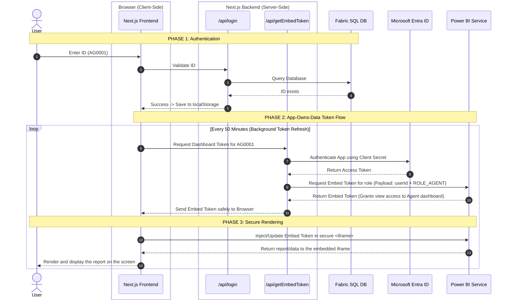

# CarPro Web App Architecture & Power BI Embedded Flow

## Overview

The `web-app` directory contains a Next.js web portal (CarPro) designed to securely embed Power BI reports using the **App-Owns-Data** architecture. It implements role-based access control so that users (Customers or Agents) log in using an application-specific Short ID. The application first authenticates the user against a SQL database to verify their existence and role, and then orchestrates the generation of a constrained Power BI Embed Token on their behalf.

This architecture acts as the concrete implementation of the theoretical process outlined in [embedded-rls-process-rerearch.md](./embedded-rls-process-rerearch.md).

---

## Architecture Flow

The sequence below illustrates how a user request flows from the browser, through our Next.js backend, to the SQL Database, Microsoft Azure/Power BI, and back to the screen.


### Design Rationale: Why Split Login and Token Generation?
You might notice that the architecture separates Phase 1 (`/api/login`) from Phase 2 (`/api/getEmbedToken`). Why doesn't the backend simply fetch the Power BI Embed Token immediately upon a successful login? This split is an intentional best practice for three critical reasons:

1. **Token Refresh Lifecycles (The 1-Hour Limit):** Power BI Embed Tokens expire quickly (typically within 1 hour). To prevent the dashboard from suddenly crashing if the user leaves the tab open, the frontend has a background timer that silently pings `/api/getEmbedToken` every 50 minutes to get a fresh ticket. If token generation was tightly coupled inside the login API, the application would have to re-execute SQL database queries and force a full re-authentication every 50 minutes just to keep the dashboard alive.
2. **Perceived Performance (Instant Login):** The cryptographic handshake with Microsoft Entra ID and the Power BI token generation APIs takes a noticeable amount of time (1-3 seconds). By isolating this process, the initial login step remains instantaneous (since checking a SQL database takes < 0.1s). The heavy lifting is deferred until the user actually navigates to the dashboard, where a "Loading..." state provides a smooth user experience.
3. **Separation of Concerns (Resource Optimization):** A user logging in might only want to check account settings or non-dashboard pages. Generating an Embed Token for every single login would waste expensive Power BI computing resources and slow down the server. The current design ensures we only generate tickets when a dashboard is actively requested.

---
## Component Breakdown

The web application is structured into three main logical parts to separate concerns between routing, backend orchestration, and frontend rendering.

### 1. Authentication API (`src/app/api/login/route.ts`)
The identity provider for our App-Owns-Data setup.
- Evaluates the prefix of the ID (`CUS` vs `AG`).
- Connects to the Fabric SQL Database (falling back to a TEST SQL Database if the production connection string is missing).
- Queries `gold.dim_customer` or `gold.dim_agent` to ensure the ID actually exists.
- Returns authorization status and role to the frontend.

### 2. Backend Token Orchestrator (`src/app/api/getEmbedToken/route.ts`)
A secure Next.js API route that holds the Azure App Registration secrets and communicates with Microsoft APIs.
- **Role Inference:** Automatically infers the Power BI role based on the prefix (e.g., assigning `ROLE_CUSTOMER` to `CUS` users).
- **Service Principal Auth (Access Token):** Reaches out to `login.microsoftonline.com` to obtain a master Access Token using the App's Client ID and Secret. This acts as the Application's "VIP Pass" proving identity to Power BI.
- **RLS Payload Generation (Embed Token):** Uses the Access Token to call the Power BI `GenerateToken` API, injecting an `identities` array (mapping the exact `userId`, inferred role, and target datasets). Power BI then issues a restricted, one-time use "Embed Token" bounded by the assigned Role. In this setup, access is primarily role-based: verified customers are granted access to view the Customer dashboard, while agents view the Agent dashboard. This secure token is what's sent to the frontend.
- **Automatic Test Fallback:** The orchestrator will attempt to generate a token using **Production** credentials first. If Power BI rejects the request, the system automatically catches the error and retries the entire process using the **Test** credentials and Test workspaces configured in the `.env.local` file.
- **Dev Mode:** If no credentials (production or test) are provided, it switches the frontend into a safe "Development Mode" rendering a static mock-up dashboard.

#### Deep Dive: Access Token vs Embed Token Workflow
To fully understand the App-Owns-Data model, it is critical to distinguish between the two tokens generated in this process:

1. **The Ask (Frontend Request):** The user's browser (`src/app/dashboard/.../page.tsx`) invokes `fetch("/api/getEmbedToken")` with their `userId`. The frontend itself has no Microsoft credentials.
2. **The App VIP Pass (Access Token):** The backend uses the `Client ID` and `Client Secret` to request an **Access Token** from Microsoft Entra ID. This token is highly privileged and grants the application broad access to the Power BI workspace. **It is never sent to the browser** to prevent data leaks.
3. **The User Ticket (Embed Token Creation):** The backend uses the privileged Access Token to ask Power BI to print a restricted "ticket" just for this user's session. It sends a payload mapping the user to their permitted role (e.g., "Assign CUS0001 to ROLE_CUSTOMER"). Power BI processes this and returns an **Embed Token** that unlocks the dashboard for that specific role.
4. **The Delivery & Render (Frontend Display):** The backend returns this restricted **Embed Token** to the browser. The frontend React component passes it into the `<PowerBIEmbed>` component, which securely opens the Power BI iframe. Even if intercepted by a malicious actor, this token only grants temporary, role-level view access and expires quickly.

### 3. Frontend Dashboard Views (`src/app/dashboard/...`)
React components representing the final landing pages for the user.
- On mount, they retrieve the `carpro_userId` from `localStorage` (kicking unauthenticated users back to `/login`).
- They ping the internal `/api/getEmbedToken` route to fetch the secure token.
- **Token Refresh Strategy:** Power BI Embed tokens expire after 1 hour. Every 50 minutes, the frontend silently calls `/api/getEmbedToken` in the background to fetch a fresh token, updating the Power BI SDK instance without reloading the iframe.
- They utilize the official `@microsoft/powerbi-client-react` SDK (`<PowerBIEmbed>`) to spawn an `iframe` and securely bind the Power BI report to the UI.

---

## Environment Configuration

To operate correctly, the `web-app` relies on a `.env.local` file containing the following parameters:

```env
# --- PRODUCTION CREDENTIALS ---
# Azure Service Principal
AZURE_TENANT_ID="..."
AZURE_CLIENT_ID="..."
AZURE_CLIENT_SECRET="..."

# Power BI Specific IDs (Customer)
POWERBI_WORKSPACE_ID_CUSTOMER="..."
POWERBI_REPORT_ID_CUSTOMER="..."
POWERBI_DATASET_ID_CUSTOMER="..."

# Power BI Specific IDs (Agent)
POWERBI_WORKSPACE_ID_AGENT="..."
POWERBI_REPORT_ID_AGENT="..."
POWERBI_DATASET_ID_AGENT="..."

# SQL Authentication
SQL_CONNECTION_STRING="..."
SQL_DATABASE="..."

# --- TEST / FALLBACK CREDENTIALS ---
# Test Azure Service Principal
TEST_AZURE_TENANT_ID="..."
TEST_AZURE_CLIENT_ID="..."
TEST_AZURE_CLIENT_SECRET="..."

# Test Power BI Shared IDs
TEST_POWERBI_WORKSPACE_ID="..."
TEST_POWERBI_REPORT_ID="..."
TEST_POWERBI_DATASET_ID="..."

# Test SQL Database
TEST_SQL_CONNECTION_STRING="..."
TEST_SQL_DATABASE="..."
```

> **Security Note:** Because these variables are **not** prefixed with `NEXT_PUBLIC_`, Next.js guarantees they are never bundled into the client-side JavaScript. They are only accessible by the Node.js backend executing `route.ts`, ensuring the Service Principal secrets remain completely secure from end-users.
