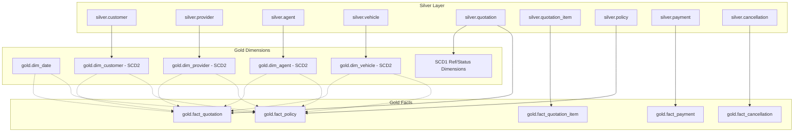

# Microsoft Fabric Gold Layer Ingestion Documentation

This document serves as the technical reference and integration guide for the **Gold Layer Ingestion Process** under **US-33: Gold Layer Ingestion**. It outlines the architecture, the implementation details of all 14 dimensions and 5 fact tables, the validation framework, and instructions on how to integrate the Gold ingestion pipeline with the preceding Silver layer in Microsoft Fabric.

---

## 1. Architectural Overview

The Gold Layer acts as the conformed, reporting-ready dimensional layer (Star Schema) optimized for Power BI and semantic modeling. It is loaded sequentially using Microsoft Fabric PySpark Notebooks with rigorous preflight checks, metadata lineage capture, soft-delete handling, and quality validation.



---

## 2. Implemented Components

The Gold ingestion process consists of 9 conformed PySpark Notebooks situated in [fabric/Gold/Notebooks/](../../fabric/Gold/Notebooks/):

### A. Setup & Schema Validation
- **Notebook**: [nb_gold_static_dimension_setup_dev](../../fabric/Gold/Notebooks/nb_gold_static_dimension_setup_dev.Notebook/notebook-content.py)
- **Functions**:
  - `validate_gold_schemas()`: Idiomatically verifies that all 19 Gold tables conform to target column configurations and data types (e.g. `DECIMAL(18,2)` for financial fields, `BIGINT` for surrogate keys).
  - `generate_dim_date()`: Generates a conformed static date calendar (`gold.dim_date`) from `2020-01-01` to `2030-12-31`.
  - `insert_unknown_members()`: Idempotently inserts the `-1` Unknown member into all 13 dimension tables to handle unresolved lookups safely.

### B. Slowly Changing Dimensions Type 1
- **Notebook**: [nb_gold_dim_scd1_load_dev.py](../../fabric/Gold/Notebooks/nb_gold_dim_scd1_load_dev.py.Notebook/notebook-content.py)
- **Logic**: Performs overwrite/upsert operations based on business keys. When source values change, the corresponding columns in Gold are updated in-place without preserving version history.
- **Dimensions Loaded**: 
  - `dim_package` (packages from `silver.quotation`)
  - `dim_coverage` (coverages from `silver.quotation_item`)
  - `dim_quotation` (quotations header reference)
  - `dim_policy` (policies header reference)
  - Reference status/method dimensions: `dim_quotation_status`, `dim_policy_status`, `dim_payment_status`, `dim_payment_method` (values normalized, e.g. `BANK_TRANSFER`), and `dim_cancellation_reason`.

### C. Slowly Changing Dimensions Type 2
- **Notebook**: [nb_gold_dim_scd2_load_dev.py](../../fabric/Gold/Notebooks/nb_gold_dim_scd2_load_dev.py.Notebook/notebook-content.py)
- **Logic**: Preserves historical changes by creating new records with updated attributes.
  - Detects changes by computing an MD5 hash over the business key and tracked fields.
  - **Insert**: Generates a new surrogate key, sets `is_current = true`, `effective_from = source.updated_at`, and `effective_to = '9999-12-31 23:59:59'`.
  - **Expire**: Updates the old active row to `is_current = false` and sets `effective_to` to the new version's `effective_from`.
  - **Type 1 Update**: Allows updating non-tracked descriptive columns in-place on current active rows.
- **Dimensions Loaded**:
  - `dim_customer` (tracked fields: `city`, `district`)
  - `dim_agent` (tracked fields: `region`, `branch`, `manager_name`)
  - `dim_provider` (tracked fields: `provider_group`, `active_flag`)
  - `dim_vehicle` (tracked fields: `vehicle_value`)

### D. Fact Ingestion Engine
- **Notebook**: [nb_gold_fact_build_dev](../../fabric/Gold/Notebooks/nb_gold_fact_build_dev.Notebook/notebook-content.py)
- **Helper Notebook**: [nb_gold_fact_helper_dev](../../fabric/Gold/Notebooks/nb_gold_fact_helper_dev.Notebook/notebook-content.py) (contains key lookup and auditing helpers)
- **Logic**: Loads conformed facts by reading Silver records, resolving keys, and writing target Delta formats.
  - **Surrogate Key Resolution**: Calls `lookup_scd2_key()` to resolve historical keys by matching the transaction timestamp against dimension validity windows (`effective_from` and `effective_to`). Direct fact-to-fact joins are avoided.
  - **Soft Delete Mapping**: Evaluates deletion events (`operation_type = 'D'` or `is_deleted = true`). Instead of physical deletion, rows are updated to `is_deleted = true`, setting `deleted_at = current_timestamp()` and `delete_batch_id = current_batch_id()`.
  - **Lineage Metadata**: Automatically tracks execution context via `_batch_id`, `_source_system`, and `pipeline_run_id`.
- **Fact Tables Loaded**:
  - `fact_policy` (resolves `policy_key`, `quotation_key`, `customer_key`, `provider_key`, `agent_key`, `package_key`, `policy_status_key`, `vehicle_key`)
  - `fact_quotation` (resolves `quotation_key`, `customer_key`, `agent_key`, `provider_key`, `package_key`, `quotation_status_key`, `vehicle_key`, and sets `converted_flag`)
  - `fact_quotation_item` (resolves parent quotation headers, `coverage_key`, `vehicle_key`, and defaults `deductible_amount` to `0.00` if null)
  - `fact_payment` (resolves `policy_key`, payment details, conformed payment method, and contains `issued_date_key` to support Average Payment Time)
  - `fact_cancellation` (resolves `policy_key`, `cancellation_reason_key`, customer details, and vehicle details)

### E. Data Quality & Validation
- **Notebook**: [nb_gold_fact_validate_dev](../../fabric/Gold/Notebooks/nb_gold_fact_validate_dev.Notebook/notebook-content.py)
- **Logic**: Executes a suite of generic checks dynamically per fact table:
  1. **Row Count Reconciliation**: Validates that target row counts match conformed source counts.
  2. **Grain Uniqueness**: Assures zero duplicate records exist based on the fact's primary business key.
  3. **Date Key Validity**: Asserts all date keys in the fact table exist in `dim_date.date_key`.
  4. **Foreign Key Integrity**: Validates that resolved surrogate keys match actual keys in dimensions or resolve to the `-1` Unknown key.
  5. **Metric Reconciliation**: Sums key business metrics (e.g. `premium_amount`, `payment_amount`, `refund_amount`) at both layers and checks they match within `0.01` decimal precision.
  6. **Soft Delete Auditing**: Verifies deleted flags write proper technical metadata.

---

## 3. End-to-End Execution Sequence

All notebooks are orchestrated safely and sequentially from the central orchestrator notebook: **`nb_gold_orchestrator_dev`**.

```text
[Preflight Guards]
        │
        ▼
[nb_cfg_etl_control_setup_dev] ──► [nb_audit_pipeline_log_dev] ──► [nb_gold_create_tables_dev] (Optional)
        │
        ▼
[nb_gold_static_dimension_setup_dev] (Calendar & -1 Unknown members)
        │
        ▼
[nb_gold_dim_scd1_load_dev] (SCD Type 1 dimensions)
        │
        ▼
[nb_gold_dim_scd2_load_dev] (SCD Type 2 dimensions)
        │
        ▼
[nb_gold_driver_flow_dev] (Executes builds and validations sequentially for all 5 Facts)
```

---

## 4. Microsoft Fabric Pipeline Integration Guide

To link the Silver layer to the Gold layer smoothly within Fabric Data Factory:

### A. Establish Success Constraints
Create a Data Factory Pipeline. Place a **Notebook Activity** for Silver processing (e.g., `nb_transform_silver`) and connect its **On Success (green wire)** connector directly to a Notebook Activity pointing to **`nb_gold_orchestrator_dev`**.

```text
+------------------------+              (On Success)             +----------------------------------+
|  Run_Silver_Ingestion  |──────────────────────────────────────>|       Run_Gold_Orchestrator      |
| (nb_transform_silver)  |                                       |   (nb_gold_orchestrator_dev)     |
+------------------------+                                       +----------------------------------+
```

### B. Configure Parameters
Click the `Run_Gold_Orchestrator` activity, open the **Settings** tab, and declare the following **Base parameters**:
- `p_execution_mode` (String): `FULL_PHASE1`
- `p_batch_id` (Expression): `@activity('Run_Silver_Ingestion').output.runOutputs.batch_id` (or bind to the pipeline parameter `@pipeline().parameters.PipelineBatchId`)
- `p_run_mode` (String): `NEW`
- `p_enable_audit` (String): `true`

---

## 5. Verification SQL Queries

Run the following conformed queries in the Lakehouse SQL Endpoint to verify the ingestion state:

- **Check duplicate primary grain**:
  ```sql
  SELECT quotation_id, COUNT(*) FROM gold.fact_quotation GROUP BY quotation_id HAVING COUNT(*) > 1;
  SELECT policy_id, COUNT(*) FROM gold.fact_policy GROUP BY policy_id HAVING COUNT(*) > 1;
  SELECT payment_id, COUNT(*) FROM gold.fact_payment GROUP BY payment_id HAVING COUNT(*) > 1;
  SELECT cancellation_id, COUNT(*) FROM gold.fact_cancellation GROUP BY cancellation_id HAVING COUNT(*) > 1;
  ```
- **Check unresolved orphan keys (keys that are NULL or 0 rather than -1)**:
  ```sql
  SELECT COUNT(*) FROM gold.fact_policy WHERE customer_key IS NULL OR customer_key = 0;
  SELECT COUNT(*) FROM gold.fact_payment WHERE policy_key IS NULL OR policy_key = 0;
  ```
- **Monitor Unknown key counts per column**:
  ```sql
  SELECT customer_key, COUNT(*) FROM gold.fact_policy GROUP BY customer_key;
  ```
- **Reconcile metrics**:
  ```sql
  SELECT SUM(premium_amount) FROM silver.policy WHERE is_deleted = false;
  SELECT SUM(premium_amount) FROM gold.fact_policy WHERE is_deleted = false;
  ```
