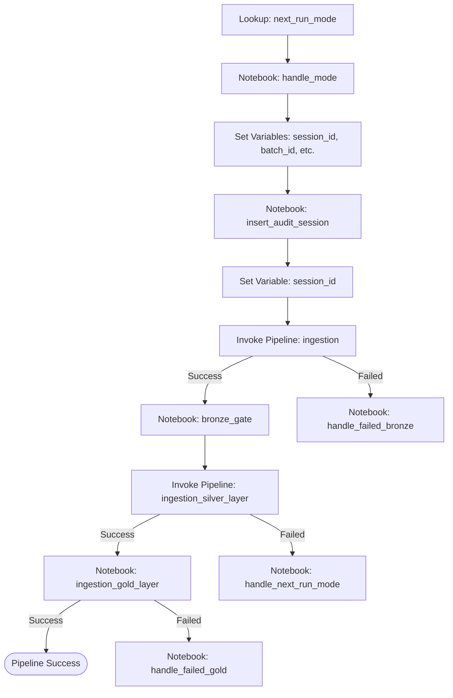

# Gold and Silver Layer Integration Strategy

This document outlines the design rationale and integration strategy for incorporating the Gold Layer ingestion and validation processes into the master ETL workflow within Microsoft Fabric.

## 1. Objectives & Architectural Constraints

The primary goal is to establish a unified, automated data pipeline running sequentially from Bronze to Gold while adhering to the following strict constraints:
- **No Modifications to Existing Components**: The existing `pl_master_etl_dev` pipeline and related Bronze/Silver notebooks/pipelines must remain untouched to prevent regressions in production-stable configurations.
- **Traceable Auditing and Lineage**: The execution lineage from Bronze to Gold must be consolidated under a single parent audit session in `log.audit_session`, avoiding disconnected execution runs.
- **Isolate Failure Recovery**: Failures in the Gold layer must trigger dedicated recovery steps that log the exact layer failure (`GOLD_LAYER_FAILED`) instead of misrepresenting the issue as a Bronze or Silver failure.

---

## 2. Integrated Pipeline Design (`pl_master_etl_gold_dev`)

To achieve end-to-end orchestration without modifying the existing master ETL pipeline, a new master pipeline `pl_master_etl_gold_dev` has been created. 

The pipeline workflow is depicted below:

### Key Activities Added:
1. **`ingestion_gold_layer`** (TridentNotebook Activity):
   - **Trigger Condition**: Runs only after `ingestion_silver_layer` completes with `Succeeded`.
   - **Target Notebook**: `nb_gold_orchestrator_dev`.
   - **Execution Settings**:
     - `p_execution_mode`: `"FULL_INGESTION"`
     - `p_run_gold_create_tables`: `"false"`
   - **Parameters Passed**:
     - `p_session_id`: `@variables('session_id')`
     - `p_batch_id`: `@variables('batch_id')`
     - `p_pipeline_run_id`: `@pipeline().RunId`

2. **`handle_failed_gold`** (TridentNotebook Activity):
   - **Trigger Condition**: Runs when `ingestion_gold_layer` status is `Failed`.
   - **Target Notebook**: `nb_gold_update_audit_session_and_next_run_mode_dev`.
   - **Parameters Passed**:
     - `session_id`: `@variables('session_id')`
     - `batch_id`: `@variables('batch_id')`

---

## 3. Auditing and Traceability Enhancements

### Lineage Correlation via `pipeline_run_id`
In Microsoft Fabric, calling the logging helper `start_pipeline_session` with an existing `pipeline_run_id` retrieves the active session ID instead of inserting a duplicate. 

To link the Gold layer's auditing with the Bronze and Silver sessions:
- The parameters of `nb_gold_orchestrator_dev` were extended to accept `p_pipeline_run_id`.
- The orchestrator maps this parameter into `common_args` passed to child notebooks.
- As a result, the fact table driver `nb_gold_driver_flow_dev` can lookup and load under the pre-existing master `session_id`, ensuring a single transaction log records the entire load.

### Gold failure recovery (`nb_gold_update_audit_session_and_next_run_mode_dev`)
Existing recovery notebooks (e.g. `nb_update_audit_session_and_next_run_mode_dev`) have hardcoded error logs representing Bronze failures. To prevent misleading status messages, a new recovery notebook was created specifically for the Gold layer.

When triggered, it executes the following operations:
1. Sets `cfg.next_run_mode.next_run_mode` to `'RECOVERY'`.
2. Updates `log.audit_session` status to `'FAILED'`, setting `error_code = 'GOLD_LAYER_FAILED'`.
3. Throws a Python exception to fail the pipeline and alert administrators.

---

## 4. Parameter Mappings Matrix

| Activity | Parameter Name | Expression / Value | Purpose |
|---|---|---|---|
| **`ingestion_gold_layer`** | `p_session_id` | `@variables('session_id')` | Trace audit session context |
| | `p_batch_id` | `@variables('batch_id')` | Associate output data with the current batch |
| | `p_pipeline_run_id` | `@pipeline().RunId` | Link lineage logs to the active Fabric run |
| | `p_execution_mode` | `"FULL_INGESTION"` | Run setup, dimensions, facts and validation |
| | `p_run_gold_create_tables` | `"false"` | Prevent destructive DDL overwrite during runs |
| **`handle_failed_gold`** | `session_id` | `@variables('session_id')` | Target audit session for termination |
| | `batch_id` | `@variables('batch_id')` | Retain batch tracking info for recovery next run |

---

## 5. Verification Plan

After deploying the pipeline and notebooks to the dev environment:

1. **Verify Sequential Run**:
   - Trigger `pl_master_etl_gold_dev`.
   - Ensure the activities execute in sequence: Ingestion (Bronze) -> Bronze Gate -> Silver Ingestion -> Gold Ingestion.

2. **Verify Lineage Continuity**:
   - Query `log.audit_session` using the `pipeline_run_id` of the pipeline execution.
   - Verify that there is exactly **one** record representing the run, and its status changes to `SUCCESS` upon completion of the Gold layer.
   - Verify that `log.audit_table_session` contains successful load entries for Silver tables AND Gold fact tables (`fact_policy`, etc.) under the same `session_id`.

3. **Verify Recovery Flow**:
   - Deliberately inject a failure in the Gold layer (e.g., mismatch a schema or set a constraint to fail).
   - Trigger `pl_master_etl_gold_dev`.
   - Confirm that `ingestion_gold_layer` fails and immediately triggers `handle_failed_gold`.
   - Check `cfg.next_run_mode` to verify that `next_run_mode` is set to `'RECOVERY'`.
   - Check `log.audit_session` to verify that the session is marked as `FAILED` with `error_code = 'GOLD_LAYER_FAILED'`.
