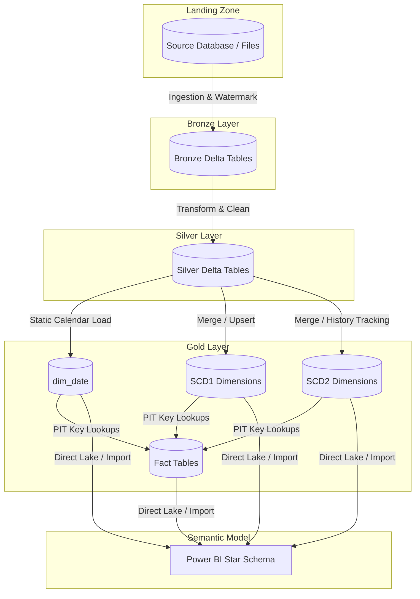

# 00 - Gold Layer Architecture Overview

This document defines the high-level architecture, team responsibilities, and notebook structures for the redesigned **Gold Layer** implementation in Microsoft Fabric. 

---

## 1. Collaboration & Medallion Context

The data pipeline follows a standard Medallion Architecture:
*   **Bronze Layer (Ingestion & Schema Guard)**: Handles source extraction, incremental loading, watermark tracking, and file-level logging.
*   **Silver Layer (Validation & Conforming)**: Cleans, deduplicates, enforces validation rules, and conforms data into clean Silver tables.
*   **Gold Layer (Reporting-Ready Star Schema)**: Ingests conformed dimensions (SCD1 and SCD2) and point-in-time conformed Fact tables optimized for reporting and analytics.

### Architectural Constraint (Strict Isolation)
> [!IMPORTANT]
> The development work for the Gold Layer is completely isolated from upstream stages. **We must NOT modify any Bronze or Silver logic, tables, or notebooks.**
> The orchestration pipeline `pl_master_etl_dev` is shared; we are only allowed to modify/re-point the final two pipeline activities:
> 1. `ingestion_gold_layer`
> 2. `handle_failed_gold`

---

## 2. End-to-End Pipeline Data Flow

The Gold Layer acts as the final target in the sequential data pipeline. The logic flow of data through the layers is shown below:



---

## 3. Directory and Notebook Structure

All operational logic for the Gold Layer is kept in the dedicated `fabric/Gold/Notebooks/` directory. The redesigned notebooks are organized as follows:

```text
fabric/Gold/Notebooks/
│
├── nb_gold_load_dim_date_dev              # Generates calendar dimension dim_date & inserts Unknown Member (-1)
├── nb_gold_load_scd1_dimensions_dev       # Ingests SCD Type 1 dimensions (In-place update)
├── nb_gold_load_scd2_dimensions_dev       # Ingests SCD Type 2 dimensions (Historical tracking)
├── nb_gold_load_fact_quotation_dev        # Ingests fact_quotation resolving dim keys
├── nb_gold_load_fact_quotation_item_dev   # Ingests fact_quotation_item resolving dim keys
├── nb_gold_load_fact_policy_dev           # Ingests fact_policy resolving dim keys
├── nb_gold_load_fact_payment_dev          # Ingests fact_payment resolving dim keys
├── nb_gold_load_fact_cancellation_dev     # Ingests fact_cancellation resolving dim keys
├── nb_gold_validate_reconciliation_dev    # Performs post-ingestion validation & data quality check suite
└── nb_gold_master_load_dev                # Master orchestrator driver running the sequential workflow
```

---

## 4. Sequential Execution Order

The master orchestrator notebook (`nb_gold_master_load_dev`) executes the ingestion steps sequentially in a single execution thread to prevent capacity pressure. The execution path is defined as:

1.  **Date Dimension Setup** (`nb_gold_load_dim_date_dev`): Populates calendar entries and ensures Unknown member rows (`-1`) are created.
2.  **SCD1 Dimension Loading** (`nb_gold_load_scd1_dimensions_dev`): Updates Type 1 conformed dimensions.
3.  **SCD2 Dimension Loading** (`nb_gold_load_scd2_dimensions_dev`): Generates and expires Type 2 versioned dimension rows.
4.  **Fact Ingestion** (Executed sequentially by Fact table dependency):
    *   `fact_quotation`
    *   `fact_quotation_item`
    *   `fact_policy`
    *   `fact_payment`
    *   `fact_cancellation`
5.  **Validation Check** (Executed by `nb_gold_validate_reconciliation_dev` running data quality & reconciliation checks).
6.  **Semantic Model Refresh** (Power BI data modeling ready).
