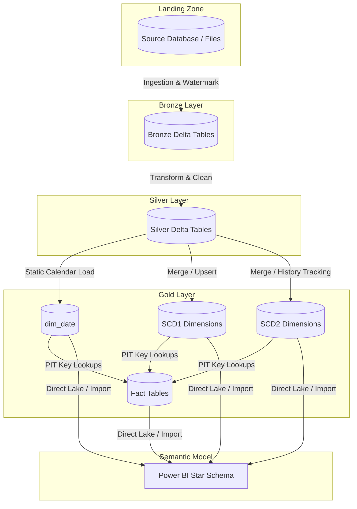

# 00 - Gold Layer Architecture Overview

This document defines the high-level architecture, medallion data flow, team responsibilities, and notebook layouts for the redesigned **Gold Layer** implementation in Microsoft Fabric.

---

## 1. Collaboration & Medallion Context

The data pipeline follows a standard Medallion Architecture:
*   **Bronze Layer (Ingestion & Schema Guard)**: Handles source extraction, incremental loading, watermark tracking, and file-level logging.
*   **Silver Layer (Validation & Conforming)**: Cleans, deduplicates, enforces validation rules, and conforms data into clean Silver tables.
*   **Gold Layer (Reporting-Ready Star Schema)**: Ingests conformed dimensions (SCD1 and SCD2) and point-in-time conformed Fact tables optimized for reporting and analytics.

### Architectural Constraint (Strict Isolation)
> [!IMPORTANT]
> The development work for the Gold Layer is completely isolated from upstream stages. **We must NOT modify any Bronze or Silver logic, tables, or notebooks.**
> The orchestration pipeline `pl_master_etl_dev` is shared; we are only allowed to modify/re-point the final two pipeline activities:
> 1. `ingestion_gold_layer`
> 2. `handle_failed_gold`

---

## 2. End-to-End Pipeline Data Flow

The Gold Layer acts as the final target in the sequential data pipeline. The logic flow of data through the layers is shown below:



---

## 3. Directory and Notebook Structure

All operational logic for the Gold Layer is kept in the dedicated `fabric/Gold/Notebooks/` directory. The notebooks are organized as follows:

```text
fabric/Gold/Notebooks/
│
├── nb_gold_load_dim_date_dev              # Generates calendar dimension dim_date & inserts Unknown Member (-1)
├── nb_gold_load_scd1_dimensions_dev       # Ingests SCD Type 1 dimensions (In-place update)
├── nb_gold_load_scd2_dimensions_dev       # Ingests SCD Type 2 dimensions (Historical tracking)
├── nb_gold_load_fact_quotation_dev        # Ingests fact_quotation resolving dim keys
├── nb_gold_load_fact_quotation_item_dev   # Ingests fact_quotation_item resolving dim keys
├── nb_gold_load_fact_policy_dev           # Ingests fact_policy resolving dim keys
├── nb_gold_load_fact_payment_dev          # Ingests fact_payment resolving dim keys
├── nb_gold_load_fact_cancellation_dev     # Ingests fact_cancellation resolving dim keys
├── nb_gold_validate_reconciliation_dev    # Performs post-ingestion validation & data quality check suite
└── nb_gold_master_load_dev                # Master orchestrator driver running the parallel workflow
```

---

## 4. Parallel Orchestration Stages

The master orchestrator notebook (`nb_gold_master_load_dev`) executes the ingestion steps in parallel stages to optimize runtime while preserving relational integrity, followed by a downstream validation activity:

1. **Stage 1 (Parallel Dimensions)**:
   - Populates calendar setup (`nb_gold_load_dim_date_dev`), 9 SCD1 dimensions, and 4 SCD2 dimensions concurrently.
   - Concurrency is throttled to `max_workers = 15`.
   - Halts if any dimension fails, preventing fact tables from joining on incorrect/outdated keys.
2. **Stage 2 (Parallel Facts)**:
   - Executes once all dimensions finish successfully.
   - Populates `fact_quotation`, `fact_quotation_item`, `fact_policy`, `fact_payment`, and `fact_cancellation` concurrently.
   - Concurrency is throttled to `max_workers = 5`.
3. **Stage 3 (Post-Ingestion Audit & Run Mode Reset)**:
   - Resolves the success/failure status of upstream ingestion sources based on target tables success.
   - Updates `log.audit_table_session` and `log.audit_session` statuses.
   - Resets the run mode to `NEW` by updating the control table `cfg.next_run_mode`.
4. **Stage 4 (Dedicated Validation Activity)**:
   - Executed as a separate pipeline activity (`nb_validation_gold`) in `pl_master_etl_dev.DataPipeline` upon successful completion of the master load.
   - Sequentially runs `nb_gold_validate_reconciliation_dev` to perform data quality checks, grain uniqueness checks, and metrics reconciliation.


---

## 5. Documentation Roadmap

To understand the full Gold Layer implementation and deployment strategy, please read the documentation files in the following sequential order:
1. **[00 - Gold Layer Architecture Overview](./00-architecture-overview.md)** (This document)
2. **[01 - Orchestration and Concurrency Specification](./01-orchestration-and-concurrency.md)**
3. **[02 - Dimension Loading Specifications](./02-dimension-loading-specs.md)**
4. **[03 - Fact Loading Specifications](./03-fact-loading-specs.md)**
5. **[04 - Audit and Validation Specifications](./04-audit-and-validation.md)**
6. **[05 - Ingestion Run Modes and Recovery Specifications](./05-pipeline-recovery-and-run-modes.md)**
