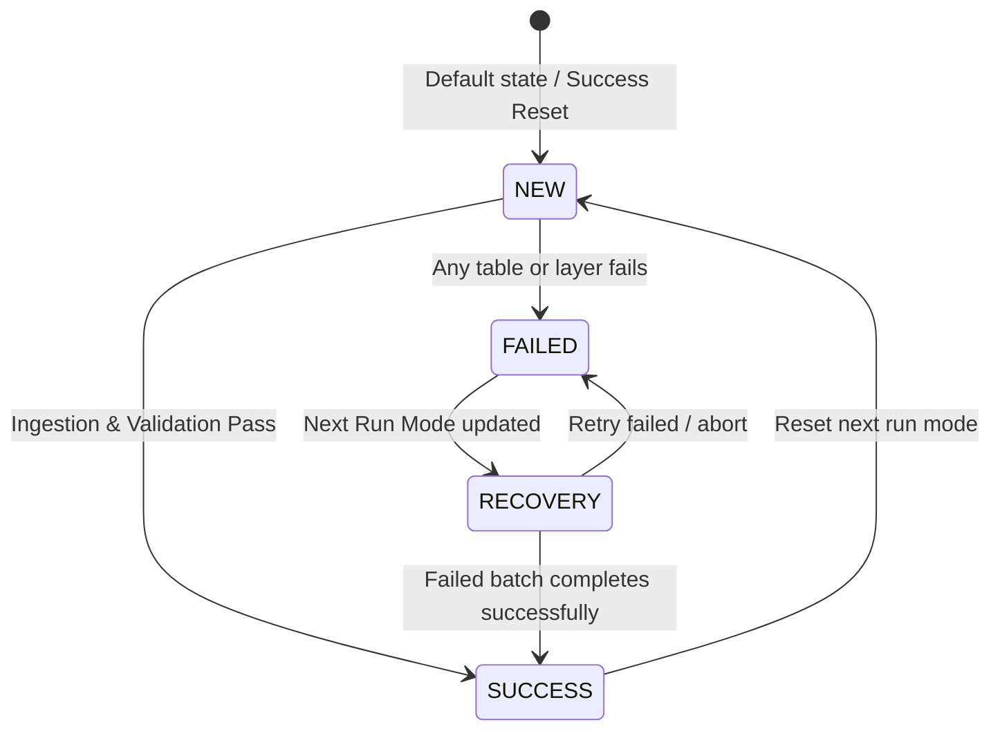
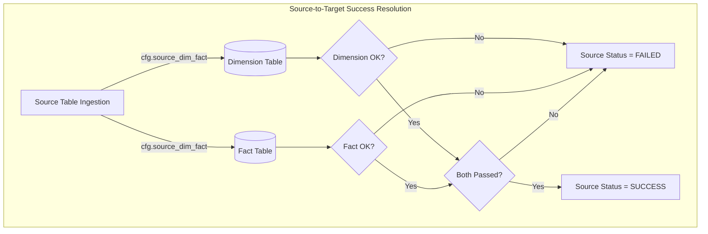
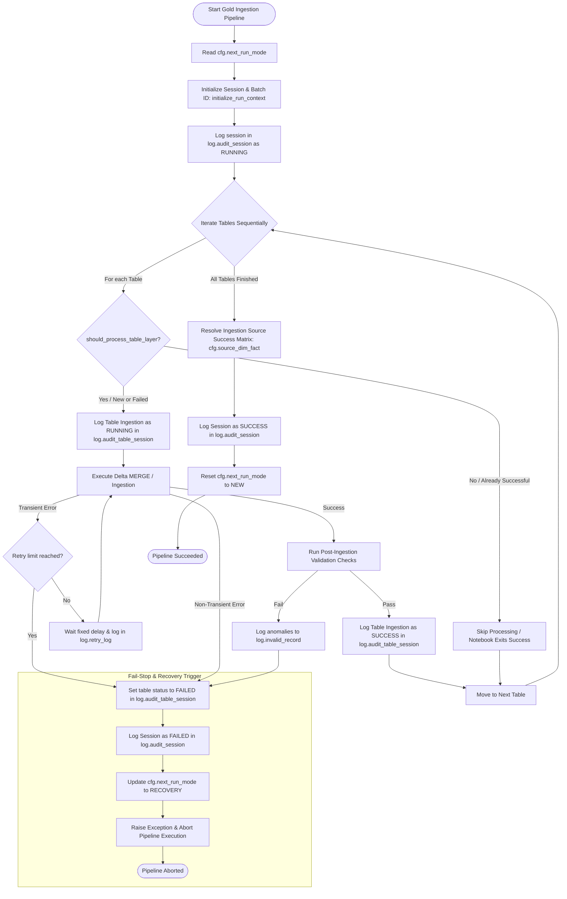

# 01 - Gold Layer Auditing and Control Flow Specification

This document defines the operational logic for auditing, state transitions, and success/failure handling in the Gold Layer of the **CarPro Insurance Analytics** pipeline. It details how the control table `cfg.next_run_mode` and the auditing tables in the `log` schema interact to ensure robustness, lineage tracking, and automated failure recovery.

---

## 1. Pipeline Run Modes & State Transitions

The execution behavior of the master ETL pipeline (`pl_master_etl_gold_dev`) is driven dynamically by the single-row control table `cfg.next_run_mode`. This table keeps track of the execution state between runs.

### 1.1. The Success Path
When the Gold Layer ingestion (SCD1, SCD2, and Fact tables) and all validation suites complete without any errors:
1. **Update Audit Session**: The pipeline updates `log.audit_session` status to `SUCCESS` and sets `session_finished = current_timestamp()`.
2. **Reset Run Mode**: The pipeline resets the singleton record in `cfg.next_run_mode` back to:
   - `next_run_mode = 'NEW'`
   - `batch_id = NULL`
   - `session_id = NULL`
   - `updated_at = current_timestamp()`
3. **Next Execution**: The next pipeline execution will start a brand-new batch with an incremented batch ID.

### 1.2. The Failure Path
If an error occurs in the Gold Layer (e.g., a notebook failure, schema mismatch, or data quality validation check failure):
1. **Trigger Recovery Notebook**: The pipeline triggers the error handler notebook `nb_gold_update_audit_session_and_next_run_mode_dev`.
2. **Update Audit Session**: The audit session status in `log.audit_session` is updated to `FAILED` with:
   - `session_status = 'FAILED'`
   - `error_code = 'GOLD_LAYER_FAILED'`
   - `error_message = <captured_exception_details>`
   - `session_finished = current_timestamp()`
3. **Set Recovery Mode**: The singleton record in `cfg.next_run_mode` is updated to preserve the failed execution context:
   - `next_run_mode = 'RECOVERY'`
   - `batch_id = <current_batch_id>` (retains the active batch ID to ensure the failed batch is reprocessed)
   - `session_id = <failed_session_id>` (preserves the failed session ID for recovery lineage tracking)
   - `updated_at = current_timestamp()`
4. **Abort Pipeline**: A Python exception is raised to fail the Fabric pipeline run and trigger administrative alerts.
5. **Next Execution**: The next time the pipeline runs, it will read `cfg.next_run_mode` as `RECOVERY`, reuse the failed `batch_id` to ensure no data loss, and resume processing starting from the failed layer/tables.

---

## 2. Table-Level Ingestion & Source Success Rule

The pipeline tracks execution at the table level in `log.audit_table_session`. In the Gold Layer, target tables (Conformed Dimensions & Facts) are related back to their ingestion sources through the mapping table `cfg.source_dim_fact`.

### 2.1. The Source Success Condition
A source table session (representing one of the 9 active sources) is resolved and recorded as successful (`table_session_status = 'SUCCESS'`) in `log.audit_table_session` **if and only if both its conformed dimensions and all fact tables mapped to it process successfully.**

If **any conformed dimension or fact table** associated with a source table fails to build or validate:
- The overall status for that source table is set to `FAILED`.
- The run mode is updated to `RECOVERY` for the next run.
- Lineage is preserved so that recovery starts exactly at the failed dimension or fact.

### 2.2. The 9 Active Ingestion Sources
There are exactly **9 active sources** in the control configuration (`cfg.source_table`). Below is the mapping matrix showing the target Dimensions and Facts associated with each source via `cfg.source_dim_fact`:

| Source ID | Source Table Name | Associated Target Dimensions (Gold) | Associated Target Facts (Gold) | Success Rule Detail |
| :---: | :--- | :--- | :--- | :--- |
| **1** | `customers` | `dim_customer` (SCD2) | `fact_quotation`, `fact_quotation_item`, `fact_policy`, `fact_payment`, `fact_cancellation` | Successful only if `dim_customer` and **all 5** facts are successfully loaded and validated. |
| **2** | `agents` | `dim_agent` (SCD2) | `fact_quotation`, `fact_quotation_item`, `fact_policy` | Successful only if `dim_agent` and **all 3** facts are successfully loaded and validated. |
| **3** | `insurance_providers` | `dim_provider` (SCD2) | `fact_quotation`, `fact_quotation_item`, `fact_policy`, `fact_payment`, `fact_cancellation` | Successful only if `dim_provider` and **all 5** facts are successfully loaded and validated. |
| **4** | `vehicle` | `dim_vehicle` (SCD2) | `fact_quotation`, `fact_quotation_item`, `fact_policy`, `fact_payment`, `fact_cancellation` | Successful only if `dim_vehicle` and **all 5** facts are successfully loaded and validated. |
| **5** | `quotation` | `dim_package` (SCD1) `dim_quotation` (SCD1) `dim_quotation_status` (SCD1) | `fact_quotation`, `fact_quotation_item`, `fact_policy` | Successful only if **all 3** SCD1 dimensions and **all 3** facts are successfully loaded and validated. |
| **6** | `quotation_item` | `dim_coverage` (SCD1) | `fact_quotation_item` | Successful only if `dim_coverage` and `fact_quotation_item` are successfully loaded and validated. |
| **7** | `policy` | `dim_policy` (SCD1) `dim_policy_status` (SCD1) | `fact_policy`, `fact_payment`, `fact_cancellation` | Successful only if **both** SCD1 dimensions and **all 3** facts are successfully loaded and validated. |
| **8** | `cancellation` | `dim_cancellation_reason` (SCD1) | `fact_cancellation` | Successful only if `dim_cancellation_reason` and `fact_cancellation` are successfully loaded and validated. |
| **9** | `payment` | `dim_payment_status` (SCD1) `dim_payment_method` (SCD1) | `fact_payment` | Successful only if **both** SCD1 dimensions and `fact_payment` are successfully loaded and validated. |

---

## 3. Auditing & Dependency Verification

During execution, conformed dimensions and fact table states are monitored. The orchestrator checks these relationships before finishing execution sessions:

### Audit Session Finish Mechanics
* **Session Finish helper**: `finish_pipeline_session(session_id, status)` evaluates the active execution batch.
* If a table session fails validation checks (e.g. grain uniqueness, date key validity, foreign key integrity, metric reconciliation), `finish_table_layer()` is invoked with `status = 'FAILED'`.
* The parent job handles the failure, catches the exception, updates the run mode to `RECOVERY`, and logs the standard error code `GOLD_LAYER_FAILED` in the master auditing table `log.audit_session`.

---

## 4. Chronological Ingestion & Auditing Control Flow

The Gold Layer execution follows a strict sequence of control flow checks and audit logging:

### Phase A: Pre-Ingestion (Pipeline Init)
1. **Read Run Mode**: Query the singleton control row in `cfg.next_run_mode` to check the current `next_run_mode` (`NEW` or `RECOVERY`), `batch_id`, and `session_id`.
2. **Context Creation**: Execute `initialize_run_context()`:
   * Generate a new execution UUID for the current run (`session_id`).
   * If `next_run_mode = 'NEW'`: Increment the batch sequence to create a new `batch_id`.
   * If `next_run_mode = 'RECOVERY'`: Retrieve and reuse the failed `batch_id` from `cfg.next_run_mode`.
3. **Session Logging**: Insert a new record into `log.audit_session` with `session_status = 'RUNNING'`, `run_mode = next_run_mode`, `batch_id = batch_id`, and `session_started = current_timestamp()`.

### Phase B: Ingestion (Table-Level Processing Loop)
The driver notebook processes target tables sequentially. For each table:
1. **Check Skip/Run**: Invoke `should_process_table_layer(batch_id, table_name, 'GOLD')`.
   * In `RECOVERY` mode, if the table's `gold_status` is already logged as `SUCCESS` for the current batch, it is **SKIPPED** (0 write I/O).
   * Otherwise, the table is **RUN**.
2. **Initialize Table Ingestion**: Write a start record in `log.audit_table_session` with `gold_status = 'RUNNING'` and `gold_started_at = current_timestamp()`.
3. **Execute Ingestion**: Run the Delta MERGE command.
   * **Transient Errors**: If a transient database/connection/cluster error occurs, apply `cfg.retry_policy` (max retries, wait delay). Log retry attempts in `log.retry_log`.
   * **On Success**: Write row counts (`inserted_row`, `updated_row`, `deleted_row`, `rejected_row`, `layer = 'GOLD'`) to `log.audit_detail`. Update `log.audit_table_session` setting `gold_status = 'SUCCESS'` and `gold_ended_at = current_timestamp()`.
   * **On Failure (Retries Exhausted or Non-Retryable Error)**:
     * Mark `gold_status = 'FAILED'`, and log `error_code` and `error_message` in `log.audit_table_session`.
     * Invoke `mark_recovery_required()` to set `cfg.next_run_mode` to `RECOVERY` with the active `batch_id` and `session_id`.
     * **Abort Immediately**: Raise a Python exception to halt the execution sequence. Subsequent tables are not run.

### Phase C: Validation (Post-Ingestion QA)
1. **QA Execution**: Run `nb_gold_validate_reconciliation_dev` after fact tables are ingested.
2. **Constraint Verification**: If any check (e.g. grain check, key check) fails:
   * Write validation failures to `log.invalid_record`.
   * Mark the table's status as `FAILED` in `log.audit_table_session`.
   * Invoke `mark_recovery_required()` to set the run mode to `RECOVERY`.
   * Halt execution immediately.

### Phase D: Post-Ingestion (Pipeline Completion)
1. **Source Mapping**: If all tables pass validation, check the Source Success Matrix (9 active sources) mapped via `cfg.source_dim_fact`.
2. **Flag Source Success**: Mark `table_session_status = 'SUCCESS'` in `log.audit_table_session` for each source table whose conformed target dimensions and facts succeeded.
3. **Finish Session**: Update `log.audit_session` status to `SUCCESS` and set `session_finished = current_timestamp()`.
4. **Reset Run Mode**: Invoke `reset_next_run_mode()` to reset the control record in `cfg.next_run_mode` back to `NEW` with null `batch_id` and `session_id`.

