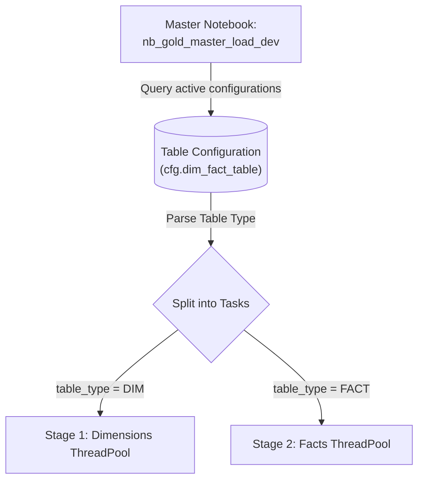
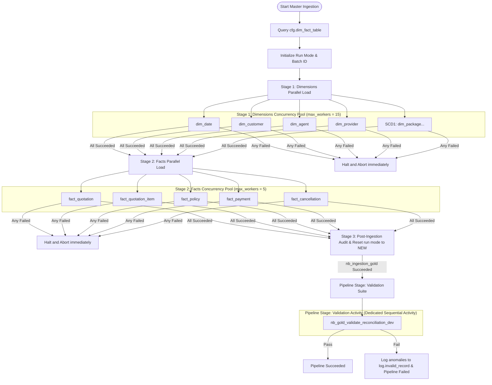
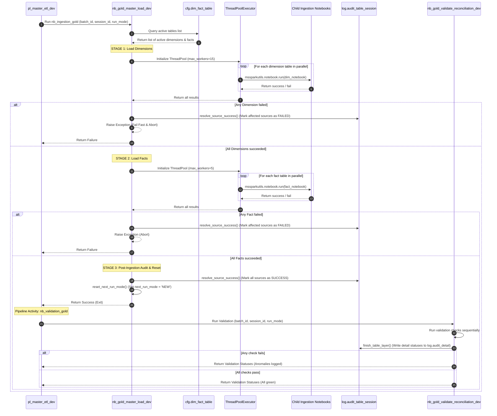

# 01 - Orchestration and Concurrency Specification

This document details the metadata-driven execution, concurrency throttling, and skip-resume recovery mechanisms implemented in the master orchestrator `nb_gold_master_load_dev`.

---

## 1. Metadata-Driven Orchestration

Rather than hardcoding the list of dimension and fact notebooks, the master notebook queries the Delta table `cfg.dim_fact_table` at runtime to dynamically fetch active configurations.

### Schema of `cfg.dim_fact_table`
The master notebook relies on the following columns from the configuration table:
*   `id`: Table sequence ID.
*   `table_name`: Target Delta table name (e.g. `dim_customer`).
*   `table_type`: Type classification (`DIM` or `FACT`).
*   `gold_transform_name`: Target notebook path (e.g. `nb_gold_load_scd2_dimensions_dev`).
*   `is_active`: Boolean flag indicating if the table is loaded in the pipeline.

---

## 2. Two-Stage Parallel Execution Flow

To ensure referential integrity, ingestion is executed in two concurrent stages. Dimension loads must be fully completed before Fact loads begin so that point-in-time dimension key lookups resolve correctly. The validation suite runs subsequently as a dedicated sequential activity.

### End-to-End Execution Sequence

The execution path, parallel notebook runs, dynamic error interception, final metadata updates, and downstream validation are outlined below:

### Concurrency Pools and Workers
*   **Dimensions Pool (`max_workers = 15`)**:
    - Runs 14 dimension loading tasks concurrently (1 `dim_date`, 9 SCD1 loads, and 4 SCD2 loads).
    - Max workers is set to 15 to allow all tasks to trigger simultaneously, maximizing cluster resource utilization.
*   **Facts Pool (`max_workers = 5`)**:
    - Runs 5 fact loading tasks concurrently.
    - Max workers is throttled to 5 to avoid resource exhaustion since fact tables carry larger volumes and perform heavy joins.

> [!WARNING]
> **Microsoft Fabric Capacity Limits**
> Spawning 15 parallel Spark notebook jobs concurrently consumes a significant amount of workspace capacity. In smaller Fabric capacities (e.g., F2/F4), some notebook sessions might queue. Ensure the capacity is configured with sufficient vCores or warm pools to allow seamless concurrent notebook startup.

---

## 3. Skip-Resume Recovery Mechanics

If a pipeline run aborts, the subsequent recovery run executes in `RECOVERY` mode using the same logical `batch_id`.

While Bronze and Silver layers actively check `should_process_table_layer` and skip tables that previously succeeded, the **Gold Layer overrides this check to always return `True`** (via `nb_gold_audit_helper_dev`). Due to the strictly idempotent design of Gold's Delta loads (SCD1, SCD2, and Facts), re-running these tables is safe, ensures complete relational consistency against updated upstream layers, and avoids audit lookup latency inside parallel threads.

For comprehensive specifications on run mode transitions, skip-resume mechanics, and Gold orchestrator failure handling, see the dedicated document:
*   [05 - Ingestion Run Modes and Recovery Specifications](./05-pipeline-recovery-and-run-modes.md)
