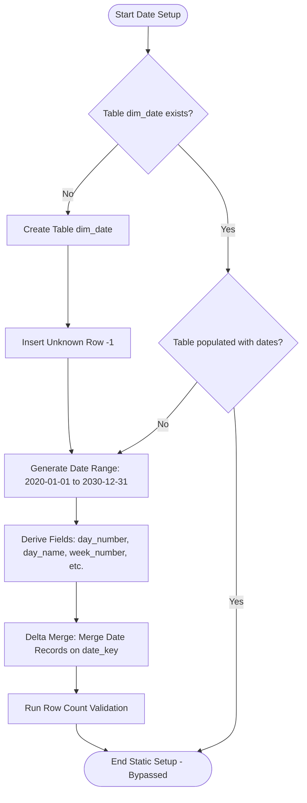

# 02 - Date Dimension Ingestion Strategy (`nb_gold_load_dim_date_dev`)

This document defines the ingestion and configuration design for `gold.dim_date`. It acts as the core calendar dimension in the Star Schema. Context for columns and rules is aligned with the project specification in [silver-to-gold-mapping.md](../source-to-target-mapping/silver-to-gold-mapping.md) and [dim_date.json](../source-to-target-mapping/jsons/silver-to-gold/dim_date.json).

---

## 1. Objectives

*   Pre-generate a calendar lookup table covering a 10-year span (from `2020-01-01` to `2030-12-31`).
*   Extract derived business columns to facilitate time-intelligence queries in Power BI.
*   Enforce the insertion of the **Unknown Member** row (`-1`) to serve as the default lookup key for blank or unresolved date keys.

---

## 2. Ingestion Logic & Flow

Unlike transactional tables, the date dimension is static. To optimize performance, if the `dim_date` table is already created and populated with data, we bypass date generation and merge steps.



---

## 3. Date Attribute Schema & Calculation Rules

The target table `gold.dim_date` contains the following attributes as defined in the mapping specifications:

| Target Column | Data Type | Calculation Rule / Value | Description |
| :--- | :--- | :--- | :--- |
| `date_key` | INT | `YYYYMMDD` format (e.g. `20260614`) | Primary key of the table (surrogate key) |
| `full_date` | DATE | Raw calendar date | Calendar date value |
| `day_number` | INT | `DAY(full_date)` | Day number within the month (1-31) |
| `day_name` | STRING | `DATE_FORMAT(full_date, 'EEEE')` | Day name (e.g. "Sunday") |
| `week_number` | INT | `WEEKOFYEAR(full_date)` | Week number of the year (1-53) |
| `month_number` | INT | `MONTH(full_date)` | Month number (1-12) |
| `month_name` | STRING | `DATE_FORMAT(full_date, 'MMMM')` | Month name (e.g. "June") |
| `quarter_number` | INT | `QUARTER(full_date)` | Quarter (1-4) |
| `year_number` | INT | `YEAR(full_date)` | Calendar year (e.g. 2026) |
| `year_month` | STRING | `DATE_FORMAT(full_date, 'yyyy-MM')` | Year-Month format (e.g. "2026-06") |
| `is_weekend` | BOOLEAN | `dayofweek(full_date) IN (1, 7)` | `True` for Saturday and Sunday |

---

## 4. Unknown Member Record Specification

To preserve referential integrity, a default "Unknown" member row must be present in the table. The schema requires the following values for this record:

*   `date_key` = `-1`
*   `full_date` = `NULL`
*   `day_number` = `NULL`
*   `day_name` = `'Unknown'`
*   `week_number` = `NULL`
*   `month_number` = `NULL`
*   `month_name` = `'Unknown'`
*   `quarter_number` = `NULL`
*   `year_number` = `NULL`
*   `year_month` = `'Unknown'`
*   `is_weekend` = `False`

---

## 5. Ingestion Verification

After execution of the notebook `nb_gold_load_dim_date_dev`, the following queries must pass:
1.  **Row Count Check**:
    ```sql
    SELECT COUNT(*) FROM gold.dim_date;
    -- Expected result: 4018 rows (365 days * 8 years + 366 days * 3 leap years + 1 Unknown row)
    ```
2.  **Unknown Member Check**:
    ```sql
    SELECT * FROM gold.dim_date WHERE date_key = -1;
    -- Expected result: Exactly 1 row with Unknown default values
    ```
