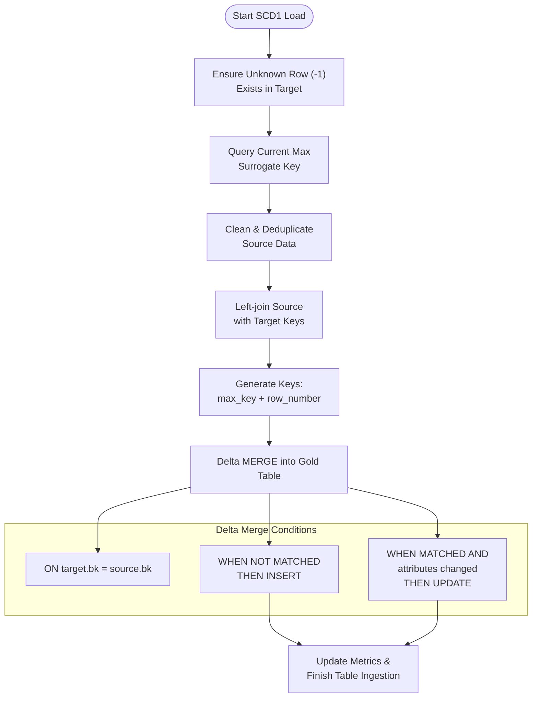
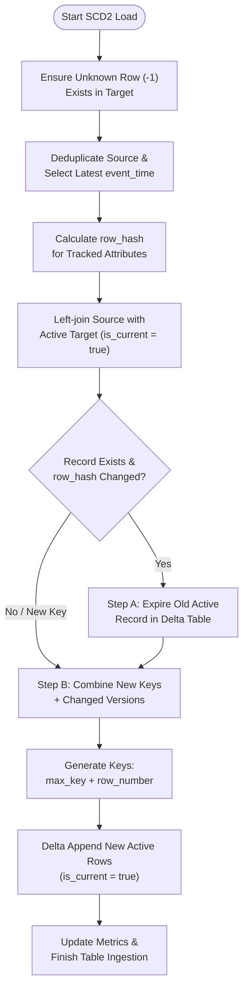

# 02 - Dimension Loading Specifications

This document defines the detailed loading logic, Spark execution patterns, Delta MERGE match statements, and update strategies for all conformed dimension tables in the Gold Layer.

---

## 1. Calendar Dimension (`dim_date`)

The calendar dimension `gold.dim_date` is statically populated from **2020-01-01** to **2030-12-31** (representing 11 years or 4,018 rows).
*   **Surrogate Key**: `date_key` (Format: `YYYYMMDD` integer, e.g., `20260617`).
*   **Date Fields**: Derives calendar fields such as `day_number`, `day_name`, `week_number`, `month_number`, `month_name`, `quarter_number`, `year_number`, `year_month`, and `is_weekend` (where day is Saturday or Sunday).
*   **Unknown Row Membership**: An Unknown member row is seeded with:
    - `date_key = -1`
    - `full_date = NULL`
    - `day_name = 'Unknown'`
    - `month_name = 'Unknown'`
    - `year_month = 'Unknown'`
    - `is_weekend = false`
*   **Execution Logic**: Checked by `nb_gold_load_dim_date_dev`. If the target table contains >= 4,018 rows, the setup is bypassed. Otherwise, it generates the date array, derives calendar columns, unions the Unknown row, and executes a Delta MERGE matching on `target.date_key = source.date_key`.

---

## 2. SCD Type 1 Dimensions (In-Place Overwrite)

SCD Type 1 dimensions update attributes in-place. If an attribute changes in the source (Silver), it overwrites the existing value in the target (Gold). History is not tracked.



### In-Notebook Implementation Details
1.  **Unknown Row Seeding**: Runs `ensure_unknown_row(target_table_name, surrogate_key_col)`. It checks if `surrogate_key = -1` exists. If not, it builds a single-row DataFrame mapping text fields to `"Unknown"`, timestamps/dates to `current_timestamp()` or `now()`, and numeric fields to `None`, then appends it to the Delta table.
2.  **Surrogate Key Generation**:
    - Fetches the maximum active surrogate key from the target Delta table:
      ```python
      max_key = spark.table(target_table).where(F.col(surrogate_key_col) != -1).agg(F.max(surrogate_key_col)).collect()[0][0]
      ```
    - Maps new records by left-joining source with target:
      ```python
      new_records = merged_prep.filter(F.col(surrogate_key_col).isNull())
      new_records_with_keys = new_records.withColumn(
          "resolved_key",
          F.lit(max_key) + F.row_number().over(Window.orderBy("src_" + business_key_col)).cast("bigint")
      )
      ```
3.  **Delta MERGE Operation**:
    - **Matching Condition**: `target.{business_key_col} = source.{business_key_col}`
    - **Overwriting Attributes**: Attributes are compared using a null-safe `COALESCE` check to see if they differ:
      ```python
      update_cond = " OR ".join([f"COALESCE(target.{c}, '') != COALESCE(source.{c}, '')" for c in attr_cols])
      ```
    - **When Matched Update**: Overwrites the attribute values and sets `updated_at = current_timestamp()`.
    - **When Not Matched Insert**: Inserts the generated `resolved_key` as the surrogate key, the business key, the attributes, and sets both `created_at` and `updated_at` to `current_timestamp()`.

---

## 3. SCD Type 2 Dimensions (Historical Tracking)

SCD Type 2 dimensions track historical changes by keeping versioned records. When an attribute changes, the existing active record is expired (closed), and a new version is inserted (opened).



### In-Notebook Implementation Details
1.  **Unknown Row Seeding**: Seeding is handled by `ensure_unknown_row_scd2()`. It inserts a row where:
    - Surrogate Key = `-1`
    - Business Key = `"Unknown"`
    - `is_current = true`
    - `effective_from = '1900-01-01 00:00:00'`
    - `effective_to = '9999-12-31 23:59:59'`
2.  **Deduplication & Hash Calculation**:
    - Deduplicates incoming source data to keep the latest state per business key:
      ```python
      window_source = Window.partitionBy(business_key_col).orderBy(F.col("event_time").desc())
      incoming_dedup = source_df.withColumn("rn", F.row_number().over(window_source)).filter(F.col("rn") == 1).drop("rn")
      ```
    - Computes an MD5 hash across all tracked columns to identify changes:
      ```python
      incoming_with_hash = incoming_dedup.withColumn(
          "row_hash",
          F.md5(F.concat_ws("||", *[F.coalesce(F.col(c).cast("string"), F.lit("")) for c in tracked_cols]))
      )
      ```
3.  **Record Versioning (Two-Step Merge/Append)**:
    - **Join with Active Target**: Join the incoming batch with active target records (`is_current = true`):
      ```python
      joined = incoming_with_hash.alias("src").join(
          target_active.alias("tgt"),
          on=F.col("src." + business_key_col) == F.col("tgt." + business_key_col),
          how="left"
      )
      ```
    - **Step A: Expire Old Versions (Delta Merge Update)**:
      For records where the business key exists in the target but the attribute hash changed, expire the old active version:
      ```python
      expire_df = joined.filter(F.col("tgt." + surrogate_key_col).isNotNull() & (F.col("src.row_hash") != F.col("tgt.row_hash")))
      
      # Delta Merge Update
      delta_table.alias("target").merge(
          expire_df.select(F.col("src." + business_key_col), F.col("src.event_time")),
          "target.business_key = source.business_key AND target.is_current = true"
      ).whenMatchedUpdate(
          set={
              "is_current": "false",
              "effective_to": "source.event_time",
              "updated_at": "current_timestamp()"
          }
      ).execute()
      ```
    - **Step B: Insert New Versions (Delta Append)**:
      Union genuinely new business keys and changed versions, generate new surrogate keys, and append them with active tracking markers:
      ```python
      insert_final = insert_prep.withColumn(
          surrogate_key_col,
          F.lit(max_key) + F.row_number().over(Window.orderBy(business_key_col)).cast("bigint")
      ).withColumn("effective_to", F.to_timestamp(F.lit("9999-12-31 23:59:59"))) \
       .withColumn("is_current", F.lit(True)) \
       .withColumn("created_at", F.current_timestamp()) \
       .withColumn("updated_at", F.current_timestamp())
      
      # Append write
      insert_final.write.format("delta").mode("append").saveAsTable(target_table_name)
      ```

---

## 4. Dimension Mapping Matrix

Below is the configuration matrix for all conformed dimensions:

| ID | Table Name | Type | Source Table (Silver) | Business Key | Surrogate Key | Tracked Attributes |
| :---: | :--- | :---: | :--- | :--- | :--- | :--- |
| **1** | `gold.dim_date` | Static | (Generated) | `full_date` | `date_key` | `day_name`, `month_name`, `year_number`, etc. |
| **2** | `gold.dim_customer` | SCD2 | `silver.customer` | `customer_id` | `customer_key` | `full_name`, `gender`, `dob`, `phone_number`, `email`, `city`, `district` |
| **3** | `gold.dim_agent` | SCD2 | `silver.agent` | `agent_id` | `agent_key` | `agent_name`, `region`, `branch`, `manager_name` |
| **4** | `gold.dim_provider` | SCD2 | `silver.provider` | `provider_code` | `provider_key` | `provider_name`, `provider_group`, `active_flag` |
| **5** | `gold.dim_package` | SCD1 | `silver.quotation` | `package_code` | `package_key` | (None) |
| **6** | `gold.dim_coverage` | SCD1 | `silver.quotation_item` | `coverage_type` | `coverage_key` | (None) |
| **7** | `gold.dim_quotation` | SCD1 | `silver.quotation` | `quotation_id` | `quotation_key` | `quotation_expiry_date` |
| **8** | `gold.dim_policy` | SCD1 | `silver.policy` | `policy_id` | `policy_key` | (None) |
| **9** | `gold.dim_quotation_status` | SCD1 | `silver.quotation` | `quotation_status_code` | `quotation_status_key` | (None) |
| **10** | `gold.dim_policy_status` | SCD1 | `silver.policy` | `policy_status_code` | `policy_status_key` | (None) |
| **11** | `gold.dim_payment_status` | SCD1 | `silver.payment` | `payment_status_code` | `payment_status_key` | (None) |
| **12** | `gold.dim_payment_method` | SCD1 | `silver.payment` | `payment_method_code` | `payment_method_key` | (None) |
| **13** | `gold.dim_cancellation_reason` | SCD1 | `silver.cancellation` | `cancellation_reason` | `cancellation_reason_key` | (None) |
| **14** | `gold.dim_vehicle` | SCD2 | `silver.vehicle` | `vehicle_id` | `vehicle_key` | `customer_id`, `plate_number`, `vehicle_brand`, `vehicle_model`, `manufacture_year`, `vehicle_value` |
