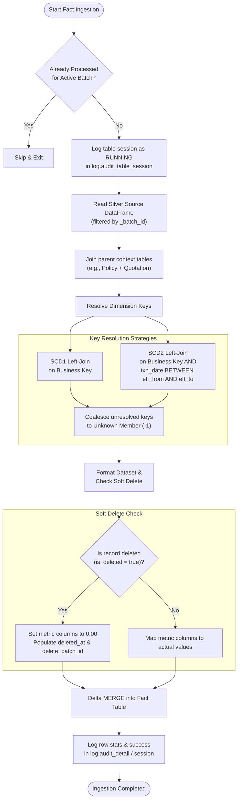
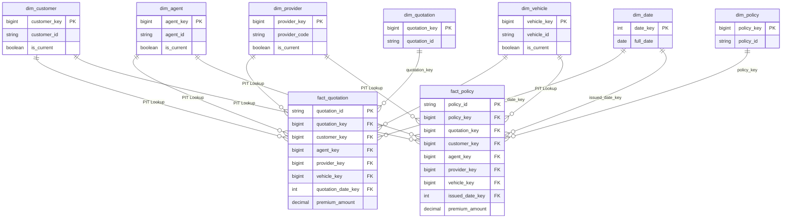

# 03 - Fact Loading Specifications

This document defines the loading logic, Point-in-Time surrogate key resolutions, soft delete check implementations, and delta MERGE specifications for all Fact tables in the Gold Layer.

---

## Fact Loading Pipeline Flowchart

The workflow below illustrates the step-by-step PySpark logic, joins, and auditing operations applied during a Fact table ingestion:



---

## 1. Point-in-Time (PIT) Key Resolution Logic

Fact tables store measurements (metrics) alongside foreign surrogate keys pointing to conformed dimensions. Key resolution requires matching transaction timestamps with active version windows of conformed dimensions.

### 1.1. SCD Type 1 Key Lookups
For SCD1 dimensions, we execute a simple left join matching on the business key code (since there is only one active version per business key in the dimension):
```python
dim_package = spark.table("gold.dim_package").select("package_key", "package_code")
# Join logic
joined_df = fact_source.alias("f").join(
    dim_package.alias("dp"),
    on=F.col("f.package_code") == F.col("dp.package_code"),
    how="left"
)
```

### 1.2. SCD Type 2 Key Lookups (PIT Window Join)
For SCD2 dimensions, we execute a left join matching on the business key AND verifying that the transaction date/timestamp (e.g. `quotation_at`, `issued_at`, `payment_at`, `cancellation_at`) falls within the validity window (`effective_from` and `effective_to`) of the version:
```python
dim_customer = spark.table("gold.dim_customer").select("customer_key", "customer_id", "effective_from", "effective_to")
# Join logic
joined_df = fact_source.alias("f").join(
    dim_customer.alias("dc"),
    on=(F.col("f.customer_id") == F.col("dc.customer_id")) & 
       (F.col("f.transaction_at").between(F.col("dc.effective_from"), F.col("dc.effective_to"))),
    how="left"
)
```

### 1.3. Fallback to Unknown member row
If a lookup fails to match (e.g. the customer ID did not exist at the transaction time, or is missing), we use PySpark's `coalesce` to default the key to **`-1`** (Unknown member key), preventing the record from being dropped:
```python
final_df = joined_df.select(
    F.coalesce(F.col("dc.customer_key"), F.lit(-1)).alias("customer_key"),
    ...
)
```

---

## 2. Soft Delete Enforcement

To ensure reconciliation integrity with upstream layers, the Gold Layer does not drop deleted source records. Instead, it flags them and updates all measurement columns to zero.

### Code Implementation
We use a conditional column mapping checking the `is_deleted` column of the incoming Silver table:
```python
final_df = joined_df.select(
    # Flag tracking
    F.coalesce(F.col("j.is_deleted"), F.lit(False)).alias("is_deleted"),
    F.when(F.col("j.is_deleted") == True, F.current_timestamp()).alias("deleted_at"),
    F.when(F.col("j.is_deleted") == True, F.lit(str(batch_id))).alias("delete_batch_id"),
    
    # Zeroing metric measurements on soft delete
    F.when(F.col("j.is_deleted") == True, F.lit(0.00))
     .otherwise(F.coalesce(F.col("j.premium_amount"), F.lit(0.00))).alias("premium_amount"),
    ...
)
```
This preserves the row count (allowing reconciliation checks to match Silver row counts) while preventing double counting of metrics in Power BI reporting sums.

---

## 3. Fact Table Configurations

Below are the ingestion details for all five conformed Fact tables:

### 3.1. `gold.fact_quotation` (ID: 15)
*   **Source Table**: `silver.quotation` filtered by active `_batch_id`.
*   **Joins**:
    - `dim_quotation` (SCD1 on `quotation_id`)
    - `dim_package` (SCD1 on `package_code`)
    - `dim_quotation_status` (SCD1 on `quotation_status`)
    - `dim_customer` (SCD2 on `customer_id` PIT `quotation_at`)
    - `dim_agent` (SCD2 on `agent_id` PIT `quotation_at`)
    - `dim_provider` (SCD2 on `provider_code` PIT `quotation_at`)
    - `dim_vehicle` (SCD2 on resolved `vehicle_id` PIT `quotation_at`)
*   **Metrics**: `premium_amount`
*   **Soft Delete**: `premium_amount` is set to `0.00` if `is_deleted` is `true`.
*   **Delta MERGE Match statement**:
    - Target: `gold.fact_quotation`
    - Match: `target.quotation_id = source.quotation_id`

### 3.2. `gold.fact_quotation_item` (ID: 16)
*   **Source Table**: `silver.quotation_item` joined with parent context `silver.quotation`.
*   **Joins**:
    - Same lookups as `fact_quotation`, adding `dim_coverage` (SCD1 on `coverage_type`).
*   **Metrics**: `coverage_amount`, `deductible_amount`
*   **Soft Delete**: `coverage_amount` and `deductible_amount` set to `0.00` if parent quotation or item is deleted.
*   **Delta MERGE Match statement**:
    - Target: `gold.fact_quotation_item`
    - Match: `target.quotation_id = source.quotation_id AND target.coverage_key = source.coverage_key`

### 3.3. `gold.fact_policy` (ID: 17)
*   **Source Table**: `silver.policy` joined with `silver.quotation` for parent context.
*   **Joins**:
    - `dim_policy` (SCD1 on `policy_id`)
    - `dim_quotation` (SCD1 on `quotation_id`)
    - `dim_package` (SCD1 on `package_code`)
    - `dim_policy_status` (SCD1 on `policy_status`)
    - `dim_customer` (SCD2 on `customer_id` PIT `issued_at`)
    - `dim_agent` (SCD2 on `agent_id` PIT `quotation_at`)
    - `dim_provider` (SCD2 on `provider_code` PIT `issued_at`)
    - `dim_vehicle` (SCD2 on resolved `vehicle_id` PIT `issued_at`)
*   **Metrics**: `premium_amount`
*   **Delta MERGE Match statement**:
    - Target: `gold.fact_policy`
    - Match: `target.policy_id = source.policy_id`

### 3.4. `gold.fact_payment` (ID: 18)
*   **Source Table**: `silver.payment` joined with `silver.policy` for parent context.
*   **Joins**:
    - `dim_policy` (SCD1 on `policy_id`)
    - `dim_payment_status` (SCD1 on `payment_status`)
    - `dim_payment_method` (SCD1 on conformed `payment_method`)
    - `dim_customer` (SCD2 on `customer_id` PIT `payment_at`)
    - `dim_provider` (SCD2 on `provider_code` PIT `payment_at`)
    - `dim_vehicle` (SCD2 on resolved `vehicle_id` PIT `payment_at`)
*   **Metrics**: `payment_amount`
*   **Delta MERGE Match statement**:
    - Target: `gold.fact_payment`
    - Match: `target.payment_id = source.payment_id`

### 3.5. `gold.fact_cancellation` (ID: 19)
*   **Source Table**: `silver.cancellation` joined with `silver.policy` for parent context.
*   **Joins**:
    - `dim_policy` (SCD1 on `policy_id`)
    - `dim_cancellation_reason` (SCD1 on `cancellation_reason`)
    - `dim_customer` (SCD2 on `customer_id` PIT `cancellation_at`)
    - `dim_provider` (SCD2 on `provider_code` PIT `cancellation_at`)
    - `dim_vehicle` (SCD2 on resolved `vehicle_id` PIT `cancellation_at`)
*   **Metrics**: `refund_amount`
*   **Delta MERGE Match statement**:
    - Target: `gold.fact_cancellation`
    - Match: `target.cancellation_id = source.cancellation_id`

---

## 4. Star Schema Entity Relationship Diagram

The conformed Gold tables represent a standard Star Schema optimized for Direct Lake semantic modeling:


