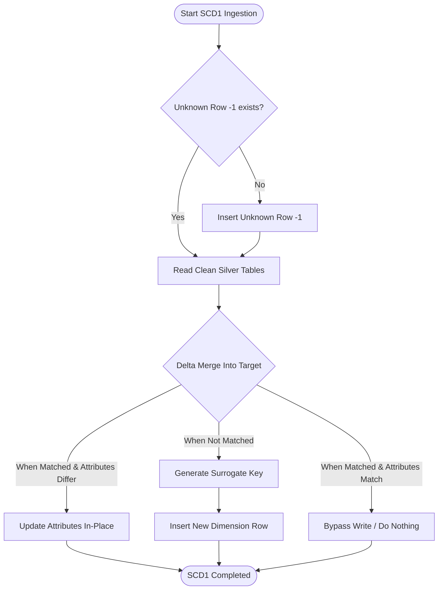

# 03 - SCD Type 1 Dimensions Ingestion Strategy (`nb_gold_load_scd1_dimensions_dev`)

This document defines the ingestion design and update rules for Slowly Changing Dimension (SCD) Type 1 tables in the Gold Layer. Context for columns and rules is aligned with the project specification in [silver-to-gold-mapping.md](../source-to-target-mapping/silver-to-gold-mapping.md) and the JSON files in [silver-to-gold](../source-to-target-mapping/jsons/silver-to-gold).

---

## 1. Objectives

*   Ingest all SCD Type 1 conformed dimensions sequentially in a single notebook activity.
*   Implement a high-performance **Delta Merge** strategy that updates changed descriptive attributes in-place without preserving history.
*   Generate system-defined surrogate keys (BIGINT) for new business keys.
*   Enforce referential integrity by inserting an Unknown Member row (`-1`) into each table prior to running the ingestion.

---

## 2. Targeted SCD Type 1 Tables

The following conformed dimensions are processed as SCD Type 1 tables (updating attributes in-place):

| Target Dimension Table | Sourced Silver Table | Business Key | Target Columns | Standard / Transform Rules |
| :--- | :--- | :--- | :--- | :--- |
| `dim_package` | `silver.quotation` | `package_code` | `package_key` (PK), `package_code` (BK) | `DISTINCT package_code` from Silver. |
| `dim_coverage` | `silver.quotation_item` | `coverage_type` | `coverage_key` (PK), `coverage_type` (BK) | `DISTINCT coverage_type` from Silver. |
| `dim_quotation` | `silver.quotation` | `quotation_id` | `quotation_key` (PK), `quotation_id` (BK), `quotation_expiry_date` | Cast `TIMESTAMP` `quotation_expiry_at` from Silver to `DATE` `quotation_expiry_date`. |
| `dim_policy` | `silver.policy` | `policy_id` | `policy_key` (PK), `policy_id` (BK) | `policy_id` mapped directly. |
| `dim_quotation_status` | `silver.quotation` | `quotation_status` | `quotation_status_key` (PK), `quotation_status_code` (BK) | Mapped from `DISTINCT quotation_status` from Silver. |
| `dim_policy_status` | `silver.policy` | `policy_status` | `policy_status_key` (PK), `policy_status_code` (BK) | Mapped from `DISTINCT policy_status` from Silver. |
| `dim_payment_status` | `silver.payment` | `payment_status` | `payment_status_key` (PK), `payment_status_code` (BK) | Mapped from `DISTINCT payment_status` from Silver. |
| `dim_payment_method` | `silver.payment` | `payment_method` | `payment_method_key` (PK), `payment_method_code` (BK) | Standardize values: `Bank Transfer -> BANK_TRANSFER`, `Credit Card -> CREDIT_CARD`, `E-wallet -> E_WALLET`. |
| `dim_cancellation_reason` | `silver.cancellation` | `cancellation_reason` | `cancellation_reason_key` (PK), `cancellation_reason` (BK) | Mapped from `DISTINCT cancellation_reason` from Silver. |

> [!NOTE]
> All the above tables also contain the standard metadata and audit columns: `created_at` (TIMESTAMP, generated at Gold load time) and `updated_at` (TIMESTAMP, generated at Gold load time).

---

## 3. Ingestion Logic Flow & Merge Design

SCD Type 1 dimensions compare incoming source attributes against target values. If differences are detected, the row is updated in-place.



### 3.1. Delta Merge PySpark Specification
The update operation runs as a Delta Lake merge statement implemented in PySpark. Below is the merge operation used for `dim_quotation` (the only SCD1 dimension with descriptive attributes to update):

```python
delta_table = DeltaTable.forName(spark, "gold.dim_quotation")
match_cond = "target.quotation_id = source.quotation_id"

delta_table.alias("target").merge(
    final_merge_df.alias("source"),
    match_cond
).whenMatchedUpdate(
    condition="COALESCE(target.quotation_expiry_date, '') != COALESCE(source.quotation_expiry_date, '')",
    set={
        "quotation_expiry_date": "source.quotation_expiry_date",
        "updated_at": "current_timestamp()"
    }
).whenNotMatchedInsert(
    values={
        "quotation_key": "source.quotation_key",
        "quotation_id": "source.quotation_id",
        "quotation_expiry_date": "source.quotation_expiry_date",
        "created_at": "current_timestamp()",
        "updated_at": "current_timestamp()"
    }
).execute()
```

For SCD1 tables with no descriptive attributes besides the business key (such as `dim_package`, `dim_coverage`, `dim_policy`, and status dimensions), the merge does not perform any update on match, only inserting new keys when not matched.

---

## 4. Idempotency & Rerun Behavior (No-Change Scenario)

To guarantee that pipeline reruns or recovery runs do not corrupt data or insert duplicates, the ingestion notebooks enforce strict idempotency:
*   **No Changes**: If the business key already exists in the target SCD1 table and the incoming attributes are identical, the merge match condition evaluates to no update (as no changes are found). No updates or inserts occur for that record.
*   **Batch Reruns**: If a batch is re-run, only keys with actual modified values are updated in-place. All other keys remain untouched, resulting in 0 bytes written for unmodified records.

---

## 5. Unknown Member Injections

Every SCD Type 1 dimension table must have a row containing `-1` as its primary surrogate key, with descriptive fields set to `'Unknown'`. This ensures joins do not drop fact records when source lookups are missing or blank.
For example, for `dim_quotation`:
*   `quotation_key` = `-1`
*   `quotation_id` = `'Unknown'`
*   `quotation_expiry_date` = `NULL`
*   `created_at` = `current_timestamp()`
*   `updated_at` = `current_timestamp()`
