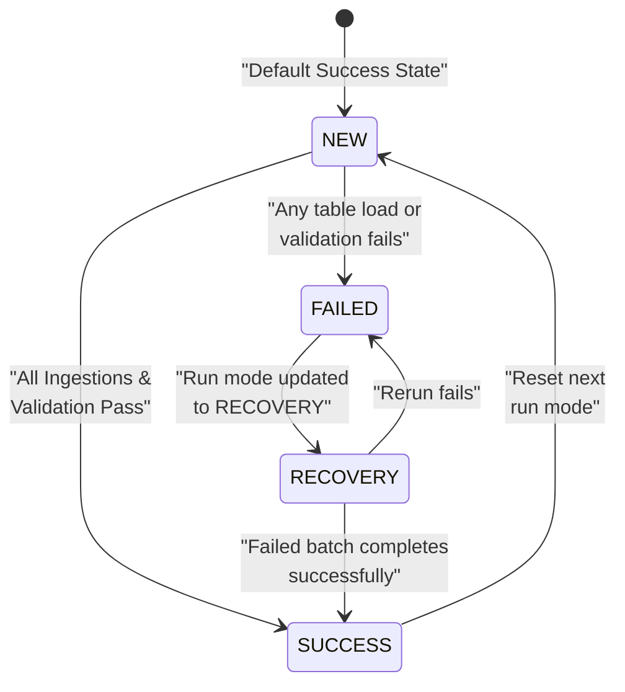
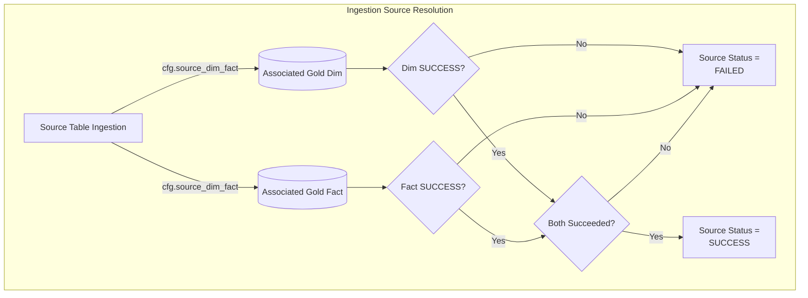

# 04 - Audit and Validation Specification

This document defines the operational logic for auditing, state transitions, post-ingestion validation rules, and success/failure handling in the Gold Layer.

---

## 1. Run Modes & State Transitions

The execution behavior of the Gold Layer is driven dynamically by the single-row control table `cfg.next_run_mode` and tracked in the `log` schema.

### 1.1. Ingestion Success Path
When all dimensions and fact tables complete execution and pass validation checks:
1.  **Flag Audit**: Update `log.audit_session` status to `SUCCESS` and calculate session duration.
2.  **Reset Run Mode**: Invoke `reset_next_run_mode()` to reset `cfg.next_run_mode` back to:
    - `next_run_mode = 'NEW'`
    - `batch_id = NULL`
    - `session_id = NULL`
3.  **Next Ingestion**: The next pipeline run begins a brand-new batch ID.

### 1.2. Ingestion Failure Path
If any notebook raises an exception or fails data quality validation:
1.  **Mark Recovery**: The notebook triggers `mark_recovery_required(batch_id, failed_layer, session_id)` which updates `cfg.next_run_mode` to:
    - `next_run_mode = 'RECOVERY'`
    - `batch_id = <current_batch_id>` (retains the active batch)
    - `session_id = <failed_session_id>` (preserves lineage)
2.  **Fail Audit**: Logs `session_status = 'FAILED'` in `log.audit_session`.
3.  **Abort**: Raises a Python exception to fail the Fabric pipeline activity, alerting administrators.

---

## 2. Ingestion Source Success Matrix

To evaluate end-to-end data processing completeness, target conformed dimensions and fact table successes are mapped back to their ingestion sources. A source is marked as successful (`gold_status = 'SUCCESS'`) in `log.audit_table_session` **only if all target Gold tables associated with it have succeeded**.

The mapping is dynamically evaluated using the mapping metadata table `cfg.source_dim_fact` for the **9 active sources**:

| Source ID | Source Table Name | Associated Dimensions | Associated Fact Tables | Success Rule |
| :---: | :--- | :--- | :--- | :--- |
| **1** | `customers` | `dim_customer` | `fact_quotation`, `fact_quotation_item`, `fact_policy`, `fact_payment`, `fact_cancellation` | Success if `dim_customer` and all 5 facts succeeded. |
| **2** | `agents` | `dim_agent` | `fact_quotation`, `fact_quotation_item`, `fact_policy` | Success if `dim_agent` and all 3 facts succeeded. |
| **3** | `insurance_providers` | `dim_provider` | `fact_quotation`, `fact_quotation_item`, `fact_policy`, `fact_payment`, `fact_cancellation` | Success if `dim_provider` and all 5 facts succeeded. |
| **4** | `vehicle` | `dim_vehicle` | `fact_quotation`, `fact_quotation_item`, `fact_policy`, `fact_payment`, `fact_cancellation` | Success if `dim_vehicle` and all 5 facts succeeded. |
| **5** | `quotation` | `dim_package`, `dim_quotation`, `dim_quotation_status` | `fact_quotation`, `fact_quotation_item`, `fact_policy` | Success if all 3 dimensions and all 3 facts succeeded. |
| **6** | `quotation_item` | `dim_coverage` | `fact_quotation_item` | Success if `dim_coverage` and `fact_quotation_item` succeeded. |
| **7** | `policy` | `dim_policy`, `dim_policy_status` | `fact_policy`, `fact_payment`, `fact_cancellation` | Success if both dimensions and all 3 facts succeeded. |
| **8** | `cancellation` | `dim_cancellation_reason` | `fact_cancellation` | Success if `dim_cancellation_reason` and `fact_cancellation` succeeded. |
| **9** | `payment` | `dim_payment_status`, `dim_payment_method` | `fact_payment` | Success if both dimensions and `fact_payment` succeeded. |

---

## 3. Post-Ingestion Validation Suite

Executed by `nb_gold_validate_reconciliation_dev` at the end of the ingestion workflow, this suite enforces data quality and metrics consistency:

1.  **Grain Uniqueness Check**:
    - Verifies that target primary keys are unique.
    - Example: Validates that `quotation_id` in `gold.fact_quotation` has 0 duplicate rows.
2.  **Date Validity Check**:
    - Ensures all date foreign keys map to a valid date key in `gold.dim_date` (or `-1` fallback).
    - Checks that date keys are not null or out of calendar ranges.
3.  **Referential Integrity Check**:
    - Verifies that dimension surrogate keys (e.g. `customer_key`, `agent_key`) map to existing rows in target dimensions.
    - Checks for unmatched keys that incorrectly resolved to `-1` but should have matched.
4.  **Reconciliation Verification**:
    - Compares row counts and measure totals between Silver source tables and Gold target tables.
    - Compares sum of premium amounts, payment amounts, and refund amounts (handling soft deletes).
    - If anomalies exceed the threshold, logs failures to `log.invalid_record`, flags the table status as `FAILED`, and raises a failure exception.
