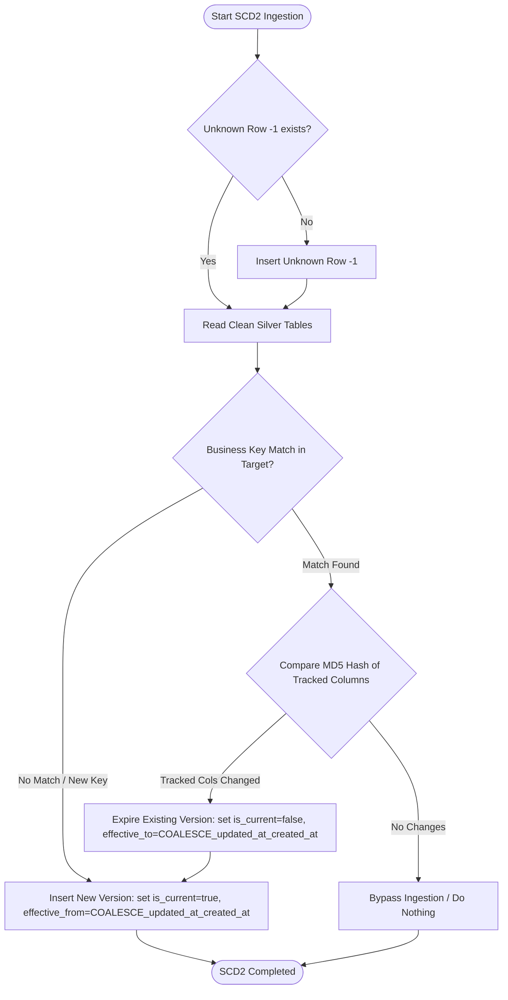

# 04 - SCD Type 2 Dimensions Ingestion Strategy (`nb_gold_load_scd2_dimensions_dev`)

This document defines the ingestion strategy and historical versioning rules for Slowly Changing Dimension (SCD) Type 2 tables in the Gold Layer. Context for columns and rules is aligned with the project specification in [silver-to-gold-mapping.md](../source-to-target-mapping/silver-to-gold-mapping.md) and the JSON files in [silver-to-gold](../source-to-target-mapping/jsons/silver-to-gold).

---

## 1. Objectives

*   Orchestrate SCD Type 2 dimensions (`dim_customer`, `dim_agent`, `dim_provider`, `dim_vehicle`).
*   Track historical changes in critical fields using surrogate keys, version start/end timestamps, and active flags.
*   Seed each dimension with an Unknown Member (`-1`) row.

---

## 2. Targeted SCD Type 2 Tables & Columns

Below is the exact column list and change-tracking columns mapped for each SCD Type 2 table:

| Target Table | Source Silver Table | Business Key | Tracked Columns (SCD2 Hash Columns) | Other Target Columns |
| :--- | :--- | :--- | :--- | :--- |
| `dim_customer` | `silver.customer` | `customer_id` | `full_name`, `gender`, `dob`, `phone_number`, `email`, `city`, `district` | `customer_key` (PK), `effective_from`, `effective_to`, `is_current`, `created_at`, `updated_at` |
| `dim_agent` | `silver.agent` | `agent_id` | `agent_name`, `region`, `branch`, `manager_name` | `agent_key` (PK), `effective_from`, `effective_to`, `is_current`, `created_at`, `updated_at` |
| `dim_provider` | `silver.provider` | `provider_code` | `provider_name`, `provider_group`, `active_flag` | `provider_key` (PK), `effective_from`, `effective_to`, `is_current`, `created_at`, `updated_at` |
| `dim_vehicle` | `silver.vehicle` | `vehicle_id` | `customer_id`, `plate_number`, `vehicle_brand`, `vehicle_model`, `manufacture_year`, `vehicle_value` | `vehicle_key` (PK), `effective_from`, `effective_to`, `is_current`, `created_at`, `updated_at` |

> [!NOTE]
> * `active_flag` (INT) in `dim_provider` is calculated by casting the Silver `is_active` (BOOLEAN) to `INT` (as specified in `dim_provider.json`).
> * `effective_from` (TIMESTAMP) is populated by `COALESCE(updated_at, created_at)` from the Silver row.
> * `effective_to` (TIMESTAMP) defaults to `9999-12-31 23:59:59` for the current active version of a row.
> * `is_current` (BOOLEAN) is set to `true` for the active version, and `false` for retired versions.

---

## 3. Ingestion Logic Flow (SCD2 Merge)

SCD Type 2 processing requires handling two primary conditions:
1.  **New Business Key**: Insert the key with `is_current = true`, `effective_from = COALESCE(source.updated_at, source.created_at)`, `effective_to = '9999-12-31 23:59:59'`.
2.  **SCD2 Tracked Change**: Expire the currently active target row (set `is_current = false`, `effective_to = COALESCE(source.updated_at, source.created_at)`) and insert a new row with updated attributes, `is_current = true`, and `effective_from = COALESCE(source.updated_at, source.created_at)`.



---

## 4. SQL Ingestion Spec Example (`dim_customer`)

To implement this logic efficiently in Spark SQL, we perform:
1. An update of existing active rows whose tracked attributes have changed, setting `is_current = false` and `effective_to` to the new version's starting timestamp.
2. An insert of new keys and new versions of changed records.

```sql
-- Expire current active records that have changed tracked columns
UPDATE gold.dim_customer AS target
SET target.is_current = false,
    target.effective_to = COALESCE(source.updated_at, source.created_at),
    target.updated_at = current_timestamp()
FROM silver.customer AS source
WHERE target.customer_id = source.customer_id
  AND target.is_current = true
  AND MD5(CONCAT_WS('||', 
        COALESCE(source.full_name, ''), 
        COALESCE(source.gender, ''), 
        COALESCE(source.dob, ''), 
        COALESCE(source.phone_number, ''), 
        COALESCE(source.email, ''), 
        COALESCE(source.city, ''), 
        COALESCE(source.district, '')
      )) <> target.row_hash;

-- Insert new records and new versions of changed records
INSERT INTO gold.dim_customer (
    customer_key, customer_id, full_name, gender, dob, phone_number, 
    email, city, district, is_current, effective_from, effective_to, row_hash, created_at, updated_at
)
SELECT 
    next_surrogate_key(),
    s.customer_id,
    s.full_name,
    s.gender,
    s.dob,
    s.phone_number,
    s.email,
    s.city,
    s.district,
    true AS is_current,
    COALESCE(s.updated_at, s.created_at) AS effective_from,
    TIMESTAMP('9999-12-31 23:59:59') AS effective_to,
    MD5(CONCAT_WS('||', 
        COALESCE(s.full_name, ''), 
        COALESCE(s.gender, ''), 
        COALESCE(s.dob, ''), 
        COALESCE(s.phone_number, ''), 
        COALESCE(s.email, ''), 
        COALESCE(s.city, ''), 
        COALESCE(s.district, '')
      )) AS row_hash,
    current_timestamp() AS created_at,
    current_timestamp() AS updated_at
FROM silver.customer s
LEFT JOIN gold.dim_customer t
  ON s.customer_id = t.customer_id
 AND t.is_current = true
WHERE t.customer_id IS NULL; -- Inserts new keys or keys whose prior active version was expired above
```

---

## 5. Idempotency & Rerun Behavior (No-Change Scenario)

SCD Type 2 processing ensures that rerun or recovery runs do not create duplicate historical versions:
*   **No Changes**: If the business key already exists in Gold as an active version (`is_current = true`) and the hash of the tracked columns is identical to the incoming data:
    *   The `UPDATE` statement that expires old records (matching on `row_hash <> target.row_hash`) will find no matches and skip the update.
    *   The `INSERT` statement (which left joins on `customer_id` and `is_current = true`) will see that an active matching version already exists and bypass the insert.
    *   Result: No records are expired and no new records are inserted.
*   **Rerun of Changed Batch**: If the same batch is rerun after a failure, the query matches on the business key. Already updated/expired records will not be modified again, maintaining deterministic history.

---

## 6. Unknown Member Specification (`dim_customer` example)

The Unknown row must be present with the following attributes:
*   `customer_key` = `-1`
*   `customer_id` = `'Unknown'`
*   `full_name` = `'Unknown'`
*   `gender` = `'Unknown'`
*   `dob` = `NULL`
*   `phone_number` = `'Unknown'`
*   `email` = `'Unknown'`
*   `city` = `'Unknown'`
*   `district` = `'Unknown'`
*   `is_current` = `true`
*   `effective_from` = `'1900-01-01 00:00:00'`
*   `effective_to` = `'9999-12-31 23:59:59'`
*   `row_hash` = `'N/A'`
