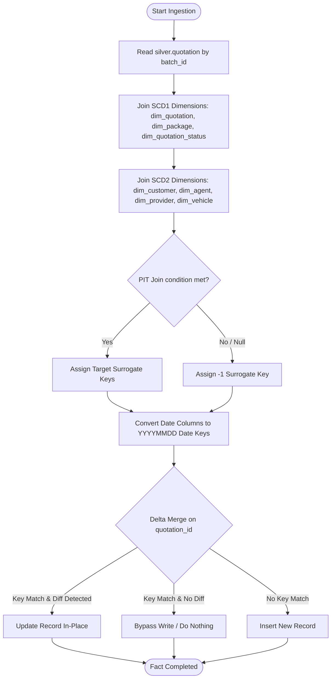

# 05 - Fact Quotation Ingestion Strategy (`nb_gold_load_fact_quotation_dev`)

This document defines the ingestion design and dimension key lookup specifications for the `gold.fact_quotation` table. Context for columns and rules is aligned with the project specification in [silver-to-gold-mapping.md](../source-to-target-mapping/silver-to-gold-mapping.md) and [fact_quotation.json](../source-to-target-mapping/jsons/silver-to-gold/fact_quotation.json).

---

## 1. Objectives

*   Ingest quotation transaction records from `silver.quotation` into `gold.fact_quotation`.
*   Resolve conformed dimension keys using direct joins (SCD Type 1) and Point-in-Time joins (SCD Type 2).
*   Enforce default key fallbacks (`-1`) for unresolved or null relationships.
*   Support soft deletes to preserve financial transaction history.

---

## 2. Ingestion Logic Flow



---

## 3. Dimension Key Lookups Schema

The target columns for `gold.fact_quotation` are resolved from the source fields using the following lookup joins:

| Target Key Column | Source Field | Target Dimension Table | Join Type & Lookup Logic |
| :--- | :--- | :--- | :--- |
| `quotation_key` | `quotation_id` | `dim_quotation` (SCD1) | Join `silver.quotation.quotation_id` = `dim_quotation.quotation_id`. Null fallback = `-1`. |
| `quotation_date_key` | `quotation_at` | `dim_date` | `CAST(DATE_FORMAT(quotation_at, 'yyyyMMdd') AS INT)`. Null fallback = `-1`. |
| `quotation_expiry_date_key` | `quotation_expiry_at` | `dim_date` | `CAST(DATE_FORMAT(quotation_expiry_at, 'yyyyMMdd') AS INT)`. Null fallback = `-1`. |
| `customer_key` | `customer_id` | `dim_customer` (SCD2) | PIT Join: Match `customer_id` AND `silver.quotation.quotation_at` BETWEEN `dim_customer.effective_from` AND `dim_customer.effective_to`. Null fallback = `-1`. |
| `agent_key` | `agent_id` | `dim_agent` (SCD2) | PIT Join: Match `agent_id` AND `silver.quotation.quotation_at` BETWEEN `dim_agent.effective_from` AND `dim_agent.effective_to`. Null fallback = `-1`. |
| `provider_key` | `provider_code` | `dim_provider` (SCD2) | PIT Join: Match `provider_code` AND `silver.quotation.quotation_at` BETWEEN `dim_provider.effective_from` AND `dim_provider.effective_to`. Null fallback = `-1`. |
| `package_key` | `package_code` | `dim_package` (SCD1) | Join `silver.quotation.package_code` = `dim_package.package_code`. Null fallback = `-1`. |
| `quotation_status_key` | `quotation_status` | `dim_quotation_status` (SCD1) | Join `silver.quotation.quotation_status` = `dim_quotation_status.quotation_status_code`. Null fallback = `-1`. |
| `vehicle_key` | `customer_id` | `dim_vehicle` (SCD2) | Join `silver.quotation.customer_id` = `silver.vehicle.customer_id` (1-to-1 assumption), then lookup `dim_vehicle` by `vehicle_id` where `silver.quotation.quotation_at` BETWEEN `dim_vehicle.effective_from` AND `dim_vehicle.effective_to`. Null fallback = `-1`. |

### Measures and Degenerate Dimensions:
*   `premium_amount`: `COALESCE(premium_amount, 0)`
*   `quotation_id` (STRING), `customer_id` (STRING), `agent_id` (STRING), `provider_code` (STRING): Mapped directly as degenerate dimensions.
*   `converted_flag` (BOOLEAN): Set to `true` if `quotation_id` exists in `silver.policy`, else `false`.

---

## 4. Ingestion Query & Soft Delete Rules

During fact ingestion, if a source quotation record is flagged as deleted (`is_deleted = true`), it is not purged from the Gold Layer. Instead, metadata columns in the target table are populated to flag the soft delete:
*   `is_deleted = true`
*   `deleted_at = current_timestamp()`
*   `delete_batch_id = <current_batch_id>`
*   Measure columns (such as `premium_amount`) are set to `0.00` to prevent skewing active summary calculations in reporting layers.

### Ingestion PySpark Implementation Details
To implement this logic, the ingestion notebook performs the following Spark SQL / Dataframe API operations:

1. **Read Incoming Batch**: Filters `silver.quotation` by the current `batch_id`.
2. **Resolve Converted Flag**: Left joins with `silver.policy` (distinct on `quotation_id`) to derive `converted_flag = has_policy IS NOT NULL`.
3. **Resolve Vehicle ID**: Left joins with `silver.vehicle` (deduplicated by `customer_id`) to resolve the business `vehicle_id` associated with the customer (using a 1-to-1 customer-to-vehicle assumption).
4. **Resolve Dimension Keys**: Left joins with the conformed dimension tables:
   - For **SCD1** dimensions (`dim_quotation`, `dim_package`, `dim_quotation_status`), joins are on business keys.
   - For **SCD2** dimensions (`dim_customer`, `dim_agent`, `dim_provider`, `dim_vehicle`), point-in-time joins are used (checking that the transaction's event timestamp `quotation_at` falls between `effective_from` and `effective_to` of the dimension record).
   - If a join fails to resolve, the surrogate key falls back to `-1` (using PySpark `coalesce` or `F.lit(-1)`).
5. **Convert Date Keys**: Formats dates (`quotation_at`, `quotation_expiry_at`) into `YYYYMMDD` integer keys using `F.date_format(col, 'yyyyMMdd').cast(IntegerType())` or fallback `-1`.

### Implementation PySpark Merge Pattern
The conformed dataframe is merged into the target Delta table unconditionally on match using the PySpark Delta Table API:

```python
delta_table = DeltaTable.forName(spark, "gold.fact_quotation")

delta_table.alias("target").merge(
    final_df.alias("source"),
    "target.quotation_id = source.quotation_id"
).whenMatchedUpdate(
    set={
        "customer_id": "source.customer_id",
        "agent_id": "source.agent_id",
        "provider_code": "source.provider_code",
        "quotation_key": "source.quotation_key",
        "customer_key": "source.customer_key",
        "agent_key": "source.agent_key",
        "provider_key": "source.provider_key",
        "package_key": "source.package_key",
        "quotation_status_key": "source.quotation_status_key",
        "quotation_date_key": "source.quotation_date_key",
        "quotation_expiry_date_key": "source.quotation_expiry_date_key",
        "vehicle_key": "source.vehicle_key",
        "premium_amount": "source.premium_amount",
        "converted_flag": "source.converted_flag",
        "updated_at": "current_timestamp()",
        "_batch_id": "source._batch_id",
        "_source_system": "source._source_system",
        "pipeline_run_id": "source.pipeline_run_id",
        "is_deleted": "source.is_deleted",
        "deleted_at": "source.deleted_at",
        "delete_batch_id": "source.delete_batch_id"
    }
).whenNotMatchedInsertAll().execute()
```

---

## 5. Idempotency & Rerun Behavior (No-Change Scenario)

*   **Idempotent Updates**: In recovery runs or batch reruns, the MERGE statement matches on `quotation_id`. Records are updated with conformed dimension surrogate keys matching the active batch state. No duplicate records are inserted, ensuring that the fact grain remains strictly unique.
*   **Active Audits**: All metrics and counts are validated post-ingestion by `nb_gold_validate_reconciliation_dev` to ensure data completeness and consistency before finishing the run.

