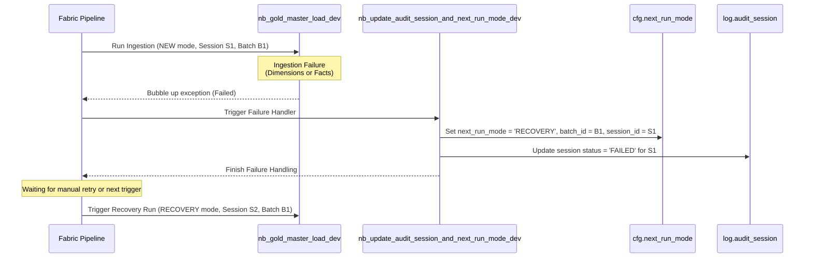
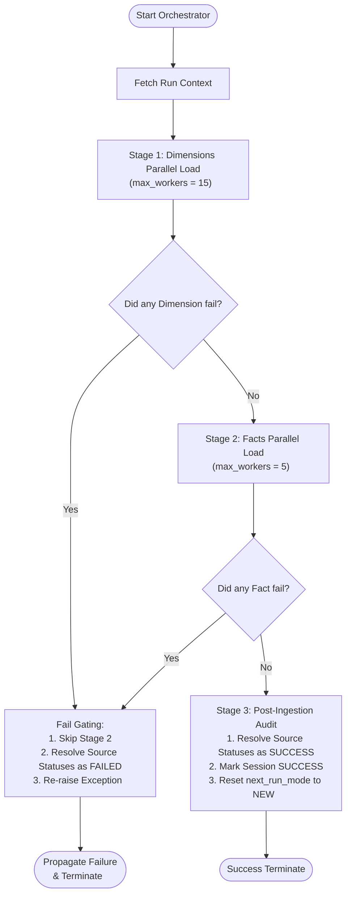

# 05 - Ingestion Run Modes and Recovery Specifications

This document defines the deep-dive design patterns, implementation logic, and system recovery behaviors for the **Orchestration Run Modes (NEW vs. RECOVERY)** within the Gold Layer data ingestion pipeline.

---

## 1. Ingestion Run Modes: NEW vs. RECOVERY

The data lakehouse orchestration supports self-healing and resumption from points of failure. This is governed by two run modes: `NEW` and `RECOVERY`.

### 1.1 Mode Definitions
*   **`NEW` Mode**:
    *   Initiated on a fresh execution schedule.
    *   Generates a brand new `batch_id` and `session_id`.
    *   Watermarks are advanced based on the successful ingestion.
*   **`RECOVERY` Mode**:
    *   Initiated when the previous pipeline run failed or aborted.
    *   Reuses the **same `batch_id`** as the failed run (preserving temporal consistency).
    *   Spawns a **new `session_id`** linked to the parent `batch_id` to audit the recovery attempt.
    *   Skips already-completed tasks in Bronze and Silver to save compute, while safely processing the remaining failed/unprocessed blocks.

### 1.2 Transition Workflow on Failure
When a notebook execution fails in the Microsoft Fabric pipeline, the orchestration transitions to recovery state using the following sequence:



The config table `cfg.next_run_mode` persists the state:
```sql
-- Queried by the orchestrator at the start of a run to discover context
SELECT next_run_mode, batch_id, session_id 
FROM cfg.next_run_mode;
```

---

## 2. Failure Handling and Skip-Resume Mechanics

Recovery logic behaves differently across layers depending on whether table loads are strictly incremental or idempotent.

### 2.1 Bronze and Silver Layer Skip-Resume
Bronze and Silver layers enforce an active skip check. Before executing a table transformation, the notebook checks if that specific table succeeded in the failed run:
```python
# Checks if the target table succeeded for the active batch_id
if not should_process_table_layer(batch_id, source_table_id, "SILVER"):
    # Bypasses execution completely, saving read/write I/O
    return
```

### 2.2 Gold Layer Bypassed Skip Check (Strict Idempotency)
In the Gold layer, conformed dimensions and facts override `should_process_table_layer` in [nb_gold_audit_helper_dev](../../fabric/Gold/Notebooks/nb_gold_audit_helper_dev.Notebook/notebook-content.py) to **always return `True`**:
```python
def should_process_table_layer(batch_id, source_table_id, layer, **kwargs):
    # Idempotent Delta updates mean we can always run the Gold notebook tables on recovery,
    # and we skip query overhead on normal runs.
    return True
```
#### Why is this bypassed?
1.  **Idempotent Operations**: Gold notebooks use Delta `MERGE` and conditional check constraints. If a record has already been updated or inserted, re-running the notebook results in a no-op (0 updates/inserts). It is safe to re-run.
2.  **Referential Consistency**: In a recovery run, upstream Silver tables might have resolved missing keys or corrected late-arriving dimensions. Re-running the Gold notebook ensures that all lookup joins are evaluated against the most up-to-date states, curing any temporary "Unknown (-1)" key mappings.
3.  **Low Latency**: Omitting audit lookup queries per conformed table inside parallel thread workers reduces Spark session query overhead.

---

## 3. Master Load Orchestrator Failure Strategy

The master orchestrator [nb_gold_master_load_dev](../../fabric/Gold/Notebooks/nb_gold_master_load_dev.Notebook/notebook-content.py) enforces concurrency and manages notebook-level failures as follows:



### 3.1 Fail-Fast Gating
If any Dimension notebook fails, the exception is collected inside the `ThreadPoolExecutor`. The master notebook immediately raises an exception, which prevents Stage 2 (Facts) from starting. This is crucial because loading facts when dimensions are incomplete would result in unresolved/dangling joins, mapping records to the default `Unknown (-1)` surrogate key.

### 3.2 Dynamic Source Status Resolution
Regardless of whether the run succeeds or fails, the orchestrator evaluates final status using `resolve_source_success()`.
*   It dynamically checks mapping configurations in `cfg.source_dim_fact` to identify which conformed Gold tables are fed by which Silver source tables (IDs 1-9).
*   If **all conformed tables** mapped to source table $S$ succeeded $\rightarrow$ `log.audit_table_session` for source $S$ is updated to `SUCCESS`.
*   If **any conformed table** mapped to source table $S$ failed or was skipped $\rightarrow$ source $S$ is updated to `FAILED`.

### 3.3 Validation Failure Behavior
Because the validation suite (`nb_gold_validate_reconciliation_dev`) executes as a dedicated pipeline activity downstream of the orchestrator:
1. **No In-Memory Status Rollback**: A validation failure does not affect the dimension and fact statuses resolved during the load stage in `nb_gold_master_load_dev`.
2. **Audit Detail Mark**: The validation activity calls `finish_table_layer` to record the `"FAILED"` validation status in `log.audit_detail` under the `"GOLD"` layer for the affected fact table session.
3. **Run Mode Reset**: Since the master orchestrator completed successfully and reset `cfg.next_run_mode` to `NEW` prior to validation running, the run mode is not automatically rolled back to `RECOVERY`.
4. **Pipeline Failure**: The pipeline execution fails due to the validation errors. Re-running the pipeline after a validation failure requires manual administrative action (e.g. manually updating `cfg.next_run_mode` to `RECOVERY` with the failed batch ID) to perform a recovery run.

