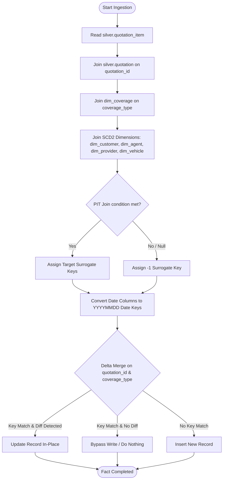

# 06 - Fact Quotation Item Ingestion Strategy (`nb_gold_load_fact_quotation_item_dev`)

This document defines the ingestion design and key lookup rules for `gold.fact_quotation_item`, which tracks line-item detail values for insurance quotations. Context for columns and rules is aligned with the project specification in [silver-to-gold-mapping.md](../source-to-target-mapping/silver-to-gold-mapping.md) and [fact_quotation_item.json](../source-to-target-mapping/jsons/silver-to-gold/fact_quotation_item.json).

---

## 1. Objectives

*   Ingest quotation line items from `silver.quotation_item` into `gold.fact_quotation_item`.
*   Establish lookup lineage for coverages (`dim_coverage`) and parent quotation attributes.
*   Resolve SCD Type 2 lookups by inheriting transaction context from the parent quotation record.

---

## 2. Ingestion Logic Flow

To resolve dimension keys for quotation items, the source data must first be enriched with the parent quotation's business keys and creation timestamp before joining dimension tables.

---

## 3. Dimension Key Lookups Schema

The conformed keys for `gold.fact_quotation_item` are resolved as follows:

| Target Key Column | Source Field | Target Dimension Table | Join Type & Lookup Logic |
| :--- | :--- | :--- | :--- |
| `quotation_key` | `quotation_id` | `dim_quotation` (SCD1) | Join `silver.quotation_item.quotation_id` = `dim_quotation.quotation_id`. Null fallback = `-1`. |
| `quotation_date_key` | `quotation_at` (Parent) | `dim_date` | `CAST(DATE_FORMAT(quotation.quotation_at, 'yyyyMMdd') AS INT)`. Null fallback = `-1`. |
| `customer_key` | `customer_id` (Parent) | `dim_customer` (SCD2) | PIT Join: Join `silver.quotation` to get `customer_id`, where `silver.quotation.quotation_at` BETWEEN `dim_customer.effective_from` AND `dim_customer.effective_to`. Null fallback = `-1`. |
| `agent_key` | `agent_id` (Parent) | `dim_agent` (SCD2) | PIT Join: Join `silver.quotation` to get `agent_id`, where `silver.quotation.quotation_at` BETWEEN `dim_agent.effective_from` AND `dim_agent.effective_to`. Null fallback = `-1`. |
| `provider_key` | `provider_code` (Parent) | `dim_provider` (SCD2) | PIT Join: Join `silver.quotation` to get `provider_code`, where `silver.quotation.quotation_at` BETWEEN `dim_provider.effective_from` AND `dim_provider.effective_to`. Null fallback = `-1`. |
| `package_key` | `package_code` (Parent) | `dim_package` (SCD1) | Join `silver.quotation.package_code` = `dim_package.package_code`. Null fallback = `-1`. |
| `coverage_key` | `coverage_type` | `dim_coverage` (SCD1) | Join `silver.quotation_item.coverage_type` = `dim_coverage.coverage_type`. Null fallback = `-1`. |
| `quotation_status_key` | `quotation_status` (Parent) | `dim_quotation_status` (SCD1) | Join `silver.quotation.quotation_status` = `dim_quotation_status.quotation_status_code`. Null fallback = `-1`. |
| `vehicle_key` | `customer_id` (Parent) | `dim_vehicle` (SCD2) | Join `silver.quotation.customer_id` = `silver.vehicle.customer_id` (1-to-1 assumption), then lookup `dim_vehicle` by `vehicle_id` where `silver.quotation.quotation_at` BETWEEN `dim_vehicle.effective_from` AND `dim_vehicle.effective_to`. Null fallback = `-1`. |

### Measures and Degenerate Dimensions:
*   `coverage_amount`: `COALESCE(coverage_amount, 0)`
*   `deductible_amount`: `COALESCE(deductible_amount, 0)`
*   `quotation_item_id` (STRING), `quotation_id` (STRING): Mapped directly as degenerate dimensions.

---

## 4. Ingestion Strategy & Soft Deletes

*   **Upsert Key**: The combination of `quotation_id` and `coverage_type` forms the unique grain of this fact table.
*   **Soft Deletes**: If the item's `is_deleted` column is `true` or if its parent quotation is flagged as soft-deleted, metadata columns are updated:
    *   `is_deleted = true`
    *   `deleted_at = current_timestamp()`
    *   `delete_batch_id = <current_batch_id>`
    *   Measure values (`coverage_amount`, `deductible_amount`) are updated to `0.00` to prevent active reporting skew.

---

## 5. Idempotency & Rerun Behavior (No-Change Scenario)

*   **No Changes**: If the line items in the incoming Silver batch are identical to target data (all keys and measures match), the Delta MERGE checks for column updates and evaluates to `false`. **No update operations occur, and no data is written to disk**, optimizing pipeline runtime.
*   **Batch Reruns**: In recovery runs, the MERGE statement matches on `(quotation_id, coverage_type)` keys and only updates fields with actual differences. No duplicate line-item rows are created.

