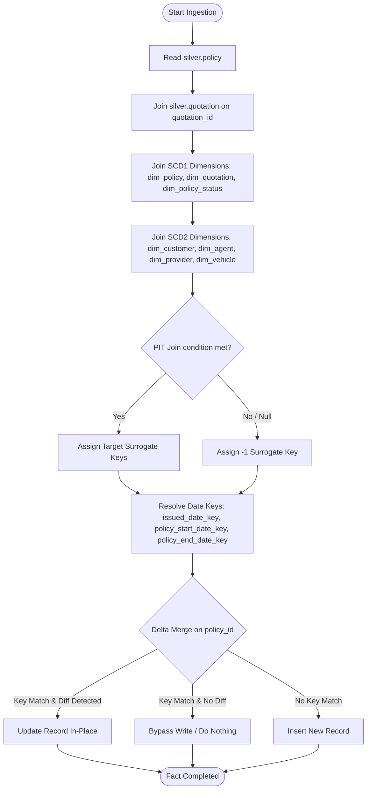

# 07 - Fact Policy Ingestion Strategy (`nb_gold_load_fact_policy_dev`)

This document defines the ingestion specifications, point-in-time (PIT) dimension lookups, and metadata tracking details for the `gold.fact_policy` table. Context for columns and rules is aligned with the project specification in [silver-to-gold-mapping.md](../source-to-target-mapping/silver-to-gold-mapping.md) and [fact_policy.json](../source-to-target-mapping/jsons/silver-to-gold/fact_policy.json).

---

## 1. Objectives

*   Ingest policy records from `silver.policy` into `gold.fact_policy`.
*   Link each policy to conformed dimensions (`dim_policy`, `dim_quotation`, `dim_policy_status`).
*   Perform PIT lookups against SCD Type 2 dimensions (`dim_customer`, `dim_agent`, `dim_provider`, `dim_vehicle`) based on the policy's transaction date.
*   Resolve multiple date key relationships against the calendar dimension `dim_date`.

---

## 2. Ingestion Logic Flow

---

## 3. Dimension Key Lookups Schema

The target columns for `gold.fact_policy` are resolved from the source fields using the following lookup joins:

| Target Key Column | Source Field | Target Dimension Table | Join Type & Lookup Logic |
| :--- | :--- | :--- | :--- |
| `policy_key` | `policy_id` | `dim_policy` (SCD1) | Join `silver.policy.policy_id` = `dim_policy.policy_id`. Null fallback = `-1`. |
| `quotation_key` | `quotation_id` | `dim_quotation` (SCD1) | Join `silver.policy.quotation_id` = `dim_quotation.quotation_id`. Null fallback = `-1`. |
| `issued_date_key` | `issued_at` | `dim_date` | `CAST(DATE_FORMAT(issued_at, 'yyyyMMdd') AS INT)`. Null fallback = `-1`. |
| `policy_start_date_key` | `policy_start_date` | `dim_date` | `CAST(DATE_FORMAT(policy_start_date, 'yyyyMMdd') AS INT)`. Null fallback = `-1`. |
| `policy_end_date_key` | `policy_end_date` | `dim_date` | `CAST(DATE_FORMAT(policy_end_date, 'yyyyMMdd') AS INT)`. Null fallback = `-1`. |
| `customer_key` | `customer_id` | `dim_customer` (SCD2) | PIT Join: Match `customer_id` where `silver.policy.issued_at` BETWEEN `dim_customer.effective_from` AND `dim_customer.effective_to`. Null fallback = `-1`. |
| `agent_key` | `agent_id` (Parent) | `dim_agent` (SCD2) | PIT Join: Join `silver.quotation` to get `agent_id`, where `silver.quotation.quotation_at` BETWEEN `dim_agent.effective_from` AND `dim_agent.effective_to`. Null fallback = `-1`. |
| `provider_key` | `provider_code` | `dim_provider` (SCD2) | PIT Join: Match `provider_code` where `silver.policy.issued_at` BETWEEN `dim_provider.effective_from` AND `dim_provider.effective_to`. Null fallback = `-1`. |
| `package_key` | `package_code` (Parent) | `dim_package` (SCD1) | Join `silver.quotation` to get `package_code`, then lookup `dim_package` by `package_code`. Null fallback = `-1`. |
| `policy_status_key` | `policy_status` | `dim_policy_status` (SCD1) | Join `silver.policy.policy_status` = `dim_policy_status.policy_status_code`. Null fallback = `-1`. |
| `vehicle_key` | `customer_id` | `dim_vehicle` (SCD2) | PIT Join: Join `silver.vehicle` on `customer_id` where `silver.policy.issued_at` BETWEEN `dim_vehicle.effective_from` AND `dim_vehicle.effective_to`. Null fallback = `-1`. |

### Measures and Degenerate Dimensions:
*   `premium_amount`: `COALESCE(premium_amount, 0)`
*   `policy_id` (STRING), `policy_number` (STRING), `quotation_id` (STRING), `customer_id` (STRING), `provider_code` (STRING): Mapped directly as degenerate dimensions.

---

## 4. Soft Delete and Ingestion Rules

*   **Soft Deletes**: If a policy is flagged as soft-deleted in `silver.policy` (`is_deleted = true`), the target row is updated:
    *   `is_deleted = true`
    *   `deleted_at = current_timestamp()`
    *   `delete_batch_id = <current_batch_id>`
    *   Metrics (`premium_amount`) are set to `0.00`.

---

## 5. Idempotency & Rerun Behavior (No-Change Scenario)

*   **No Changes**: If policy details in the incoming Silver batch are identical to existing target records (keys, measures, status match), the MERGE statement condition checks for differences and evaluates to `false`. **No update operations are performed, and no data is written to disk**, saving I/O overhead.
*   **Batch Reruns**: In recovery runs, the MERGE statement matches on the `policy_id` key and updates only the changed columns, preserving GWP values without duplication.

