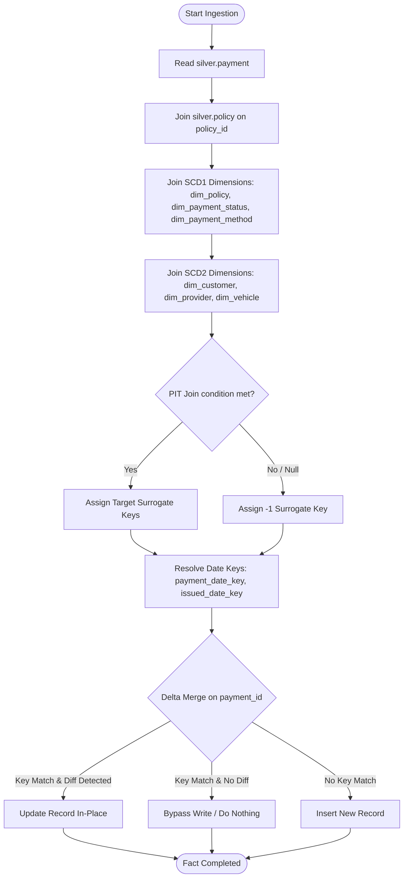

# 08 - Fact Payment Ingestion Strategy (`nb_gold_load_fact_payment_dev`)

This document defines the ingestion specifications, conformed key lookups, and operational metadata tracking logic for the `gold.fact_payment` table. Context for columns and rules is aligned with the project specification in [silver-to-gold-mapping.md](../source-to-target-mapping/silver-to-gold-mapping.md) and [fact_payment.json](../source-to-target-mapping/jsons/silver-to-gold/fact_payment.json).

---

## 1. Objectives

*   Ingest payment transaction records from `silver.payment` into `gold.fact_payment`.
*   Link each payment to conformed payment status (`dim_payment_status`) and payment method (`dim_payment_method`) dimensions.
*   Inherit policy, customer, provider, and vehicle keys from the upstream `silver.policy` lineage context.
*   Apply PIT logic based on the transaction date to resolve the correct customer and vehicle versions.

---

## 2. Ingestion Logic Flow



---

## 3. Dimension Key Lookups Schema

The conformed keys for `gold.fact_payment` are resolved using the following specifications:

| Target Key Column | Source Field | Target Dimension Table | Join Type & Lookup Logic |
| :--- | :--- | :--- | :--- |
| `policy_key` | `policy_id` | `dim_policy` (SCD1) | Join `silver.payment.policy_id` = `dim_policy.policy_id`. Null fallback = `-1`. |
| `payment_date_key` | `payment_at` | `dim_date` | `CAST(DATE_FORMAT(payment_at, 'yyyyMMdd') AS INT)`. Null fallback = `-1`. |
| `issued_date_key` | `issued_at` (Parent) | `dim_date` | Join `silver.policy` to get `issued_at`, then resolve `CAST(DATE_FORMAT(policy.issued_at, 'yyyyMMdd') AS INT)`. Null fallback = `-1`. |
| `customer_key` | `customer_id` (Parent) | `dim_customer` (SCD2) | PIT Join: Join `silver.policy` to get `customer_id`, where `silver.payment.payment_at` BETWEEN `dim_customer.effective_from` AND `dim_customer.effective_to`. Null fallback = `-1`. |
| `provider_key` | `provider_code` (Parent) | `dim_provider` (SCD2) | PIT Join: Join `silver.policy` to get `provider_code`, where `silver.payment.payment_at` BETWEEN `dim_provider.effective_from` AND `dim_provider.effective_to`. Null fallback = `-1`. |
| `payment_status_key` | `payment_status` | `dim_payment_status` (SCD1) | Join `silver.payment.payment_status` = `dim_payment_status.payment_status_code`. Null fallback = `-1`. |
| `payment_method_key` | `payment_method` | `dim_payment_method` (SCD1) | Join `silver.payment.payment_method` = `dim_payment_method.payment_method_code`. Null fallback = `-1`. |
| `vehicle_key` | `customer_id` (Parent) | `dim_vehicle` (SCD2) | PIT Join: Join `silver.policy` to get `customer_id` and find active `vehicle_id` from `silver.vehicle` where `silver.payment.payment_at` BETWEEN `dim_vehicle.effective_from` AND `dim_vehicle.effective_to`. Null fallback = `-1`. |

### Measures and Degenerate Dimensions:
*   `payment_amount`: `COALESCE(payment_amount, 0)`
*   `payment_id` (STRING), `policy_id` (STRING), `transaction_reference` (STRING): Mapped directly as degenerate dimensions.

---

## 4. Ingestion Strategy & PySpark Implementation Details

To build the fact table conformed rows, the notebook performs the following:

1. **Read Incoming Batch**: Filters `silver.payment` by the current `batch_id`.
2. **Resolve Parent Context**: Left joins with `silver.policy` on `policy_id` to retrieve parent fields: `issued_at`, `customer_id`, `provider_code`.
3. **Resolve Vehicle ID**: Left joins with `silver.vehicle` (deduplicated by `customer_id`) on `customer_id` (from parent context) to obtain `vehicle_id` (using the 1-to-1 assumption).
4. **Conform Payment Method**: Standardizes incoming method strings: `Bank Transfer -> BANK_TRANSFER`, `Credit Card -> CREDIT_CARD`, `E-wallet -> E_WALLET`, otherwise mapping as uppercase.
5. **Resolve Dimension Keys**: Left joins conformed dimensions:
   - For **SCD1** dimensions (`dim_policy`, `dim_payment_status`, `dim_payment_method`), joins are on business keys.
   - For **SCD2** dimensions (`dim_customer`, `dim_provider`, `dim_vehicle`), point-in-time joins check that the payment transaction date `payment_at` falls between `effective_from` and `effective_to`.
   - Surrogate keys fallback to `-1` on null.
6. **Convert Date Keys**: Formats dates (`payment_at`, `issued_at`) into `YYYYMMDD` integer keys (`payment_date_key`, `issued_date_key`), falling back to `-1` on null.

### Implementation PySpark Merge Pattern
The conformed payment records are merged on a matching condition on `payment_id`:

```python
delta_table = DeltaTable.forName(spark, "gold.fact_payment")

delta_table.alias("target").merge(
    final_df.alias("source"),
    "target.payment_id = source.payment_id"
).whenMatchedUpdate(
    set={
        "policy_id": "source.policy_id",
        "transaction_reference": "source.transaction_reference",
        "policy_key": "source.policy_key",
        "payment_status_key": "source.payment_status_key",
        "payment_method_key": "source.payment_method_key",
        "payment_date_key": "source.payment_date_key",
        "issued_date_key": "source.issued_date_key",
        "customer_key": "source.customer_key",
        "provider_key": "source.provider_key",
        "vehicle_key": "source.vehicle_key",
        "payment_amount": "source.payment_amount",
        "updated_at": "current_timestamp()",
        "_batch_id": "source._batch_id",
        "_source_system": "source._source_system",
        "pipeline_run_id": "source.pipeline_run_id",
        "is_deleted": "source.is_deleted",
        "deleted_at": "source.deleted_at",
        "delete_batch_id": "source.delete_batch_id"
    }
).whenNotMatchedInsertAll().execute()
```

---

## 5. Idempotency & Rerun Behavior (No-Change Scenario)

*   **Idempotent Updates**: In recovery runs or batch reruns, the MERGE statement matches on `payment_id`. Existing rows are updated with conformed dimension surrogate keys matching the active batch state. No duplicate records are inserted, ensuring that the fact grain remains strictly unique.
*   **Active Audits**: All metrics and counts are validated post-ingestion by `nb_gold_validate_reconciliation_dev` to ensure data completeness and consistency before finishing the run.


