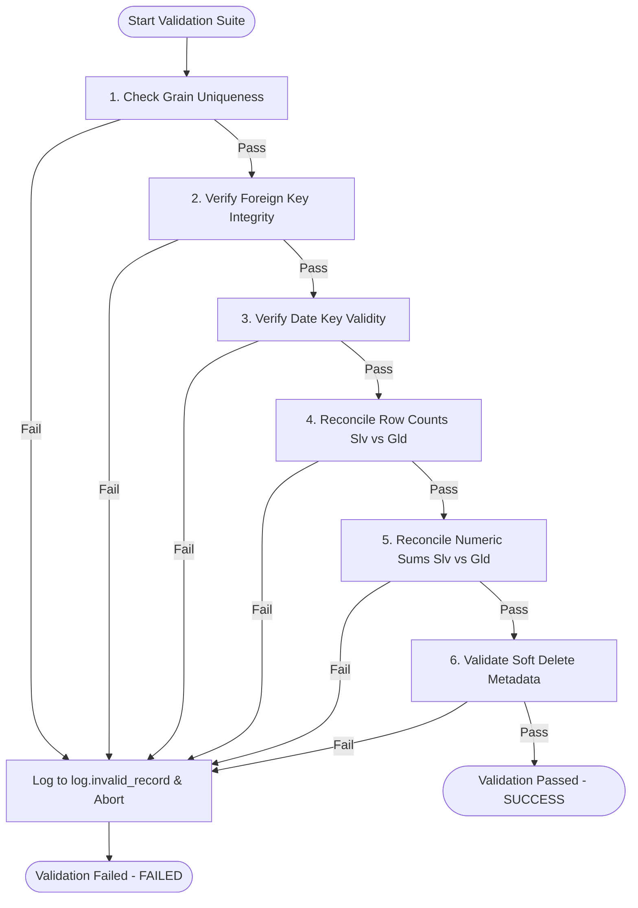

# 10 - Gold Layer Validation and Reconciliation Strategy

This document defines the post-ingestion validation and data quality audit suite executed in the dedicated notebook **`nb_gold_validate_reconciliation_dev`** for target tables in the Gold Layer.

---

## 1. Objectives

*   Enforce strict data quality standards on all conformed dimensions and facts before publishing.
*   Log validation anomalies to `log.invalid_record` for administrative review.
*   Fail the table execution session immediately if critical validation constraints are violated, triggering recovery flow.

---

## 2. Ingestion Validation Logic Flow

---

## 3. The 6 Automated Data Quality Checks

Every fact table undergoes a suite of 6 validation tests implemented via PySpark:

### 1. Grain Uniqueness Check
*   **Purpose**: Validates that no logical duplicate keys exist at the grain of the fact table for the current batch.
*   **Logic**: 
    - Filters the target Gold table by the current `_batch_id`.
    - Groups by the logical grain columns (e.g. `quotation_id` for `fact_quotation`) and checks for any groups with a count greater than 1:
      `batch_gold_df.groupBy(*grain_cols).count().filter("count > 1")`
*   **Failure Rule**: Fails if the duplicate count is greater than 0.

### 2. Foreign Key Integrity Check
*   **Purpose**: Ensures that all resolved surrogate keys in the fact table exist in their mapped conformed dimensions (no orphaned links).
*   **Logic**:
    - Left joins the active Gold batch dataframe with each mapped dimension table on their surrogate key.
    - Filters for rows where the fact key is not `-1` (Unknown) but has no matching record in the dimension table:
      `batch_gold_df.join(dim_df, on=..., how="left").filter((F.col(fk_col) != -1) & F.col(dim_pk).isNull())`
*   **Failure Rule**: Fails if any orphaned records are found.

### 3. Date Key Validity Check
*   **Purpose**: Assures all date keys in the fact table map to a valid record in the calendar dimension.
*   **Logic**:
    - Left joins the active Gold batch dataframe with `gold.dim_date` on the date key columns.
    - Filters for records where the date key is not `-1` and cannot be resolved in `dim_date.date_key`:
      `batch_gold_df.join(dim_date_keys, on=..., how="left").filter((F.col(date_key_col) != -1) & F.col("d.date_key").isNull())`
*   **Failure Rule**: Fails if any unresolved date keys are found.

### 4. Row Count Reconciliation
*   **Purpose**: Assures no rows were dropped during ingestion.
*   **Logic**:
    - Compares the total row count of the Gold fact table for the current batch against the deduplicated Silver source records for the active batch.
    - The Silver source records are deduplicated based on their business keys (e.g. `silver.quotation` is deduplicated on `quotation_id`).
*   **Failure Rule**: Fails if the Gold count does not match the deduplicated Silver count.

### 5. Metric Reconciliation
*   **Purpose**: Confirms that financial metrics remain precise and unaltered between layers.
*   **Logic**:
    - Sums the metric columns in the Gold active batch.
    - Sums the metric columns in the Silver active batch. If the Silver table has an `is_deleted` column, it zeroes out the metric for soft-deleted records when summing:
      `F.sum(F.when(F.col("is_deleted") == True, F.lit(0.00)).otherwise(F.coalesce(F.col(metric_col), F.lit(0.00))))`
    - Computes the absolute difference: `variance = abs(silver_metric_sum - gold_metric_sum)`.
*   **Failure Rule**: Fails if `variance > 0.01` (to allow for floating-point precision discrepancies).

### 6. Soft Delete Auditing Check
*   **Purpose**: Verifies that soft-deleted records have their technical delete metadata populated correctly.
*   **Logic**:
    - Filters the active Gold batch for rows with `is_deleted = true`.
    - Checks that both `deleted_at` and `delete_batch_id` are populated:
      `batch_gold_df.filter((F.col("is_deleted") == True) & (F.col("deleted_at").isNull() | F.col("delete_batch_id").isNull()))`
*   **Failure Rule**: Fails if any soft-deleted records have missing metadata.

---

## 4. Error Logging Mechanics

When a validation check fails, the notebook:
1.  Logs the validation failures to `log.invalid_record` via `log_invalid_record()`, writing details about the failed rule, target table, record key, column, and reason.
2.  Calls `finish_table_layer` with `status = 'FAILED'`, updating the logging metadata in `log.audit_table_session`.
3.  Throws a PySpark Python runtime exception to stop the orchestrator execution workflow immediately.
