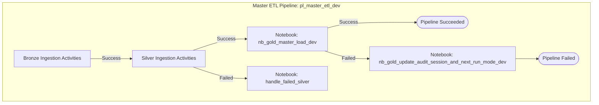
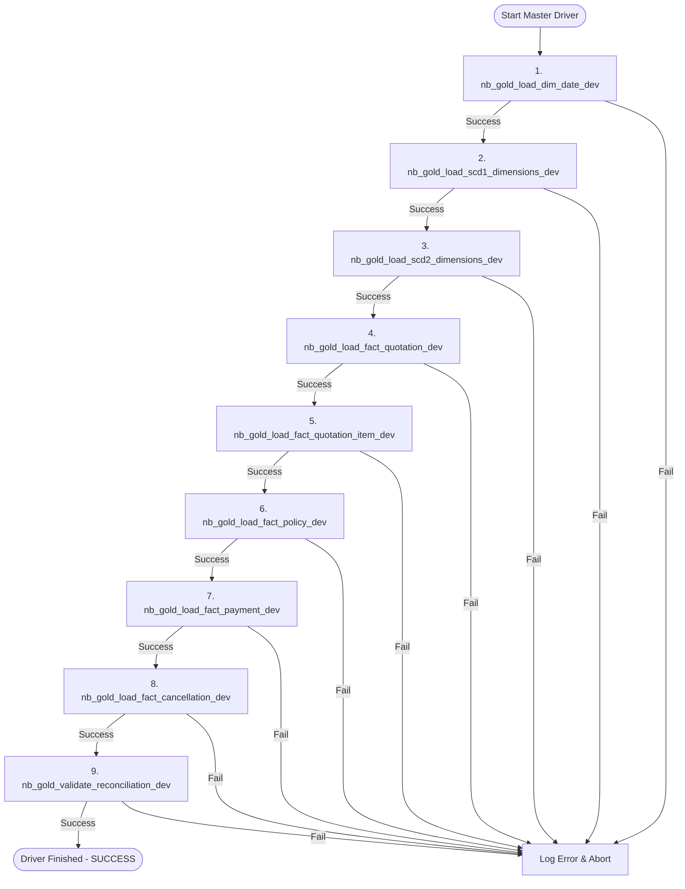
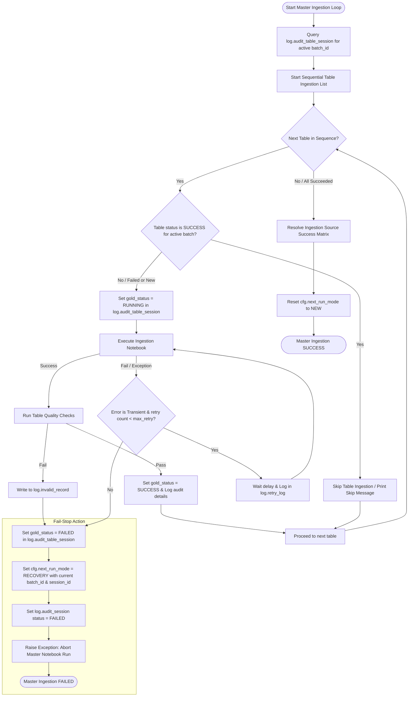
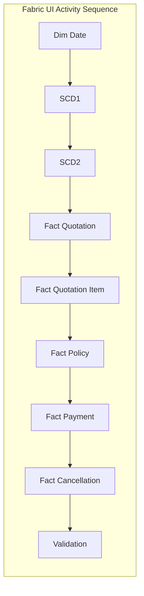

# 11 - Pipeline Orchestration and Recovery Runbook

This document defines the orchestration architecture, notebook integration, parameter passing, and recovery configurations for the Gold Layer in the master ETL pipeline.

---

## 1. Orchestration Architecture

The orchestration runs in the shared `pl_master_etl_dev` pipeline. All upstream ingestion stages (Bronze & Silver) execute first. The Gold Layer processes at the end of the pipeline.



---

## 2. Activity Configuration Details

We modify only the final two pipeline activities to point to our newly designed notebooks:

### Activity 1: `ingestion_gold_layer`
*   **Type**: Notebook Activity
*   **Target Notebook**: `fabric/Gold/Notebooks/nb_gold_master_load_dev`
*   **Run Settings**: Sequential, timeout 3600 seconds.
*   **Parameters Passed**:
    *   `p_session_id`: `@variables('session_id')`
    *   `p_batch_id`: `@variables('batch_id')`
    *   `p_run_mode`: `@variables('run_mode')` (inherited from `cfg.next_run_mode`)

### Activity 2: `handle_failed_gold`
*   **Type**: Notebook Activity
*   **Trigger Condition**: Executes only if `ingestion_gold_layer` fails.
*   **Target Notebook**: `fabric/Monitoring/Audit/nb_gold_update_audit_session_and_next_run_mode_dev`
*   **Parameters Passed**:
    *   `session_id`: `@variables('session_id')`
    *   `batch_id`: `@variables('batch_id')`

---

## 3. Master Ingestion Driver (`nb_gold_master_load_dev`)

The driver notebook orchestrates child notebooks using `mssparkutils.notebook.run()`. It passes parameters sequentially and tracks status.



### Parameter Propagation Code
Within `nb_gold_master_load_dev`, parameters are defined in a parameters cell and automatically injected by the Microsoft Fabric pipeline orchestrator at runtime. They are then propagated down to child notebooks using the `common_args` parameter map:

```python
# Parameters Cell (injected by pipeline activity at runtime)
p_session_id = ""
p_batch_id = ""
p_run_mode = "NEW"

# Safe type casting of parameters
p_batch_id = int(p_batch_id) if p_batch_id else 0
p_session_id = str(p_session_id)
p_run_mode = str(p_run_mode).upper()

# Parameter map propagated to children
common_args = {
    "session_id": p_session_id,
    "batch_id": p_batch_id,
    "run_mode": p_run_mode
}

# Run sequential notebook executions
mssparkutils.notebook.run("nb_gold_load_dim_date_dev", 1800, common_args)
mssparkutils.notebook.run("nb_gold_load_scd1_dimensions_dev", 1800, common_args)
mssparkutils.notebook.run("nb_gold_load_scd2_dimensions_dev", 1800, common_args)

# Fact tables
mssparkutils.notebook.run("nb_gold_load_fact_quotation_dev", 1800, common_args)
mssparkutils.notebook.run("nb_gold_load_fact_quotation_item_dev", 1800, common_args)
mssparkutils.notebook.run("nb_gold_load_fact_policy_dev", 1800, common_args)
mssparkutils.notebook.run("nb_gold_load_fact_payment_dev", 1800, common_args)
mssparkutils.notebook.run("nb_gold_load_fact_cancellation_dev", 1800, common_args)

# Validation Suite
mssparkutils.notebook.run("nb_gold_validate_reconciliation_dev", 1800, common_args)
```

---

## 4. Recovery and Skip-Resume Mechanics

To optimize cluster utilization and ensure strict data consistency, the master coordinator notebook (`nb_gold_master_load_dev`) enforces a **Stop-on-Failure** execution policy paired with a **Skip-Resume** rerun recovery mechanism.

### 4.1. Stop-on-Failure Policy
* **Behavior**: The Gold Layer tables are loaded in a strict sequential dependency order (Calendar -> SCD1 -> SCD2 -> Facts -> Validation). If any conformed dimension or fact table ingestion fails, or fails its post-ingestion validation check, the execution **halts immediately**.
* **Rationale**: Facts rely on the integrity of dimensions to resolve conformed surrogate keys. Continuing execution after a dimension table fails would cause downstream fact loads to incorrectly map foreign keys to `-1` (Unknown), leading to corrupt reporting dashboards and skewed metrics. Halting immediately preserves database state integrity and prevents wasted compute resources.

### 4.2. Skip-Resume Rerun Behavior
If a pipeline run aborts, the subsequent recovery run executes in `RECOVERY` mode using the same logical `batch_id`:
1. **Already Completed Tasks**: The master driver queries `log.audit_table_session` using the reused `batch_id`. Any table that has already reached `gold_status = 'SUCCESS'` is **SKIPPED** entirely, bypassing Spark notebook invocations.
2. **First Point of Failure**: Processing resumes precisely at the first table that either failed (`FAILED` status) or was not run (`NOT_RUN` / `RUNNING` status from the aborted run).
3. **Idempotent Resumption**: For the resumed table:
   * The Delta MERGE statement checks keys and tracked attribute columns (`target.row_hash <> source.hash_val`).
   * Records that were already successfully merged in the prior run but did not get updated are bypass-skipped at the disk-write level.
   * Duplicate records are never inserted, ensuring a clean historical trace.



---

## 5. Alternative Design: Direct Pipeline Activity Orchestration

If the team prefers to avoid a master coordinator notebook (`nb_gold_master_load_dev`) and instead control all steps directly in the Microsoft Fabric Pipeline user interface, the activities `ingestion_gold_layer` and `handle_failed_gold` can be completely deleted and replaced by individual activities:



### Tradeoffs Comparison (Selected Pattern: Master Notebook Ingestion)

| Design Pattern | Status | Pros | Cons |
| :--- | :--- | :--- | :--- |
| **Master Notebook Ingestion (Recommended)** | **SELECTED (Approved for Ingestion)** | <ul><li>**Low Overhead**: Shares a single Spark Session, saving ~15 minutes of session initialization overhead.</li><li>**Simplicity**: Easier to execute and test end-to-end locally.</li></ul> | <ul><li>**Low UI Visibility**: Sub-steps do not appear as separate blocks in the Fabric Monitoring UI.</li></ul> |
| **Direct Pipeline Activities Ingestion** | **DEPRECATED (Avoided due to latency)** | <ul><li>**High Visibility**: Each step has its own block in the Fabric UI, making it clear where a failure occurred.</li><li>**Granular Retries**: Direct retry configuration per notebook activity.</li></ul> | <ul><li>**High Overhead**: Fabric initializes a new Spark Session context for each notebook activity, adding 1-2 minutes of startup latency per step (~15-20 mins total delay).</li></ul> |

If the **Direct Pipeline Activities** pattern is selected:
1. Every activity passes `@variables('session_id')`, `@variables('batch_id')`, and `@variables('run_mode')` parameters.
2. Every activity contains a **On Failure** trigger routing to `nb_gold_update_audit_session_and_next_run_mode_dev` to ensure failures correctly flag the database as `RECOVERY` for the next run.
3. Skip-resume logic is implemented inside each notebook's startup check rather than inside a master notebook.

