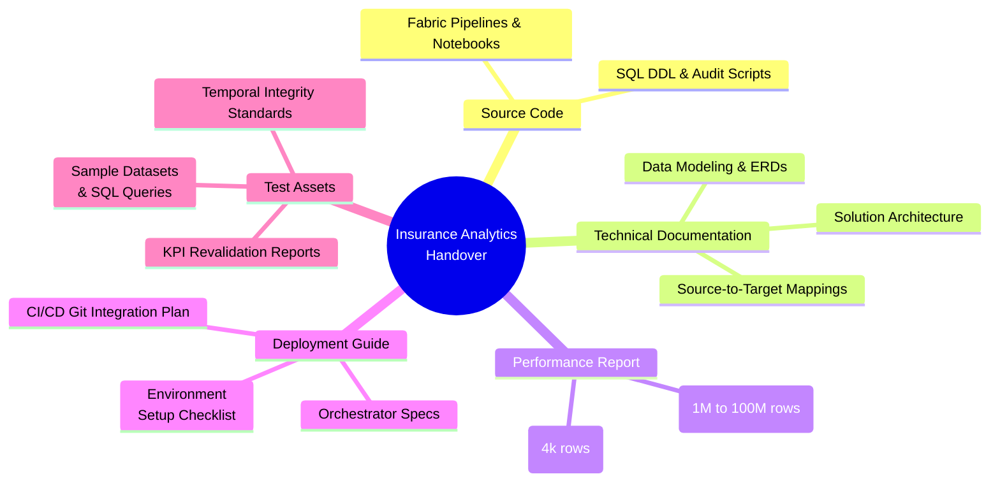

# Knowledge Transfer & Project Handover Guide

This document serves as the master index for the **Rookie Data DN 2026 - Insurance Analytics** project handover. It structures and maps all project deliverables to their locations within this repository, facilitating knowledge transfer, future maintenance, and stakeholder review.

The deliverables are categorized into five core pillars, as defined in the project presentation slide:

---

## 1. Source Code

All source code for the medallion lakehouse architecture, ETL workflows, and the presentation layers are stored in the following directories:

*   **Microsoft Fabric Workspaces & Notebooks**: Managed under the [fabric/](../../fabric/) directory. This contains the physical representations of all Fabric workspace items:
    *   **Source Data Simulator**: [fabric/Source/](../../fabric/Source/) - Simulates transactional inputs.
    *   **Bronze Layer**: [fabric/Bronze/](../../fabric/Bronze/) - Schema-on-read landing zone.
    *   **Silver Layer**: [fabric/Silver/](../../fabric/Silver/) - Cleaned and deduplicated tables.
    *   **Gold Layer**: [fabric/Gold/](../../fabric/Gold/) - Star schema dimensional reporting structures.
    *   **Orchestration Pipelines**: [fabric/Orchestration/](../../fabric/Orchestration/) - End-to-end pipelines.
    *   **Power BI Semantic Models**: [fabric/Powerbi/](../../fabric/Powerbi/) - Direct Lake reporting models.
*   **Database SQL DDL Scripts**: Located in the [sql/](../../sql/) folder. Contains standard relational definitions:
    *   **Source System Schema**: [insurance_source_db_v3.sql](../../sql/source/insurance_source_db_v3.sql)
    *   **Bronze Schema DDL**: [create_bronze_tables.sql](../../sql/lakehouse/create_bronze_tables.sql)
    *   **Silver Schema DDL**: [create_silver_tables.sql](../../sql/lakehouse/create_silver_tables.sql)
    *   **Gold Schema DDL**: [create_gold_tables.sql](../../sql/lakehouse/create_gold_tables.sql)
*   **Power BI Embedded Web App**: A production-ready Next.js application that integrates the Power BI dashboard with Azure Active Directory (Entra ID) and Row-Level Security (RLS) policies:
    *   **Web App Root**: [web-app/](../../web-app/)
    *   **Web App README**: [web-app/README.md](../../web-app/README.md)

---

## 2. Technical Documentation

Comprehensive designs, data maps, and guidelines are provided to detail the logical and physical implementation of the platform:

*   **Solution Architecture Guide**: [architecture/README.md](../../architecture/README.md) - Describes the overall medallion architecture, logging mechanisms, and system accessibility.
*   **Business Process Analysis**:
    *   **BPMN Workflow Specifications**: [BPMN_Document_Ver1.5.md](../business-process/docs/BPMN_Document_Ver1.5.md)
    *   **Granularity & Fact Definitions**: [Grain_Fact_Tables_Ver_1.8.md](../business-process/docs/Grain_Fact_Tables_Ver_1.8.md)
*   **Star Schema & Data Modeling**:
    *   **Conformed Bus Matrix**: [01-bus-matrix-conformed-dimension-scope.md](../data-modeling/dimensional-design/01-bus-matrix-conformed-dimension-scope.md)
    *   **Dimension Table Structure**: [02-dimensional-table-structures-design.md](../data-modeling/dimensional-design/02-dimensional-table-structures-design.md)
    *   **Surrogate Key Strategy**: [03-surrogate-key-strategy.md](../data-modeling/dimensional-design/03-surrogate-key-strategy.md)
    *   **SCD Type 2 Handling**: [04-scd-handling-approach.md](../data-modeling/dimensional-design/04-scd-handling-approach.md)
    *   **Power BI Relationships**: [05-powerbi-relationship-design.md](../data-modeling/dimensional-design/05-powerbi-relationship-design.md)
    *   **Logical Star Schema ERD**: [star-schema-erd-ver-1.9.mermaid](../business-process/diagram/star-schema-erd-ver-1.9.mermaid) (Mermaid representation).
*   **Source-to-Target Columns Mappings (STTM)**:
    *   **Source to Bronze**: [source-to-bronze-mapping.md](../source-to-target-mapping/source-to-bronze-mapping.md)
    *   **Bronze to Silver**: [bronze-to-silver-mapping.md](../source-to-target-mapping/bronze-to-silver-mapping.md)
    *   **Silver to Gold**: [silver-to-gold-mapping.md](../source-to-target-mapping/silver-to-gold-mapping.md)
*   **Lakehouse to Power BI Data Integration**:
    *   **Integration Process Flow**: [data-integration-process.md](../dashboard/data-integration-process.md) - Details connections, data preparation, table mappings, and unresolved data investigations.

---

## 3. Performance Report

Performance verification includes stress-testing the medallion pipelines under high volume loads and documenting refactoring results:

*   **Scale Benchmarking Reports**: Shows pipeline timings, audit logs, and row-count metrics at various data volumes:
    *   **1 Million Rows**: [1-million-test.md](../../tests/performance/rows/1-million/1-million-test.md) (Total execution time: ~16m 31s)
    *   **5 Million Rows**: [5-million-test.md](../../tests/performance/rows/5-million/5-million-test.md) (Total execution time: ~18m 59s)
    *   **10 Million Rows**: [10-million-test.md](../../tests/performance/rows/10-million/10-million-test.md) (Total execution time: ~20m 39s)
    *   **100 Million Rows**: [100-million-test.md](../../tests/performance/rows/100-million/100-million-test.md) (Total execution time: ~47m 49s)
    *   **4 Billion Rows**: [4-billion-test.md](../../tests/performance/rows/4-billion/4-billion-test.md) (Total execution time: ~3h 9m 25s)
*   **Refactoring & Optimization Report**:
    *   **Before vs After Optimization**: [before-and-after-with-4000-records.md](../refactor-optimize-pipeline/before-and-after-with-4000-records.md) - Compares execution times for 4,000 records before and after optimization, highlighting a significant reduction in execution times.
    *   **Before Optimization Log**: [4000-records-test.md (Before)](../../tests/performance/rows/4000-records-before-optimization/4000-records-test.md)
    *   **After Optimization Log**: [4000-records-test.md (After)](../../tests/performance/rows/4000-records-after-optimization/4000-records-test.md)

---

## 4. Deployment Guide

Deployment guides outline the automation scripts, environment progressions, and runbooks:

*   **CI/CD Git Integration Plan**: [plan.en.md](../../cicd/docs/plan.en.md) - Explains how to integrate Microsoft Fabric Git structures with GitHub Actions for automated deployment.
*   **Deployment Prerequisites Checklist**: [checklist.md](../../cicd/docs/checklist.md) - Itemizes the Azure Service Principal permissions, Fabric workspace setups, and GitHub secrets.
*   **Fabric Gold Layer Strategy & Recovery**:
    *   **Architecture Overview**: [00-architecture-overview.md](../fabric-strategy-for-implementing-gold-layer/00-architecture-overview.md)
    *   **Orchestration and Concurrency**: [01-orchestration-and-concurrency.md](../fabric-strategy-for-implementing-gold-layer/01-orchestration-and-concurrency.md)
    *   **Dimension Loading Specifications**: [02-dimension-loading-specs.md](../fabric-strategy-for-implementing-gold-layer/02-dimension-loading-specs.md)
    *   **Fact Loading Specifications**: [03-fact-loading-specs.md](../fabric-strategy-for-implementing-gold-layer/03-fact-loading-specs.md)
    *   **Audit and Validation**: [04-audit-and-validation.md](../fabric-strategy-for-implementing-gold-layer/04-audit-and-validation.md)
    *   **Pipeline Recovery & Run Modes**: [05-pipeline-recovery-and-run-modes.md](../fabric-strategy-for-implementing-gold-layer/05-pipeline-recovery-and-run-modes.md)
*   **Git Promotion Workflow**: [00-promotion-workflow.md](../standards/git-rules/00-promotion-workflow.md) - Outlines branch progression (`feature` $\rightarrow$ `dev` $\rightarrow$ `release` $\rightarrow$ `main`) across Fabric environments.

---

## 5. Test Assets

Quality assurance and business integrity rules are validated through automated scripts and testing suites:

*   **Temporal & Referential Integrity Checklist**: [gold-temporal-integrity-checklist.md](../../tests/data-quality/gold-temporal-integrity-checklist.md) - Standardizes lookups, SCD Type 2 point-in-time constraints, and dashboard metric distribution validations (e.g. sales funnel drop-offs, payment aging distributions).
*   **KPI Validation & Revalidation Report**: [validation-kpi-measure.md](../../tests/data-quality/validation-kpi-measure.md) - Documents validation and correction results for all **49 business KPIs** (31 Executive + 18 Operational) verified against Gold SQL queries.
*   **Sample Datasets**:
    *   **Initial Full Load (31-08-2025)**: [json-source/full-31-08-2025/](../../json-source/full-31-08-2025/)
    *   **Incremental Load (30-05-2026)**: [json-source/incremental-30-05-2026/](../../json-source/incremental-30-05-2026/)
    *   **Incremental Dummy Files**: [tests/pipeline-tests/dummy-incremental-data/](../../tests/pipeline-tests/dummy-incremental-data/)
