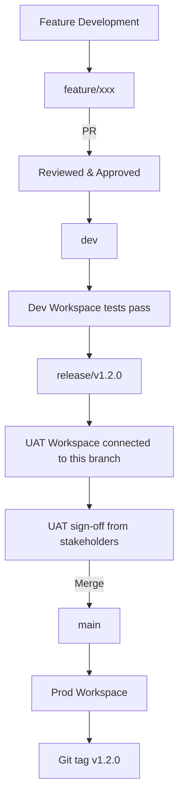

# Promotion Flow

```mermaid
flowchart TD
     A[Feature Development]
     A --> B[feature/xxx]
     B -->|PR| C[Reviewed & Approved]
     C --> D[dev]
     D --> E[Dev Workspace tests pass]
     E --> F[release/v1.2.0]
     F --> G[UAT Workspace connected to this branch]
     G --> H[UAT sign-off from stakeholders]
     H -->|Merge| I[main]
     I --> J[Prod Workspace]
     J --> K[Git tag v1.2.0]
```
