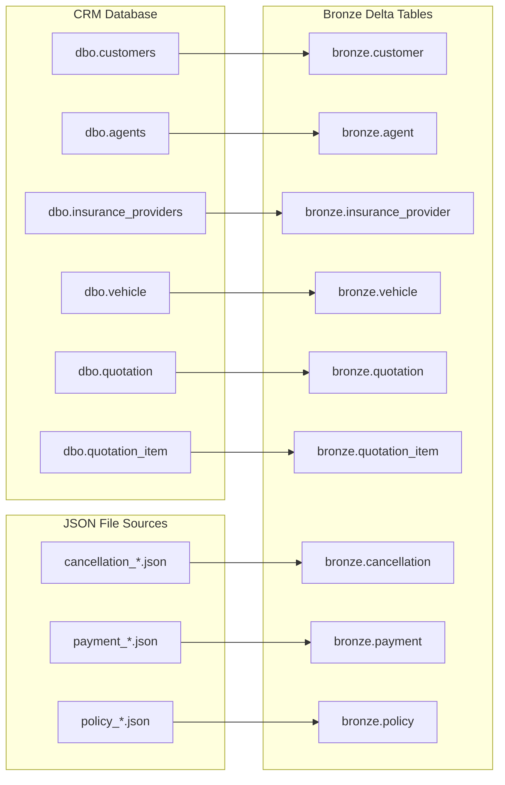
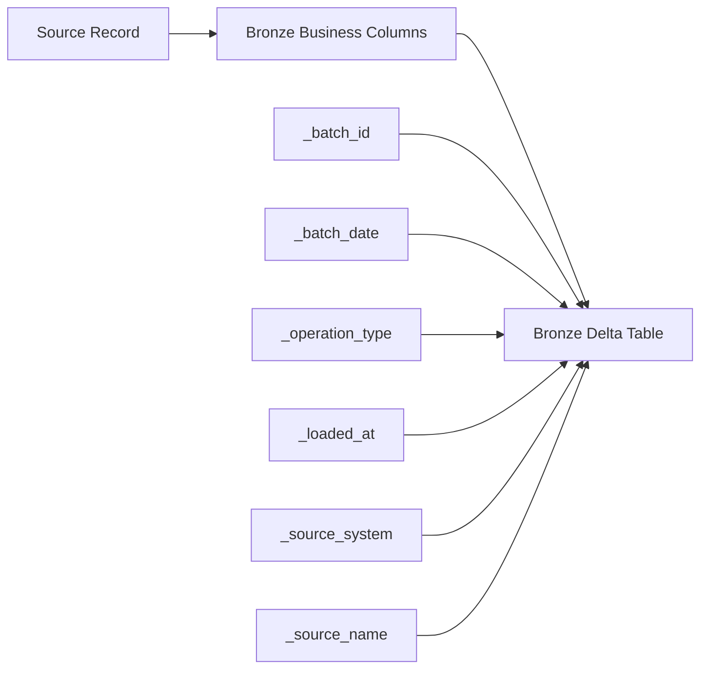

# Source to Bronze Mapping

> **Note:**
>
> - This mapping is based on `insurance_source_db_v3.sql`.

## Overview

This document defines the Source-to-Bronze mapping for CRM database tables and JSON-based sources, including field mappings, logical data types, Bronze metadata columns, and proposed type mappings for Microsoft Fabric Lakehouse.

## Bronze Metadata Flow

## 1. Objective

Provide a standardized Source to Bronze mapping reference for CRM (database) and JSON-based sources, including field mappings, logical data types, metadata and audit columns for the Bronze layer in Microsoft Fabric.

## 2. Audit and Metadata Columns

| Bronze Metadata Column | Project Baseline Term | Notes |
| --- | --- | --- |
| `_batch_id` | `batch_id` | Logical batch identifier generated by the pipeline. |
| `_batch_date` | `batch_date` | Mapped from `batch_date` for JSON sources and generated from the pipeline execution date for database sources. |
| `_loaded_at` | `ingested_at` | Timestamp when the record is loaded into Bronze. |
| `_source_system` | `source_system` | Source system from the pipeline configuration. |
| `_source_name` | Source table/entity or source file name/path | Source object defined in the pipeline configuration. |
| `_operation_type` | `operation_type` | Mapped from `operation_type` for JSON sources and inferred from `updated_date` for database sources (for example, `I` when `updated_date` is null and `U` when `updated_date` is not null). |

> **Note:**
>
> - `load_type` is tracked in the configuration and audit tables through `cfg.source_table` and `cfg.audit_table_session`.

## 3. JSON Source to Bronze Mapping

> **Note:**
>
> - Initial ingestion uses *_full_.json files as full-load extracts. Subsequent loads are incremental extracts identified by batch_date, operation_type, and last_updated.
>
> - Bronze stores raw JSON records using append-only ingestion. CDC handling based on operation_type will be implemented in the Silver layer.
>
> - Any SQL Server JSON export wrapper (e.g. `JSON_F52E2B61-18A1-11d1-B105-00805F49916B`) must be removed, and any wrapped or multi-line payload must be normalized into valid JSON records before parsing.

### 3.1. Cancellations

- **Source system:** policy_system.

- **Source file:** cancellation_*.json.

- **Target table:** bronze.cancellation.

| Source Column | Source Type | Target Column | Target Type | Target Length | Target Precision | Target Scale | Rule |
| --- | --- | --- | --- | --- | --- | --- | --- |
| cancellation_id | STRING | cancellation_id | STRING | 20 | N/A | N/A | Direct Mapping |
| policy_id | STRING | policy_id | STRING | 20 | N/A | N/A | Direct Mapping |
| cancellation_date | STRING | cancellation_date | STRING | 23 | N/A | N/A | Direct Mapping |
| cancellation_reason | STRING | cancellation_reason | STRING | 255 | N/A | N/A | Direct Mapping |
| refund_amount | STRING | refund_amount | STRING | 30 | N/A | N/A | Direct Mapping |
| last_updated | STRING | last_updated | STRING | 23 | N/A | N/A | Direct Mapping |
| source_system | STRING | source_system | STRING | 50 | N/A | N/A | Direct Mapping |
| N/A | N/A | _batch_id | STRING | 50 | N/A | N/A | Pipeline Generated |
| operation_type | STRING | _operation_type | STRING | 1 | N/A | N/A | Direct Mapping (JSON Sources) |
| batch_date | STRING | _batch_date | DATE | N/A | N/A | N/A | Direct Mapping |
| N/A | N/A | _loaded_at | TIMESTAMP | N/A | N/A | N/A | Pipeline Generated |
| N/A | N/A | _source_system | STRING | 50 | N/A | N/A | Pipeline Generated |
| N/A | N/A | _source_name | STRING | 100 | N/A | N/A | Pipeline Generated |

### 3.2. Payments

- **Source system:** payment_system.

- **Source file:** payment_*.json.

- **Target table:** bronze.payment.

| Source Column | Source Type | Target Column | Target Type | Target Length | Target Precision | Target Scale | Rule |
| --- | --- | --- | --- | --- | --- | --- | --- |
| payment_id | STRING | payment_id | STRING | 20 | N/A | N/A | Direct Mapping |
| policy_id | STRING | policy_id | STRING | 20 | N/A | N/A | Direct Mapping |
| payment_date | STRING | payment_date | STRING | 23 | N/A | N/A | Direct Mapping |
| payment_method | STRING | payment_method | STRING | 50 | N/A | N/A | Direct Mapping |
| payment_status | STRING | payment_status | STRING | 50 | N/A | N/A | Direct Mapping |
| payment_amount | STRING | payment_amount | STRING | 30 | N/A | N/A | Direct Mapping |
| transaction_reference | STRING | transaction_reference | STRING | 100 | N/A | N/A | Direct Mapping |
| last_updated | STRING | last_updated | STRING | 23 | N/A | N/A | Direct Mapping |
| source_system | STRING | source_system | STRING | 50 | N/A | N/A | Direct Mapping |
| N/A | N/A | _batch_id | STRING | 50 | N/A | N/A | Pipeline Generated |
| operation_type | STRING | _operation_type | STRING | 1 | N/A | N/A | Direct Mapping (JSON Sources) |
| batch_date | STRING | _batch_date | DATE | N/A | N/A | N/A | Direct Mapping |
| N/A | N/A | _loaded_at | TIMESTAMP | N/A | N/A | N/A | Pipeline Generated |
| N/A | N/A | _source_system | STRING | 50 | N/A | N/A | Pipeline Generated |
| N/A | N/A | _source_name | STRING | 100 | N/A | N/A | Pipeline Generated |

### 3.3. Policies

- **Source system:** policy_system.

- **Source file:** policy_*.json.

- **Target Table:** bronze.policy.

| Source Column | Source Type | Target Column | Target Type | Target Length | Target Precision | Target Scale | Rule |
| --- | --- | --- | --- | --- | --- | --- | --- |
| policy_id | STRING | policy_id | STRING | 20 | N/A | N/A | Direct Mapping |
| quotation_id | STRING | quotation_id | STRING | 20 | N/A | N/A | Direct Mapping |
| customer_id | STRING | customer_id | STRING | 20 | N/A | N/A | Direct Mapping |
| provider_code | STRING | provider_code | STRING | 20 | N/A | N/A | Direct Mapping |
| policy_number | STRING | policy_number | STRING | 50 | N/A | N/A | Direct Mapping |
| policy_start_date | STRING | policy_start_date | STRING | 10 | N/A | N/A | Direct Mapping |
| policy_end_date | STRING | policy_end_date | STRING | 10 | N/A | N/A | Direct Mapping |
| policy_status | STRING | policy_status | STRING | 50 | N/A | N/A | Direct Mapping |
| premium_amount | STRING | premium_amount | STRING | 30 | N/A | N/A | Direct Mapping |
| issued_date | STRING | issued_date | STRING | 23 | N/A | N/A | Direct Mapping |
| last_updated | STRING | last_updated | STRING | 23 | N/A | N/A | Direct Mapping |
| source_system | STRING | source_system | STRING | 50 | N/A | N/A | Direct Mapping |
| N/A | N/A | _batch_id | STRING | 50 | N/A | N/A | Pipeline Generated |
| operation_type | STRING | _operation_type | STRING | 1 | N/A | N/A | Direct Mapping (JSON Sources) |
| batch_date | STRING | _batch_date | DATE | N/A | N/A | N/A | Direct Mapping |
| N/A | N/A | _loaded_at | TIMESTAMP | N/A | N/A | N/A | Pipeline Generated |
| N/A | N/A | _source_system | STRING | 50 | N/A | N/A | Pipeline Generated |
| N/A | N/A | _source_name | STRING | 100 | N/A | N/A | Pipeline Generated |

## 4. CRM Source to Bronze Mapping

> **Note:**
>
> - `_operation_type` is inferred as `I` when `updated_date` is null and `U` when `updated_date` is not null. `_batch_date` is generated from the pipeline execution date.

### 4.1. Customers

- **Source system:** crm_system.

- **Source Table:** dbo.customers.

- **Target Table:** bronze.customer.

| Source Column | Source Type | Target Column | Target Type | Target Length | Target Precision | Target Scale | Rule |
| --- | --- | --- | --- | --- | --- | --- | --- |
| customer_id | VARCHAR(20) | customer_id | STRING | 20 | N/A | N/A | Direct Mapping |
| full_name | NVARCHAR(200) | full_name | STRING | 200 | N/A | N/A | Direct Mapping |
| gender | VARCHAR(10) | gender | STRING | 10 | N/A | N/A | Direct Mapping |
| dob | DATE | dob | DATE | N/A | N/A | N/A | Direct Mapping |
| phone_number | VARCHAR(20) | phone_number | STRING | 20 | N/A | N/A | Direct Mapping |
| email | VARCHAR(200) | email | STRING | 200 | N/A | N/A | Direct Mapping |
| city | NVARCHAR(100) | city | STRING | 100 | N/A | N/A | Direct Mapping |
| district | NVARCHAR(100) | district | STRING | 100 | N/A | N/A | Direct Mapping |
| created_date | DATETIME | created_date | TIMESTAMP | N/A | N/A | N/A | Direct Mapping |
| updated_date | DATETIME2(3) | updated_date | TIMESTAMP | N/A | N/A | N/A | Direct Mapping |
| N/A | N/A | `_batch_id` | STRING | 50 | N/A | N/A | Pipeline Generated |
| N/A | N/A | `_operation_type` | STRING | 1 | N/A | N/A | Inferred from `updated_date` |
| N/A | N/A | `_batch_date` | DATE | N/A | N/A | N/A | Pipeline Generated |
| N/A | N/A | `_loaded_at` | TIMESTAMP | N/A | N/A | N/A | Pipeline Generated |
| N/A | N/A | `_source_system` | STRING | 50 | N/A | N/A | Pipeline Generated |
| N/A | N/A | `_source_name` | STRING | 100 | N/A | N/A | Pipeline Generated |

### 4.2. Agents

- **Source system:** crm_system.

- **Source Table:** dbo.agents.

- **Target Table:** bronze.agent.

| Source Column | Source Type | Target Column | Target Type | Target Length | Target Precision | Target Scale | Rule |
| --- | --- | --- | --- | --- | --- | --- | --- |
| agent_id | VARCHAR(20) | agent_id | STRING | 20 | N/A | N/A | Direct Mapping |
| agent_name | NVARCHAR(200) | agent_name | STRING | 200 | N/A | N/A | Direct Mapping |
| region | NVARCHAR(100) | region | STRING | 100 | N/A | N/A | Direct Mapping |
| branch | NVARCHAR(100) | branch | STRING | 100 | N/A | N/A | Direct Mapping |
| manager_name | NVARCHAR(200) | manager_name | STRING | 200 | N/A | N/A | Direct Mapping |
| created_date | DATETIME | created_date | TIMESTAMP | N/A | N/A | N/A | Direct Mapping |
| updated_date | DATETIME2(3) | updated_date | TIMESTAMP | N/A | N/A | N/A | Direct Mapping |
| N/A | N/A | `_batch_id` | STRING | 50 | N/A | N/A | Pipeline Generated |
| N/A | N/A | `_operation_type` | STRING | 1 | N/A | N/A | Inferred from `updated_date` |
| N/A | N/A | `_batch_date` | DATE | N/A | N/A | N/A | Pipeline Generated |
| N/A | N/A | `_loaded_at` | TIMESTAMP | N/A | N/A | N/A | Pipeline Generated |
| N/A | N/A | `_source_system` | STRING | 50 | N/A | N/A | Pipeline Generated |
| N/A | N/A | `_source_name` | STRING | 100 | N/A | N/A | Pipeline Generated |

### 4.3. Insurance providers

- **Source system:** crm_system.

- **Source Table:** dbo.insurance_providers.

- **Target Table:** bronze.insurance_provider.

| Source Column | Source Type | Target Column | Target Type | Target Length | Target Precision | Target Scale | Rule |
| --- | --- | --- | --- | --- | --- | --- | --- |
| provider_code | VARCHAR(20) | provider_code | STRING | 20 | N/A | N/A | Direct Mapping |
| provider_name | NVARCHAR(200) | provider_name | STRING | 200 | N/A | N/A | Direct Mapping |
| provider_group | NVARCHAR(100) | provider_group | STRING | 100 | N/A | N/A | Direct Mapping |
| active_flag | INT | active_flag | INT | N/A | N/A | N/A | Direct Mapping |
| created_date | DATETIME2(3) | created_date | TIMESTAMP | N/A | N/A | N/A | Direct Mapping |
| updated_date | DATETIME2(3) | updated_date | TIMESTAMP | N/A | N/A | N/A | Direct Mapping |
| N/A | N/A | `_batch_id` | STRING | 50 | N/A | N/A | Pipeline Generated |
| N/A | N/A | `_operation_type` | STRING | 1 | N/A | N/A | Inferred from `updated_date` |
| N/A | N/A | `_batch_date` | DATE | N/A | N/A | N/A | Pipeline Generated |
| N/A | N/A | `_loaded_at` | TIMESTAMP | N/A | N/A | N/A | Pipeline Generated |
| N/A | N/A | `_source_system` | STRING | 50 | N/A | N/A | Pipeline Generated |
| N/A | N/A | `_source_name` | STRING | 100 | N/A | N/A | Pipeline Generated |

### 4.4. Vehicles

- **Source system:** crm_system.

- **Source Table:** dbo.vehicle.

- **Target Table:** bronze.vehicle.

| Source Column | Source Type | Target Column | Target Type | Target Length | Target Precision | Target Scale | Rule |
| --- | --- | --- | --- | --- | --- | --- | --- |
| vehicle_id | VARCHAR(20) | vehicle_id | STRING | 20 | N/A | N/A | Direct Mapping |
| customer_id | VARCHAR(20) | customer_id | STRING | 20 | N/A | N/A | Direct Mapping |
| plate_number | VARCHAR(20) | plate_number | STRING | 20 | N/A | N/A | Direct Mapping |
| vehicle_brand | NVARCHAR(100) | vehicle_brand | STRING | 100 | N/A | N/A | Direct Mapping |
| vehicle_model | NVARCHAR(100) | vehicle_model | STRING | 100 | N/A | N/A | Direct Mapping |
| manufacture_year | INT | manufacture_year | INT | N/A | N/A | N/A | Direct Mapping |
| vehicle_value | DECIMAL(18,2) | vehicle_value | DECIMAL | N/A | 18 | 2 | Direct Mapping |
| created_date | DATETIME2(3) | created_date | TIMESTAMP | N/A | N/A | N/A | Direct Mapping |
| updated_date | DATETIME2(3) | updated_date | TIMESTAMP | N/A | N/A | N/A | Direct Mapping |
| N/A | N/A | `_batch_id` | STRING | 50 | N/A | N/A | Pipeline Generated |
| N/A | N/A | `_operation_type` | STRING | 1 | N/A | N/A | Inferred from `updated_date` |
| N/A | N/A | `_batch_date` | DATE | N/A | N/A | N/A | Pipeline Generated |
| N/A | N/A | `_loaded_at` | TIMESTAMP | N/A | N/A | N/A | Pipeline Generated |
| N/A | N/A | `_source_system` | STRING | 50 | N/A | N/A | Pipeline Generated |
| N/A | N/A | `_source_name` | STRING | 100 | N/A | N/A | Pipeline Generated |

### 4.5. Quotations

- **Source system:** crm_system.

- **Source Table:** dbo.quotation.

- **Target Table:** bronze.quotation.

| Source Column | Source Type | Target Column | Target Type | Target Length | Target Precision | Target Scale | Rule |
| --- | --- | --- | --- | --- | --- | --- | --- |
| quotation_id | VARCHAR(20) | quotation_id | STRING | 20 | N/A | N/A | Direct Mapping |
| customer_id | VARCHAR(20) | customer_id | STRING | 20 | N/A | N/A | Direct Mapping |
| agent_id | VARCHAR(20) | agent_id | STRING | 20 | N/A | N/A | Direct Mapping |
| provider_code | VARCHAR(20) | provider_code | STRING | 20 | N/A | N/A | Direct Mapping |
| quotation_date | DATETIME | quotation_date | TIMESTAMP | N/A | N/A | N/A | Direct Mapping |
| quotation_status | VARCHAR(50) | quotation_status | STRING | 50 | N/A | N/A | Direct Mapping |
| package_code | VARCHAR(50) | package_code | STRING | 50 | N/A | N/A | Direct Mapping |
| premium_amount | DECIMAL(18,2) | premium_amount | DECIMAL | N/A | 18 | 2 | Direct Mapping |
| quotation_expiry_date | DATETIME | quotation_expiry_date | TIMESTAMP | N/A | N/A | N/A | Direct Mapping |
| created_date | DATETIME2(3) | created_date | TIMESTAMP | N/A | N/A | N/A | Direct Mapping |
| updated_date | DATETIME2(3) | updated_date | TIMESTAMP | N/A | N/A | N/A | Direct Mapping |
| N/A | N/A | `_batch_id` | STRING | 50 | N/A | N/A | Pipeline Generated |
| N/A | N/A | `_operation_type` | STRING | 1 | N/A | N/A | Inferred from `updated_date` |
| N/A | N/A | `_batch_date` | DATE | N/A | N/A | N/A | Pipeline Generated |
| N/A | N/A | `_loaded_at` | TIMESTAMP | N/A | N/A | N/A | Pipeline Generated |
| N/A | N/A | `_source_system` | STRING | 50 | N/A | N/A | Pipeline Generated |
| N/A | N/A | `_source_name` | STRING | 100 | N/A | N/A | Pipeline Generated |

### 4.6. Quotation items

- **Source system:** crm_system.

- **Source Table:** dbo.quotation_item.

- **Target Table:** bronze.quotation_item.

| Source Column | Source Type | Target Column | Target Type | Target Length | Target Precision | Target Scale | Rule |
| --- | --- | --- | --- | --- | --- | --- | --- |
| quotation_item_id | VARCHAR(20) | quotation_item_id | STRING | 20 | N/A | N/A | Direct Mapping |
| quotation_id | VARCHAR(20) | quotation_id | STRING | 20 | N/A | N/A | Direct Mapping |
| coverage_type | NVARCHAR(100) | coverage_type | STRING | 100 | N/A | N/A | Direct Mapping |
| coverage_amount | DECIMAL(18,2) | coverage_amount | DECIMAL | N/A | 18 | 2 | Direct Mapping |
| deductible_amount | DECIMAL(18,2) | deductible_amount | DECIMAL | N/A | 18 | 2 | Direct Mapping |
| created_date | DATETIME2(3) | created_date | TIMESTAMP | N/A | N/A | N/A | Direct Mapping |
| updated_date | DATETIME2(3) | updated_date | TIMESTAMP | N/A | N/A | N/A | Direct Mapping |
| N/A | N/A | `_batch_id` | STRING | 50 | N/A | N/A | Pipeline Generated |
| N/A | N/A | `_operation_type` | STRING | 1 | N/A | N/A | Inferred from `updated_date` |
| N/A | N/A | `_batch_date` | DATE | N/A | N/A | N/A | Pipeline Generated |
| N/A | N/A | `_loaded_at` | TIMESTAMP | N/A | N/A | N/A | Pipeline Generated |
| N/A | N/A | `_source_system` | STRING | 50 | N/A | N/A | Pipeline Generated |
| N/A | N/A | `_source_name` | STRING | 100 | N/A | N/A | Pipeline Generated |

## 5. Mapping Matrix

| Target Type | Target Length | Target Precision | Target Scale | Delta Lake Type |
| --- | --- | --- | --- | --- |
| STRING | Any | N/A | N/A | STRING |
| INT | N/A | N/A | N/A | INT |
| BIGINT | N/A | N/A | N/A | BIGINT |
| DECIMAL | N/A | p | s | DECIMAL(p,s) |
| DATE | N/A | N/A | N/A | DATE |
| TIMESTAMP | N/A | N/A | N/A | TIMESTAMP |
| BOOLEAN | N/A | N/A | N/A | BOOLEAN |
| DOUBLE | N/A | N/A | N/A | DOUBLE |