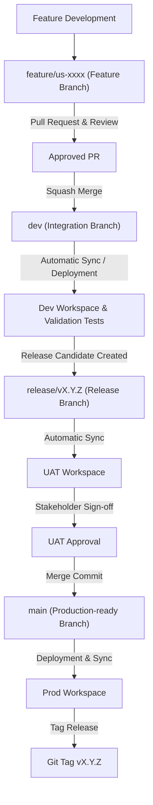

# Promotion Workflow

This document describes the branch promotion strategy and deployment flow across workspaces for the Rookie Data DN 2026 project.

---

## 1. Promotion Flow Diagram

---

## 2. Stage Breakdown and Guidelines

### Stage 1: Feature Development
- **Branch**: `feature/us-xxxx-short-description` or `chore/no-ref-xxx` branched off `dev`.
- **Workspace**: Local or dedicated developer workspace sandbox.
- **Action**: Developers commit and run isolated unit/quality tests.

### Stage 2: Integration and Dev Testing
- **Branch**: `dev`
- **Trigger**: Approved Pull Request with a squash merge.
- **Workspace**: Shared **Dev Workspace**.
- **Action**: End-to-end integration pipeline tests are run. If tests fail, fixes are pushed via new feature branches.

### Stage 3: Stabilization & UAT (User Acceptance Testing)
- **Branch**: `release/vX.Y.Z` branched off `dev`.
- **Trigger**: Code frozen on `dev` for a release cycle.
- **Workspace**: **UAT Workspace**.
- **Action**: Business stakeholders perform validation and sign off. Minor fixes can be committed directly to the release branch (and merged back into `dev`).

### Stage 4: Production Release
- **Branch**: `main`
- **Trigger**: Merge of the approved `release/*` branch into `main` via a Merge Commit (requires Stage 3 PO sign-off after Peer and Team Lead reviews).
- **Workspace**: **Production Workspace**.
- **Action**: Production release runs. A Git tag (e.g., `v1.2.0`) is created at the release commit on `main`.
