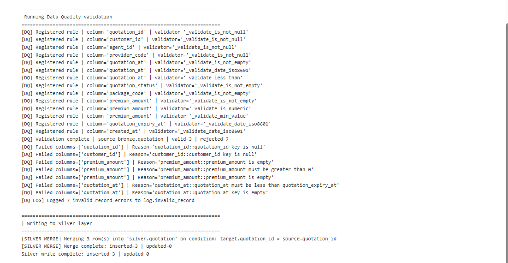
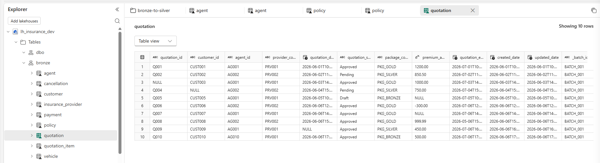
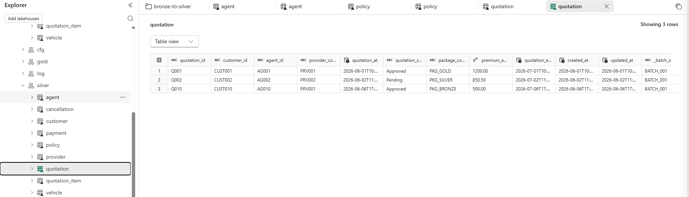

## Test Case Execution Result

### TC_DQ_001 - Validate quotation_id NOT NULL
**Input:** `quotation_id = NULL`  
**Expected Result:** Record is rejected and error `quotation_id key is null` is logged.  
**Actual Result:** Record rejected with expected error message.  
**Status:** ✅ Pass

---

### TC_DQ_002 - Validate customer_id NOT NULL
**Input:** `customer_id = NULL`  
**Expected Result:** Record is rejected and error `customer_id key is null` is logged.  
**Actual Result:** Record rejected with expected error message.  
**Status:** ✅ Pass

---

### TC_DQ_003 - Validate agent_id NOT NULL
**Input:** Valid `agent_id` value  
**Expected Result:** Record passes validation.  
**Actual Result:** Record passed validation.  
**Status:** ✅ Pass

---

### TC_DQ_004 - Validate provider_code NOT NULL
**Input:** Valid `provider_code` value  
**Expected Result:** Record passes validation.  
**Actual Result:** Record passed validation.  
**Status:** ✅ Pass

---

### TC_DQ_005 - Validate quotation_at NOT EMPTY
**Input:** `quotation_at = ''`  
**Expected Result:** Record is rejected and error `quotation_at key is empty` is logged.  
**Actual Result:** Record rejected with expected error message.  
**Status:** ✅ Pass

---

### TC_DQ_006 - Validate quotation_at ISO8601 Format
**Input:** Valid ISO8601 datetime value  
**Expected Result:** Record passes validation.  
**Actual Result:** Record passed validation.  
**Status:** ✅ Pass

---

### TC_DQ_007 - Validate quotation_at < quotation_expiry_at
**Input:** `quotation_at >= quotation_expiry_at`  
**Expected Result:** Record is rejected and error `quotation_at must be less than quotation_expiry_at` is logged.  
**Actual Result:** Record rejected with expected error message.  
**Status:** ✅ Pass

---

### TC_DQ_008 - Validate quotation_status NOT EMPTY
**Input:** Valid `quotation_status` value  
**Expected Result:** Record passes validation.  
**Actual Result:** Record passed validation.  
**Status:** ✅ Pass

---

### TC_DQ_009 - Validate package_code NOT EMPTY
**Input:** Valid `package_code` value  
**Expected Result:** Record passes validation.  
**Actual Result:** Record passed validation.  
**Status:** ✅ Pass

---

### TC_DQ_010 - Validate premium_amount NOT EMPTY
**Input:** `premium_amount = ''`  
**Expected Result:** Record is rejected and error `premium_amount is empty` is logged.  
**Actual Result:** Record rejected with expected error message.  
**Status:** ✅ Pass

---

### TC_DQ_011 - Validate premium_amount NUMERIC
**Input:** Numeric value provided  
**Expected Result:** Record passes validation.  
**Actual Result:** Record passed validation.  
**Status:** ✅ Pass

---

### TC_DQ_012 - Validate premium_amount > 0
**Input:** `premium_amount <= 0`  
**Expected Result:** Record is rejected and error `premium_amount must be greater than 0` is logged.  
**Actual Result:** Record rejected with expected error message.  
**Status:** ✅ Pass

---

### TC_DQ_013 - Validate quotation_expiry_at ISO8601 Format
**Input:** Valid ISO8601 datetime value  
**Expected Result:** Record passes validation.  
**Actual Result:** Record passed validation.  
**Status:** ✅ Pass

---

### TC_DQ_014 - Validate created_at ISO8601 Format
**Input:** Valid ISO8601 datetime value  
**Expected Result:** Record passes validation.  
**Actual Result:** Record passed validation.  
**Status:** ✅ Pass

---

### TC_DQ_015 - Validate Invalid Record Logging
**Input:** Dataset containing invalid records  
**Expected Result:** All failed records are written to `log.invalid_record`.  
**Actual Result:** 7 invalid records logged successfully.  
**Status:** ✅ Pass

---

### TC_DQ_016 - Validate Silver Merge Insert
**Input:** 3 valid records after DQ validation  
**Expected Result:** 3 records inserted into `silver.quotation`.  
**Actual Result:** Inserted = 3, Updated = 0.  
**Status:** ✅ Pass

---

### TC_DQ_017 - Validate End-to-End Data Quality Process
**Input:** Source dataset with 10 records  
**Expected Result:** 3 valid records, 7 rejected records, successful Silver load.  
**Actual Result:** Valid = 3, Rejected = 7, Silver Inserted = 3, Updated = 0.  
**Status:** ✅ Pass

---

## Execution Summary

| Metric | Result |
|----------|----------|
| Source Records | 10 |
| Valid Records | 3 |
| Rejected Records | 7 |
| Invalid Records Logged | 7 |
| Silver Inserts | 3 |
| Silver Updates | 0 |
| Overall Status | ✅ PASS |

Logs:

Bronze Layer

Silver Layer
