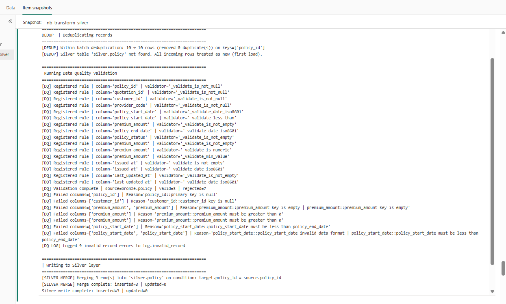
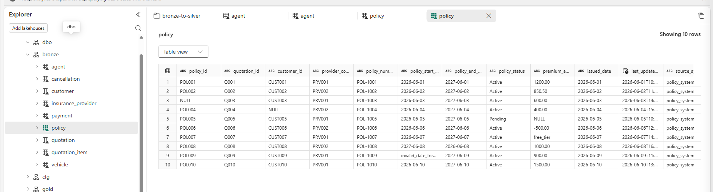
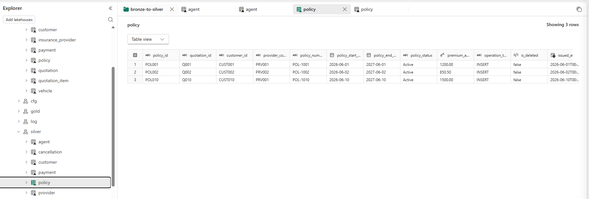

# Policy Table - Silver Validation Test Cases

## Overview

This document defines all test scenarios for validating data from `bronze.policy` before loading into `silver.policy`.

### Validation Rules

| Column            | Validation                |
| ----------------- | ------------------------- |
| policy_id         | NOT NULL                  |
| quotation_id      | NOT NULL                  |
| customer_id       | NOT NULL                  |
| provider_code     | NOT NULL                  |
| policy_start_date | ISO8601 Date              |
| policy_start_date | Less Than policy_end_date |
| policy_end_date   | ISO8601 Date              |
| premium_amount    | NOT EMPTY                 |
| premium_amount    | NUMERIC                   |
| premium_amount    | MIN VALUE > 0             |
| policy_status     | NOT EMPTY                 |
| issued_at         | NOT EMPTY                 |
| issued_at         | ISO8601 Date              |
| last_updated_at   | NOT EMPTY                 |
| last_updated_at   | ISO8601 Date              |

---

# Test Scenarios

## TC001 - Valid Record

### Description

Verify valid records pass all DQ validations and are loaded into Silver.

### Input

| policy_id | quotation_id | customer_id | provider_code | policy_start_date | policy_end_date | premium_amount |
| --------- | ------------ | ----------- | ------------- | ----------------- | --------------- | -------------- |
| POL001    | QT001        | CUS001      | AIA           | 2025-01-01        | 2026-01-01      | 1000           |

### Expected Result

* Validation Status = PASS
* Record written to Silver
* Rejected Row Count = 0

---

## TC002 - policy_id is NULL

### Description

Verify primary key cannot be NULL.

### Input

| policy_id |
| --------- |
| NULL      |

### Expected Result

Rejected with:

```text
policy_id::primary key is null
```

---

## TC003 - quotation_id is NULL

### Input

| quotation_id |
| ------------ |
| NULL         |

````

### Expected Result

Rejected.

---

## TC004 - customer_id is NULL

### Input

| customer_id |
|------------|
| NULL |

### Expected Result

Rejected with:

```text
customer_id::customer_id key is null
````

---

## TC005 - provider_code is NULL

### Input

| provider_code |
| ------------- |
| NULL          |

### Expected Result

Rejected.

---

## TC006 - premium_amount is NULL

### Input

| premium_amount |
| -------------- |
| NULL           |

### Expected Result

Rejected with:

```text
premium_amount::premium_amount key is empty
```

---

## TC007 - premium_amount is Empty String

### Input

| premium_amount |
| -------------- |
| ''             |

### Expected Result

Rejected with:

```text
premium_amount::premium_amount key is empty
```

---

## TC008 - premium_amount is Non-Numeric

### Input

| premium_amount |
| -------------- |
| ABC            |

### Expected Result

Rejected with:

```text
premium_amount::premium_amount must be numeric
```

---

## TC009 - premium_amount = 0

### Input

| premium_amount |
| -------------- |
| 0              |

### Expected Result

Rejected with:

```text
premium_amount::premium_amount must be greater than 0
```

---

## TC010 - premium_amount < 0

### Input

| premium_amount |
| -------------- |
| -100           |

### Expected Result

Rejected with:

```text
premium_amount::premium_amount must be greater than 0
```

---

## TC011 - policy_start_date Invalid Format

### Input

| policy_start_date |
| ----------------- |
| 01/01/2025        |

### Expected Result

Rejected with:

```text
policy_start_date::policy_start_date invalid data format
```

---

## TC012 - policy_end_date Invalid Format

### Input

| policy_end_date |
| --------------- |
| 01/01/2026      |

### Expected Result

Rejected.

---

## TC013 - issued_at Invalid Format

### Input

| issued_at    |
| ------------ |
| invalid-date |

### Expected Result

Rejected.

---

## TC014 - last_updated_at Invalid Format

### Input

| last_updated_at |
| --------------- |
| invalid-date    |

### Expected Result

Rejected.

---

## TC015 - policy_start_date Greater Than policy_end_date

### Input

| policy_start_date | policy_end_date |
| ----------------- | --------------- |
| 2026-01-01        | 2025-01-01      |

### Expected Result

Rejected with:

```text
policy_start_date::policy_start_date must be less than policy_end_date
```

---

## TC016 - policy_start_date Equals policy_end_date

### Input

| policy_start_date | policy_end_date |
| ----------------- | --------------- |
| 2025-01-01        | 2025-01-01      |

### Expected Result

Rejected.

---

## TC017 - policy_status Empty

### Input

| policy_status |
| ------------- |
| ''            |

### Expected Result

Rejected.

---

## TC018 - issued_at Empty

### Input

| issued_at |
| --------- |
| ''        |

### Expected Result

Rejected.

---

## TC019 - last_updated_at Empty

### Input

| last_updated_at |
| --------------- |
| ''              |

### Expected Result

Rejected.

---

# Deduplication Test Cases

## TC020 - Duplicate Records Within Batch

### Description

Same policy_id appears multiple times in Bronze batch.

### Input

| policy_id |
| --------- |
| POL001    |
| POL001    |

### Expected Result

```text
[DEDUP] Within-batch deduplication
removed 1 duplicate(s)
```

Only one record proceeds to DQ validation.

---

## TC021 - Duplicate Records Across Silver

### Description

policy_id already exists in Silver.

### Expected Result

* MERGE performs UPDATE
* No duplicate row inserted

---

# Initial Load Test Cases

## TC022 - First Silver Load

### Pre-condition

Silver table does not exist.

### Expected Result

```text
[DEDUP] Silver table 'silver.policy' not found.
All incoming rows treated as new.
```

All valid records inserted.

---

# Mixed Validation Test

## TC023 - Multiple Validation Failures

### Input

| policy_start_date | policy_end_date | premium_amount |
| ----------------- | --------------- | -------------- |
| invalid-date      | 2025-01-01      | 0              |

### Expected Result

Multiple validation errors captured:

```text
policy_start_date::policy_start_date invalid data format
policy_start_date::policy_start_date must be less than policy_end_date
premium_amount::premium_amount must be greater than 0
```

Record rejected.

---

# Success Criteria

Pipeline execution is considered successful when:

* All valid records are loaded into Silver.
* Invalid records are written to reject/error output.
* Error reasons are populated correctly.
* Deduplication behaves as expected.
* Merge logic correctly inserts and updates records.
* Validation summary metrics match expected counts.


Image log validate



Data At Bronze Layer


Data Silver Policy



## Test Result

All test scenarios for Policy Data Quality validation were executed successfully.

Validated areas include:
- Required field validation (NOT NULL / NOT EMPTY)
- Data type validation
- Date format validation (ISO8601)
- Business rule validation (`policy_start_date < policy_end_date`)
- Numeric and minimum value validation
- Within-batch deduplication
- Initial load handling
- Silver MERGE (insert/update) logic
- Error handling and reject record processing

Result:
- Total Test Cases: 23
- Passed: 23
- Failed: 0