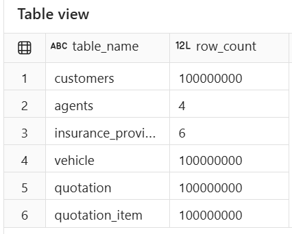
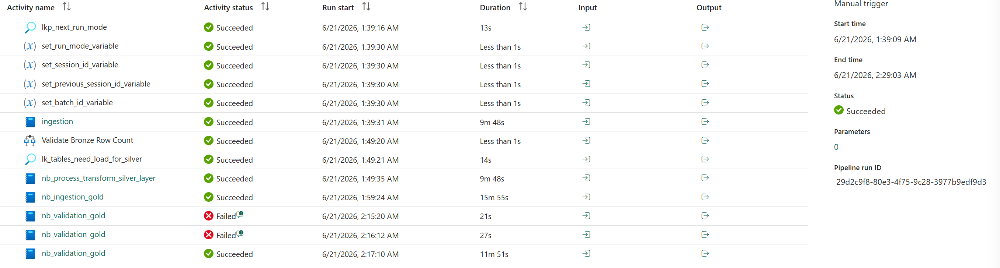
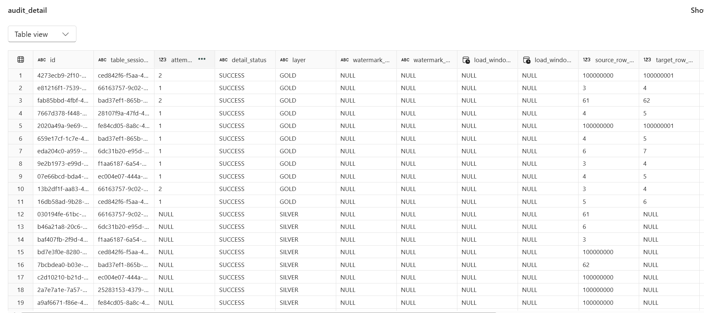
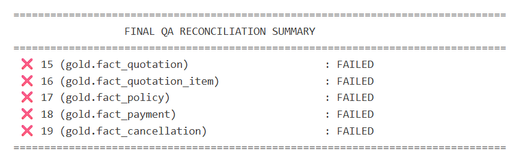

## Row Count
*   **Total Records**: 400,000,010 records (400 million records in total: 100,000,000 per table for Customers, Vehicles, Quotations, and Quotation Items)

## Execution Time

~47 minutes 49 seconds

### Medallion Layer Durations:
*   **Bronze (ingestion)**: 10m 1s
*   **Silver**: 10m 2s
*   **Gold**: 15m 55s
*   **Validation (nb_validation_gold)**: 11m 51s *(Note: Succeeded on the 3rd attempt; 2 previous attempts failed at 21s and 27s due to Fabric capacity limits/HTTP 430)*

## Inserted Records

## Validation Results

