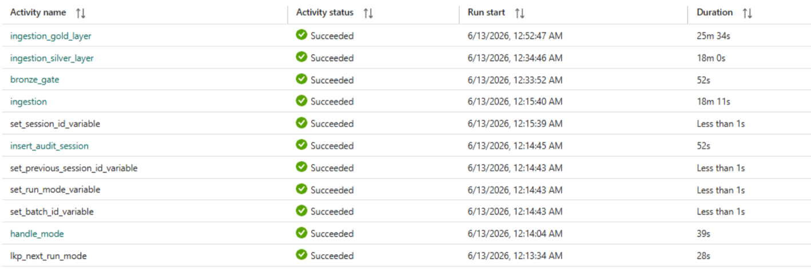

## Row Count
*   **Total Records**: 4,000 records (1,000 per table for Customers, Vehicles, Quotations, and Quotation Items)

## Execution Time

~64 minutes 47 seconds

### Medallion Layer Durations:
*   **Bronze (ingestion)**: 21m 10s *(Note: Includes 18m 11s core ingestion and setup activities)*
*   **Silver (ingestion_silver_layer)**: 18m 0s
*   **Gold (ingestion_gold_layer)**: 25m 34s *(Note: Validation and Reconciliation were integrated inside the Gold notebook in this run)*
*   **Validation**: N/A *(Integrated within Gold)*
