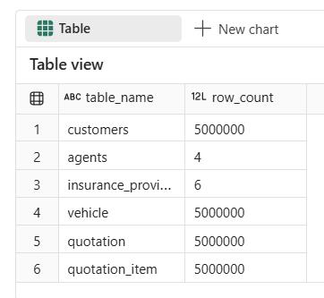
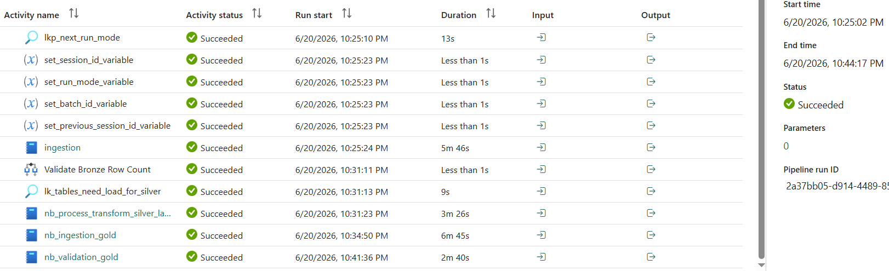
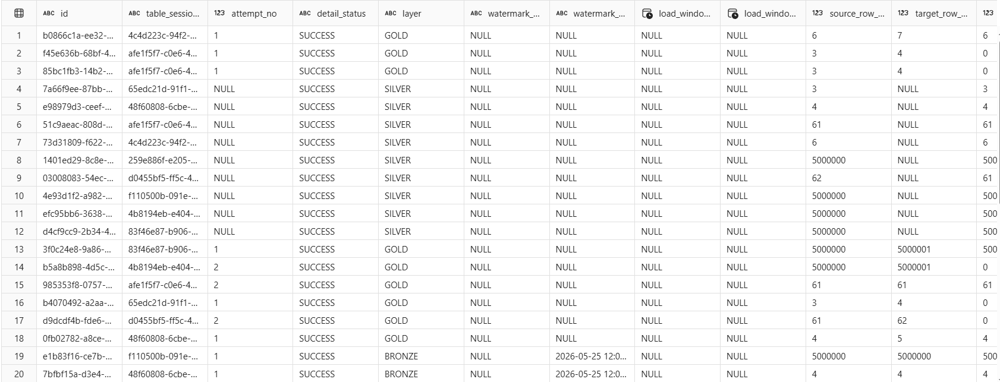

## Row Count
*   **Total Records**: 20,000,010 records (20 million records in total: 5,000,000 per table for Customers, Vehicles, Quotations, and Quotation Items)

## Execution Time

~18 minutes 59 seconds

### Medallion Layer Durations:
*   **Bronze (ingestion)**: 5m 59s
*   **Silver (nb_process_transform_silver_layer)**: 3m 35s
*   **Gold (nb_ingestion_gold)**: 6m 45s
*   **Validation (nb_validation_gold)**: 2m 40s

## Inserted Records

## Validation Results

